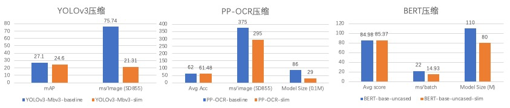

# PaddleSlim

[](https://paddleslim.readthedocs.io/en/latest/)
[](https://paddleslim.readthedocs.io/zh_CN/latest/)
[](LICENSE)

## 简介

PaddleSlim是一个专注于深度学习模型压缩的工具库，提供**剪裁、量化、蒸馏、和模型结构搜索**等模型压缩策略，帮助用户快速实现模型的小型化。

## 版本对齐

|  PaddleSlim   | PaddlePaddle   | PaddleLite    | 备注        |
| :-----------: | :------------: | :------------:| :----------:|
| 1.0.1         | <=1.7          |       2.7     | 支持静态图  |
| 1.1.1         | 1.8            |       2.7     | 支持静态图  |
| 1.2.0         | 2.0Beta/RC     |       2.8     | 支持静态图  |
| 2.0.0         | 2.0            |       2.8     | 支持动态图和静态图  |


## 安装

安装最新版本：
```bash
pip install paddleslim -i https://pypi.tuna.tsinghua.edu.cn/simple
```

安装指定版本：
```bash
pip install paddleslim==2.0.0 -i https://pypi.tuna.tsinghua.edu.cn/simple
```

## 最近更新

2021.2.5： 发布V2.0.0版本，新增支持动态图，新增OFA压缩功能，优化剪枝功能。
2020.9.16:  发布V1.2.0版本，新增PACT量化训练功能，新增DML(互蒸馏功能)，修复部分剪裁bug，加强对depthwise_conv2d的剪裁能力，优化剪裁和量化API的易用性和灵活性。

更多信息请参考：[release note](https://github.com/PaddlePaddle/PaddleSlim/releases)

## 功能概览

PaddleSlim支持以下功能，也支持自定义量化、裁剪等功能。
<table>
<tr align="center" valign="bottom">
  <th><a href="https://github.com/PaddlePaddle/PaddleSlim/blob/release/2.0.0/docs/zh_cn/tutorials/quant/overview.md">Quantization</a></th>
  <th><a href="https://github.com/PaddlePaddle/PaddleSlim/blob/release/2.0.0/docs/zh_cn/tutorials/pruning/overview.md">Pruning</a></th>
  <th><a href="https://github.com/PaddlePaddle/PaddleSlim/blob/release/2.0.0/docs/zh_cn/tutorials/nas/overview.md">NAS</a></th>
  <th><a href="">Distilling</a></th>
</tr>
<tr valign="top">
  <td>
    <ul>
      <li><a href="docs/zh_cn/api_cn/overview.md#%E5%9C%A8%E7%BA%BF%E9%87%8F%E5%8C%96%E8%AE%AD%E7%BB%83qat">QAT</a></li>
      <li><a href="docs/zh_cn/api_cn/overview.md#pact">PACT</a></li>
      <li><a href="docs/zh_cn/api_cn/overview.md#%E9%9D%99%E6%80%81%E7%A6%BB%E7%BA%BF%E9%87%8F%E5%8C%96ptq-static">PTQ Static</a></li>
      <li><a href="docs/zh_cn/api_cn/overview.md#%E5%8A%A8%E6%80%81%E7%A6%BB%E7%BA%BF%E9%87%8F%E5%8C%96ptq-dynamic">PTQ Dynamic</a></li>
      <li><a href="docs/zh_cn/api_cn/overview.md#embedding%E9%87%8F%E5%8C%96">Embedding Quant</a></li>
    </ul>
  </td>
  <td>
    <ul>
      <li><a href="docs/zh_cn/api_cn/overview.md#%E6%95%8F%E6%84%9F%E5%BA%A6%E5%89%AA%E6%9E%9D">SensitivityPruner</a></li>
      <li><a href="docs/zh_cn/api_cn/overview.md#fpgm">FPGMFilterPruner</a></li>
      <li><a href="docs/zh_cn/api_cn/overview.md#l1norm">L1NormFilterPruner</a></li>
      <li><a href="docs/zh_cn/api_cn/overview.md#l2norm">**L2NormFilterPruner</a></li>
      <li><a href="docs/zh_cn/api_cn/overview.md#slimfilter">*SlimFilterPruner</a></li>
      <li><a href="docs/zh_cn/api_cn/overview.md#optslimfilter">*OptSlimFilterPruner</a></li>
    </ul>
  </td>
  <td>
    <ul>
      <li><a href="docs/zh_cn/api_cn/overview.md#sanas">*Simulate Anneal based NAS</a></li>
      <li><a href="docs/zh_cn/api_cn/overview.md#rlnas">*Reinforcement Learning based NAS</a></li>
      <li><a href="docs/zh_cn/api_cn/overview.md#darts">**DARTS</a></li>
      <li><a href="docs/zh_cn/api_cn/overview.md#pc-darts">**PC-DARTS</a></li>
      <li><a href="docs/zh_cn/api_cn/overview.md#once-for-all">**Once-for-All</a></li>
      <li><a href="docs/zh_cn/api_cn/overview.md#hardware-aware-search">*Hardware-aware Search</a></li>
    </ul>
  </td>

  <td>
    <ul>
      <li><a href="docs/zh_cn/api_cn/overview.md#fsp">*FSP</a></li>
      <li><a href="docs/zh_cn/api_cn/overview.md#dml">*DML</a></li>
      <li><a href="docs/zh_cn/api_cn/overview.md#dk">*DK</a></li>
    </ul>
  </td>
</tr>
</table>

注：
- *表示仅支持静态图，**表示仅支持动态图
- 敏感度裁剪指的是通过各个层的敏感度分析来确定各个卷积层的剪裁率，需要和其他裁剪方法配合使用。

### 效果展示

PaddleSlim在典型视觉和自然语言处理任务上做了模型压缩，并且测试了Nvidia GPU、ARM等设备上的加速情况，这里展示部分模型的压缩效果，详细方案可以参考下面CV和NLP模型压缩方案:

<p align="center">
 <br />
<strong>表1: 部分模型压缩加速情况</strong>
</p>

注:
- YOLOv3: 在移动端SD855上加速3.55倍。
- PP-OCR: 体积由8.9M减少到2.9M, 在SD855上加速1.27倍。
- BERT: 模型参数由110M减少到80M，精度提升的情况下，Tesla T4 GPU FP16计算加速1.47倍。

## 文档教程

### 快速开始

快速开始教程是能基于CIFAR10数据集快速运行起来的简单示例，若您是Paddle官方模型套件用户，请直接使用下方的CV模型压缩或者NLP模型压缩中教程。

- 量化训练 - [动态图](docs/zh_cn/quick_start/dygraph/dygraph_quant_aware_training_tutorial.md) | [静态图](docs/zh_cn/quick_start/static/quant_aware_tutorial.md)
- 离线量化 - [动态图](docs/zh_cn/quick_start/dygraph/dygraph_quant_post_tutorial.md) | [静态图](docs/zh_cn/quick_start/static/quant_post_static_tutorial.md)
- 剪裁 - [动态图](docs/zh_cn/quick_start/dygraph/dygraph_pruning_tutorial.md) | [静态图](docs/zh_cn/quick_start/static/pruning_tutorial.md)
- 蒸馏 - [静态图](docs/zh_cn/quick_start/static/distillation_tutorial.md)
- NAS - [静态图](docs/zh_cn/quick_start/static/nas_tutorial.md)

### 进阶教程

进阶教程详细介绍了每一步的流程，帮助您把相应方法迁移到您自己的模型上。

- 通道剪裁
  - [四种剪裁策略效果对比与应用方法](docs/zh_cn/tutorials/pruning/overview.md)
    - [L1NormFilterPruner](docs/zh_cn/tutorials/pruning/overview.md#l1normfilterpruner)
    - [FPGMFilterPruner](docs/zh_cn/tutorials/pruning/overview.md#fpgmfilterpruner)
    - [SlimFilterFilterPruner](docs/zh_cn/tutorials/pruning/overview.md#slimfilterpruner)
    - [OptSlimFilterPruner](docs/zh_cn/tutorials/pruning/overview.md#optslimfilterpruner)
  - 自定义剪裁策略：[动态图](docs/zh_cn/tutorials/pruning/dygraph/self_defined_filter_pruning.md)

- 低比特量化
  - [三种量化方法介绍与应用](docs/zh_cn/tutorials/quant/overview.md)
    - 量化训练：[动态图](docs/zh_cn/tutorials/quant/dygraph/quant_aware_training_tutorial.md) | [静态图](docs/zh_cn/quick_start/static/quant_aware_tutorial.md)
    - 离线量化：[动态图](docs/zh_cn/tutorials/quant/dygraph/dygraph_quant_post_tutorial.md) | [静态图](docs/zh_cn/tutorials/quant/static/quant_post_tutorial.md)
    - embedding量化：[静态图](docs/zh_cn/tutorials/quant/static/embedding_quant_tutorial.md)

- NAS
  - [四种NAS策略介绍和应用](docs/zh_cn/tutorials/nas/overview.md)
    - [Once-For-All](docs/zh_cn/tutorials/nas/dygraph/nas_ofa.md)
    - [SANAS](docs/zh_cn/tutorials/nas/static/sanas_darts_space.md)
    - [RLNAS](https://github.com/PaddlePaddle/PaddleSlim/tree/release/2.0.0/demo/nas#rlnas%E7%BD%91%E7%BB%9C%E7%BB%93%E6%9E%84%E6%90%9C%E7%B4%A2%E7%A4%BA%E4%BE%8B)
    - [DARTS](demo/darts/README.md)

- 蒸馏
  - [知识蒸馏示例](demo/distillation)


#### 推理部署

- [Intel CPU量化部署](demo/mkldnn_quant/README.md)
- [Nvidia GPU量化部署](demo/quant/deploy/TensorRT/README.md)
- [PaddleLite量化部署](docs/zh_cn/deploy/deploy_cls_model_on_mobile_device.md)

### CV模型压缩
本系列教程均基于Paddle官方的模型套件中模型进行压缩，若您不是模型套件用户，更推荐使用快速教程和进阶教程。

- 检测模型压缩
  - 压缩方案
    - [PPDetection-YOLOv3 压缩方案](docs/zh_cn/cv/detection/static/yolov3_slim.md)

  - 方法应用-静态图
    - [蒸馏](docs/zh_cn/cv/detection/static/paddledetection_slim_distillation_tutorial.md)
    - [量化训练](docs/zh_cn/cv/detection/static/paddledetection_slim_quantization_tutorial.md)
    - [模型结构搜索](docs/zh_cn/cv/detection/static/paddledetection_slim_nas_tutorial.md)
    - [剪枝](docs/zh_cn/cv/detection/static/paddledetection_slim_pruing_tutorial.md)
    - [剪枝与蒸馏的结合使用](docs/zh_cn/cv/detection/static/paddledetection_slim_prune_dist_tutorial.md)
    - [卷积层敏感度分析](docs/zh_cn/cv/detection/static/paddledetection_slim_sensitivy_tutorial.md)

  - 方法应用-动态图
    - [剪枝](https://github.com/PaddlePaddle/PaddleDetection/tree/release/2.0-rc/dygraph/configs/slim#%E5%89%AA%E8%A3%81)
    - [量化训练](https://github.com/PaddlePaddle/PaddleDetection/tree/release/2.0-rc/dygraph/configs/slim#%E9%87%8F%E5%8C%96)

- 分割模型压缩

  - 压缩方案

  - 方法应用-静态图
    - [蒸馏](https://github.com/PaddlePaddle/PaddleSeg/tree/release/v0.8.0/slim/distillation)
    - [量化训练](https://github.com/PaddlePaddle/PaddleSeg/tree/release/v0.8.0/slim/quantization)
    - [模型结构搜索](https://github.com/PaddlePaddle/PaddleSeg/tree/release/v0.8.0/slim/nas)
    - [剪枝](https://github.com/PaddlePaddle/PaddleSeg/tree/release/v0.8.0/slim/prune)

  - 方法应用-动态图
    - [剪枝](https://github.com/PaddlePaddle/PaddleSeg/tree/develop/slim#%E6%A8%A1%E5%9E%8B%E8%A3%81%E5%89%AA)
    - [量化训练](https://github.com/PaddlePaddle/PaddleSeg/tree/develop/slim#%E6%A8%A1%E5%9E%8B%E9%87%8F%E5%8C%96)

- OCR模型压缩

  - 压缩方案
    - [3.5M模型压缩方案](docs/zh_cn/cv/ocr/static/3.5M_slim.md)

  - 方法应用-静态图
    - [量化训练](https://github.com/PaddlePaddle/PaddleOCR/tree/release/1.1/deploy/slim/quantization)
    - [剪枝](https://github.com/PaddlePaddle/PaddleOCR/tree/release/1.1/deploy/slim/prune)

  - 方法应用-动态图
    - [剪枝](https://github.com/PaddlePaddle/PaddleOCR/tree/develop/deploy/slim/prune)
    - [量化训练](https://github.com/PaddlePaddle/PaddleOCR/tree/develop/deploy/slim/quantization)


### NLP模型压缩

- [PaddleNLP-BERT](docs/zh_cn/nlp/paddlenlp_slim_ofa_tutorial.md)
- [ERNIE-ERNIE](docs/zh_cn/nlp/ernie_slim_ofa_tutorial.md)

### API文档

- [动态图](docs/zh_cn/api_cn/dygraph)
- [静态图](docs/zh_cn/api_cn/static)

### [FAQ](docs/zh_cn/FAQ/quantization_FAQ.md)

## 许可证书

本项目的发布受[Apache 2.0 license](https://github.com/PaddlePaddle/PaddleSlim/blob/develop/LICENSE)许可认证。

## 贡献代码

我们非常欢迎你可以为PaddleSlim提供代码，也十分感谢你的反馈。

## 欢迎加入PaddleSlim技术交流群

请添加微信公众号"AIDigest"，备注“压缩”，飞桨同学会拉您进入微信交流群。
