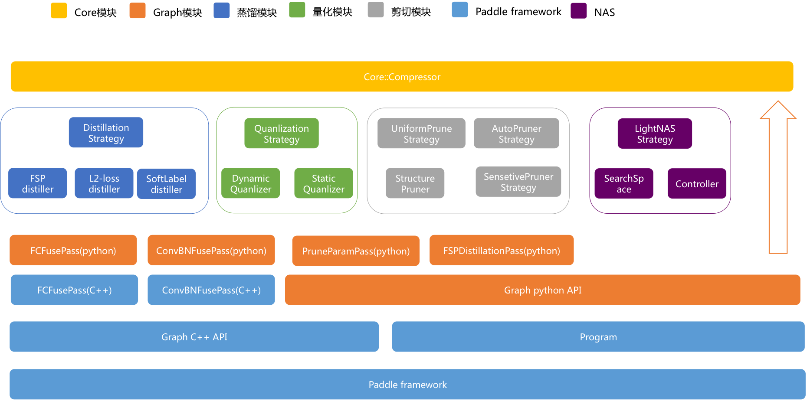
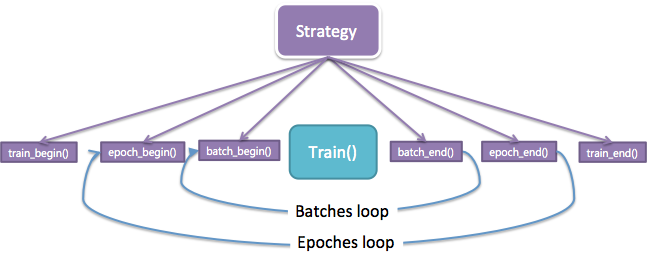

# PaddleSlim

As a submodule of PaddlePaddle framework, PaddleSlim is an open-source library for deep model compression and architecture search. PaddleSlim supports current popular deep compression techniques such as pruning, quantization, and knowledge distillation. Further, it also automates the search of hyperparameters and the design of lightweight deep architectures. In the future, we will develop more practically useful compression techniques for industrial-level applications and transfer these techniques to models in NLP.

## Outline
- Key Features
- Architecture of PaddleSlim
- Methods
- Experimental Results

## Key Features

The main key features of PaddleSlim are:

### Simple APIs

- It provides simple APIs for building and deploying lightweight and energy-efficient deep models on different platforms. Experimental hyperparameters can be set up by a simple configuration file.
- It requires just a little coding work for a model compression.

### Outstanding Performance

- For MobileNetV1 with limited redundancy, channel-based pruning can ensure lossless compression.
- Knowledge distillation can promote the performance of baseline models with a clear margin.
- Quantization after knowledge distillation can reduce model size and increase accuracy of models.

### Flexible APIs

- We automate the pruning process.
- Pruning strategy can be applied onto various deep architectures.
- We can distill multiple kinds of knowledge from teacher models to student models and self-defined losses for the corresponding knowledge distillation are supported.
- We support the deployment of multiple compression strategies.

## Architecture of PaddleSlim
To make the usage of PaddleSlim clearer and easier, we briefly introduce the background of how to implement the library.

The architecture of PaddleSlim is demonstrated in **Figure 1**. The high-level APIs often depend on several low-level APIs. We can see, knowledge distillation, quantization, and pruning are indirectly based on the Paddle framework. Currently, as a part of PaddlePaddle, user can use PaddleSlim for model compression and search after kindly download and install Paddle framework.

<p align="center">
 <br />
<strong>Figure 1</strong>
</p>

As shown in **Figure 1**, the top-level module, marked as yellow, is the API exposed to users. When we deploy compression methods in Python, we only need to construct an instance of Compressor.

We encapsulate each compression and search method to a compression strategy class. When we train the deep model to be compressed, the strategy class will be instantiated by using the configuration information registered by users, as shown in **Figure 2**. The logic of training process is encapsulated in our compression method. The jobs that users should do by themself is to define the structure of deep models, to prepare the training data, and to choose optimization strategy. This would surely help users save much effort.

<p align="center">
 <br />
<strong>Figure 2</strong>
</p>

## Methods

### Pruning

- Here, PaddleSlim supports uniform prunning, sensitivity-based prunning, and automated model pruning methods.
- PaddleSlim supports pruning of various deep architectures such as VGG, ResNet, and MobileNet.
- PaddleSlim supports self-defined range of pruning, i.e., layers to be pruned.

### Quantization

- PaddleSlim supports training-aware quantization with static and dynamic estimation of quantization hyperparameters such as scale.
  - Dynamic strategy: During inference, we quantize models with hyperparameters dynamically estimated from small batches of samples.
  - Static strategy: During inference, we quantize models with the same hyperparameters estimated from training data.
- PaddleSlim supports layer-wise and channel-wise quantization.
- PaddleSlim provides models compatible with Paddle Mobile for final inference.

### Knowledge Distillation

- **Naive knowledge distillation**: transfers dark knowledge by merging the teacher and student model into the same Program, and supports the following losses added on any paired layers between teacher and student models:
  - Flow of the solution procedure (FSP) loss;
  - L2 loss;
  - Softmax with cross-entropy loss.

- **Paddle large-scale scalable knowledge distillation framework [Pantheon](paddleslim/pantheon)**:  a universal solution for knowledge distillation, more flexible than the naive knowledge distillation,  and easier to scale to the large-scale applications.
  - Decouple the teacher and student models --- they run in different processes in the same or different nodes, and transfer knowledge via TCP/IP ports or local files;
  - Friendly to assemble multiple teacher models and each of them can work in either online or offline mode independently;
  - Merge knowledge from different teachers and make batch data for the student model automatically;
  - Support the large-scale knowledge prediction of teacher models on multiple devices.

### Lightweight Network Architecture Search (Light-NAS)

- PaddleSlim provides Simulated Annealing (SA)-based lightweight network architecture search method.
  - PaddleSlim supports distributed search.
  - PaddleSlim supports FLOPs and latency constrained search.
  - PaddleSlim supports the latency estimation on different hardware and platforms.

## Experimental Results

In this section, we will show some experimental results conducted on PaddleSlim.

### Quantization

We evaluate the quantized models on ImageNet2012. The top-5/top-1 accuracies are compared,

| Model | FP32| int8(X:abs_max, W:abs_max) | int8, (X:moving_average_abs_max, W:abs_max) |int8, (X:abs_max, W:channel_wise_abs_max) |
|:---|:---:|:---:|:---:|:---:|
|MobileNetV1|89.54%/70.91%|89.64%/71.01%|89.58%/70.86%|89.75%/71.13%|
|ResNet50|92.80%/76.35%|93.12%/76.77%|93.07%/76.65%|93.15%/76.80%|

Before and after quantization, the model sizes are,

| Model       | FP32  | int8(A:abs_max, W:abs_max) | int8, (A:moving_average_abs_max, W:abs_max) | int8, (A:abs_max, W:channel_wise_abs_max) |
| :---        | :---: | :---:                      | :---:                                       | :---:                                     |
| MobileNetV1 | 17M   | 4.8M(-71.76%)               | 4.9M(-71.18%)                                | 4.9M(-71.18%)                              |
| ResNet50    | 99M   | 26M(-73.74%)                | 27M(-72.73%)                                 | 27M(-72.73%)                               |

Note: abs_max refers to dynamic strategy; moving_average_abs_max refers to static strategy; channel_wise_abs_max refers channel-wise quantization for weights in convolutional layers.

### Pruning

Data: ImageNet2012
Baseline model: MobileNetV1
Model size: 17M
Top-5/top-1 accuracies: 89.54% / 70.91%

#### Uniform pruning

| FLOPS |model size| Decrease in accuracy (top5/top1)| Accuracy (top5/top1) |
|---|---|---|---|
| -50%|-47.0%(9.0M)|-0.41% / -1.08%|88.92% / 69.66%|
| -60%|-55.9%(7.5M)|-1.34% / -2.67%|88.22% / 68.24%|
| -70%|-65.3%(5.9M)|-2.55% / -4.34%|86.99% / 66.57%|

#### Sensitivity-based pruning

| FLOPS |精度（top5/top1）|
|---|---|
| -0%  |89.54% / 70.91% |
| -20% |90.08% / 71.48% |
| -36% |89.62% / 70.83%|
| -50% |88.77% / 69.31%|

### Knowledge distillation

Data: ImageNet2012
Baseline model: MobileNetV1

|- |Accuracy (top5/top1) |Gain in accuracy (top5/top1)|
|---|---|---|
| Train from scratch | 89.54% / 70.91%| - |
| Distilled from ResNet50 | 90.92% / 71.97%| +1.28% / +1.06%|

### Hydrid methods

Data: ImageNet2012
Baseline model: MobileNetV1

|Methods |Accuracy (top5/top1) |Model Size|
|---|---|---|
| Baseline|89.54% / 70.91%|17.0M|
| Distilled from ResNet50|90.92% / 71.97%|17.0M|
| Distilled from ResNet50 + Quantization |90.94% / 72.01%|4.8M|
| Pruning -50% FLOPS|89.13% / 69.83%|9.0M|
| Pruning -50% FLOPS + Quantization|89.11% / 69.20%|2.3M|

### Light-NAS

Data: ImageNet2012

| -                | FLOPS | Top1/Top5 accuracy | GPU cost             |
|------------------|-------|--------------------|----------------------|
| MobileNetV2      | 0%    | 71.90% / 90.55%    | -                    |
| Light-NAS-model0 | -3%   | 72.45% / 90.70%    | 1.2K GPU hours(V100) |
| Light-NAS-model1 | -17%  | 71.84% / 90.45%    | 1.2K GPU hours(V100) |

Hardware-aware latency-constrained light-NAS

| -             | Latency | Top1/Top5 accuracy | GPU cost            |
|---------------|---------|--------------------|---------------------|
| MobileNetV2   | 0%      | 71.90% / 90.55%    | -                   |
| RK3288  | -23%    | 71.97% / 90.35%    | 1.2K GPU hours(V100) |
| Android cellphone  | -20%    | 72.06% / 90.36%    | 1.2K GPU hours(V100) |
| iPhone 6s   | -17%    | 72.22% / 90.47%    | 1.2K GPU hours(V100) |


# PaddleSlim

PaddleSlim是PaddlePaddle框架的一个子模块，主要用于压缩图像领域模型。在PaddleSlim中，不仅实现了目前主流的网络剪枝、量化、蒸馏三种压缩策略，还实现了超参数搜索和小模型网络结构搜索功能。在后续版本中，会添加更多的压缩策略，以及完善对NLP领域模型的支持。

## 功能

- 模型剪裁
  - 支持通道均匀模型剪裁（uniform pruning)
  - 基于敏感度的模型剪裁
  - 基于进化算法的自动模型剪裁三种方式

- 量化训练
  - 在线量化训练（training aware）
  - 离线量化（post training）
  - 支持对权重全局量化和Channel-Wise量化

- 蒸馏

- 轻量神经网络结构自动搜索（Light-NAS）
  - 支持基于进化算法的轻量神经网络结构自动搜索（Light-NAS）
  - 支持One-Shot网络结构自动搜索（Ont-Shot-NAS）
  - 支持 FLOPS / 硬件延时约束
  - 支持多平台模型延时评估


## 安装

安装PaddleSlim前，请确认已正确安装Paddle1.6版本或更新版本。Paddle安装请参考：[Paddle安装教程](https://www.paddlepaddle.org.cn/install/quick)。


- 安装develop版本


```
git clone https://github.com/PaddlePaddle/PaddleSlim.git
cd PaddleSlim
python setup.py install
```

- 安装官方发布的最新版本

```
pip install paddleslim -i https://pypi.org/simple
```

- 安装历史版本

请点击[pypi.org](https://pypi.org/project/paddleslim/#history)查看可安装历史版本。

## 使用

- [API文档](https://paddlepaddle.github.io/PaddleSlim/)：API使用介绍，包括[蒸馏](https://paddlepaddle.github.io/PaddleSlim/api/single_distiller_api/)、[剪裁](https://paddlepaddle.github.io/PaddleSlim/api/prune_api/)、[量化](https://paddlepaddle.github.io/PaddleSlim/api/quantization_api/)和[模型结构搜索](https://paddlepaddle.github.io/PaddleSlim/api/nas_api/)。
- [示例](https://github.com/PaddlePaddle/PaddleSlim/tree/develop/demo)：基于mnist和cifar10等简单分类任务的模型压缩示例，您可以通过该部分快速体验和了解PaddleSlim的功能。
- [实践教程](https://paddlepaddle.github.io/PaddleSlim/)：经典模型的分析和压缩实验教程。
- [模型库](https://paddlepaddle.github.io/PaddleSlim/model_zoo/)：经过压缩的分类、检测、语义分割模型，包括权重文件、网络结构文件和性能数据。
- [Paddle检测库](https://github.com/PaddlePaddle/PaddleDetection/tree/master/slim)：介绍如何在检测库中使用PaddleSlim。
- [Paddle分割库](https://github.com/PaddlePaddle/PaddleSeg/tree/develop/slim)：介绍如何在分割库中使用PaddleSlim。
- [PaddleLite](https://paddlepaddle.github.io/Paddle-Lite/)：介绍如何使用预测库PaddleLite部署PaddleSlim产出的模型。

## 贡献与反馈
