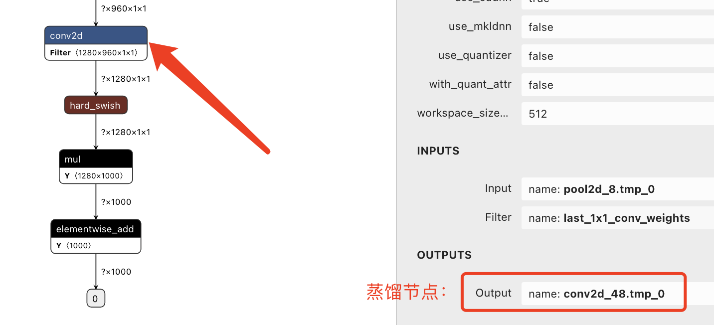

# ACT超参详细教程

## 各压缩方法超参解析

#### 配置定制量化方案

量化参数主要设置量化比特数和量化op类型，其中量化op包含卷积层（conv2d, depthwise_conv2d）和全连接层（mul, matmul_v2）。以下为只量化卷积层的示例：
```yaml
Quantization:
    use_pact: true                                # 量化训练是否使用PACT方法
    activation_bits: 8                            # 激活量化比特数
    weight_bits: 8                                # 权重量化比特数
    activation_quantize_type: 'range_abs_max'     # 激活量化方式
    weight_quantize_type: 'channel_wise_abs_max'  # 权重量化方式
    is_full_quantize: false                       # 是否全量化
    not_quant_pattern: [skip_quant]               # 跳过量化层的name_scpoe命名(保持默认即可)
    quantize_op_types: [conv2d, depthwise_conv2d] # 量化OP列表
```

#### 配置定制蒸馏策略

蒸馏参数主要设置蒸馏节点（`distill_node_pair`）和教师预测模型路径。蒸馏节点需包含教师网络节点和对应的学生网络节点，其中教师网络节点名称将在程序中自动添加 “teacher_” 前缀，如下所示：
```yaml
Distillation:
    distill_lambda: 1.0
    distill_loss: l2_loss
    distill_node_pair:
    - teacher_relu_30.tmp_0
    - relu_30.tmp_0
    merge_feed: true
    teacher_model_dir: ./inference_model
    teacher_model_filename: model.pdmodel
    teacher_params_filename: model.pdiparams
```

#### 配置定制非结构化稀疏策略

非结构化稀疏参数设置如下所示，其中参数含义详见[非结构化稀疏API文档](https://github.com/PaddlePaddle/PaddleSlim/blob/develop/docs/zh_cn/api_cn/dygraph/pruners/unstructured_pruner.rst)：
```yaml
UnstructurePrune:
    prune_strategy: gmp
    prune_mode: ratio
    pruned_ratio: 0.75
    gmp_config:
    stable_iterations: 0
    pruning_iterations: 4500
    tunning_iterations: 4500
    resume_iteration: -1
    pruning_steps: 100
    initial_ratio: 0.15
    prune_params_type: conv1x1_only
    local_sparsity: True
```

#### 配置训练超参

训练参数主要设置学习率、训练次数（epochs）和优化器等。
```yaml
TrainConfig:
  epochs: 14
  eval_iter: 400
  learning_rate: 5.0e-03
  optimizer: SGD
  optim_args:
    weight_decay: 0.0005
```

## 其他参数配置

#### 1.自动蒸馏效果不理想，怎么自主选择蒸馏节点？

首先使用[Netron工具](https://netron.app/) 可视化`model.pdmodel`模型文件，选择模型中某些层输出Tensor名称，对蒸馏节点进行配置。（一般选择Backbone或网络的输出等层进行蒸馏）

<div align="center">
    
</div>
