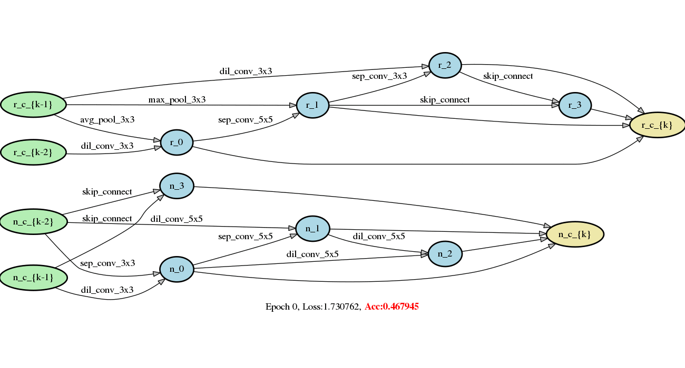

# 可微分架构搜索DARTS(Differentiable Architecture Search)方法使用示例

本示例介绍如何使用PaddlePaddle进行可微分架构搜索，可以直接使用[DARTS](https://arxiv.org/abs/1806.09055)和[PC-DARTS](https://arxiv.org/abs/1907.05737)两种方法，也支持自定义修改后使用其他可微分架构搜索算法。

本示例目录结构如下：
```
├── genotypes.py 搜索过程得到的模型结构Genotypes
│
├── model.py 对搜索得到的子网络组网
│
├── model_search.py 对搜索前的超网络组网
│
├── operations.py 用于搜索的多种运算符组合
│
├── reader.py 数据读取与增广部分
│
├── search.py 模型结构搜索入口
│
├── train.py CIFAR10数据集评估训练入口
│
├── train_imagenet.py ImageNet数据集评估训练入口
│
├── visualize.py 模型结构可视化入口

```

## 依赖项

PaddlePaddle >= 1.8.0, PaddleSlim >= 1.1.0, graphviz >= 0.11.1

## 数据集

本示例使用`CIFAR10`数据集进行架构搜索，可选择在`CIFAR10`或`ImageNet`数据集上做架构评估。
`CIFAR10`数据集可以在进行架构搜索或评估的过程中自动下载，`ImageNet`数据集需要自行下载，可参照此[教程](https://github.com/PaddlePaddle/models/tree/develop/PaddleCV/image_classification#%E6%95%B0%E6%8D%AE%E5%87%86%E5%A4%87)


## 网络结构搜索

搜索方法支持DARTS的一阶、二阶近似搜索方法和PC-DARTS的搜索方法:
``` bash
python search.py                       # DARTS一阶近似搜索方法
python search.py --unrolled=True       # DARTS的二阶近似搜索方法
python search.py --method='PC-DARTS' --batch_size=256 --learning_rate=0.1 --arch_learning_rate=6e-4 --epochs_no_archopt=15   # PC-DARTS搜索方法
```
如果您使用的是docker环境，请确保共享内存足够使用多进程的dataloader，如果碰到共享内存问题，请设置`--use_multiprocess=False`

也可以使用多卡进行模型结构搜索，以4卡为例(GPU id: 0-3), 启动命令如下:

```bash
python -m paddle.distributed.launch --selected_gpus=0,1,2,3 --log_dir ./mylog search.py --use_data_parallel 1
```

因为使用多卡训练总的BatchSize会扩大n倍，n代表卡数，为了获得与单卡相当的准确率效果，请相应的将初始学习率扩大n倍。

模型结构随搜索轮数的变化如图1所示。需要注意的是，图中准确率Acc并不代表该结构最终准确率，为了获得当前结构的最佳准确率，请对得到的genotype做网络结构评估训练。



<p align="center">
图1: 在CIFAR10数据集上进行搜索的模型结构变化，上半部分为reduction cell，下半部分为normal cell
</p>

使用三种搜索方法得到的结构Genotype已添加到了genotypes.py文件中，`DARTS_V1`、`DARTS_V2`和`PC_DARTS`分别代表使用DARTS一阶、二阶近似方法和PC-DARTS搜索方法得到的网络结构。

## 网络结构评估训练

在得到搜索结构Genotype之后，可以对其进行评估训练，从而获得它在特定数据集上的真实性能

```bash
python train.py --arch='PC_DARTS'            # 在CIFAR10数据集上对搜索到的结构评估训练
python train_imagenet.py --arch='PC_DARTS'   # 在ImageNet数据集上对搜索得到的结构评估训练
```

同样，也支持用多卡进行评估训练, 以4卡为例(GPU id: 0-3), 启动命令如下：

```bash
python -m paddle.distributed.launch --selected_gpus=0,1,2,3  --log_dir ./mylog train.py --use_data_parallel 1 --arch='DARTS_V2'
python -m paddle.distributed.launch --selected_gpus=0,1,2,3  --log_dir ./mylog train_imagenet.py --use_data_parallel 1 --arch='DARTS_V2'
```

同理，使用多卡训练总的BatchSize会扩大n倍，n代表卡数，为了获得与单卡相当的准确率效果，请相应的将初始学习率扩大n倍。

对搜索到的`DARTS_V1`、`DARTS_V2`和`PC-DARTS`做评估训练的结果如下：

| 模型结构                    | 数据集   | 准确率          |
| --------------------------- | -------- | --------------- |
| DARTS_V1                    | CIFAR10  | 97.01%          |
| DARTS（一阶搜索，论文数据） | CIFAR10  | 97.00$\pm$0.14% |
| DARTS_V2                    | CIFAR10  | 97.26%          |
| DARTS  (二阶搜索，论文数据) | CIFAR10  | 97.24$\pm$0.09% |
| DARTS_V2                    | ImageNet | 74.12%          |
| DARTS (二阶搜索，论文数据)  | ImageNet | 73.30%          |
| PC-DARTS                    | CIFAR10  | 97.41%          |
| PC-DARTS （论文数据）       | CIFAR10  | 97.43$\pm$0.07% |

## 自定义数据集与搜索空间

### 修改数据集

本示例默认使用CIFAR10数据集进行搜索，如果需要替换为其他自定义数据集只需要对reader.py进行少量代码修改：

```python
def train_search(batch_size, train_portion, is_shuffle, args):
    datasets = cifar10_reader(                                          #对此进行替换
        paddle.dataset.common.download(CIFAR10_URL, 'cifar', CIFAR10_MD5),
        'data_batch', is_shuffle, args)
```

将默认使用的`cifar10_reader`替换为特定数据集的reader即可

### 修改搜索空间

本示例提供了DARTS和PC-DARTS两种方法，定义在model_search.py中

可以直接修改model_search.py中定义的`class Network`对搜索空间进行自定义，使用paddleslim.nas.DARTSearch对该结构进行搜索

搜索结束后对model.py做相应的修改进行评估训练。


## 搜索结构可视化

使用以下命令对搜索得到的Genotype结构进行可视化观察

```python
python visualize.py PC_DARTS
```

`PC_DARTS`代表某个Genotype结构，需要预先添加到genotype.py中
