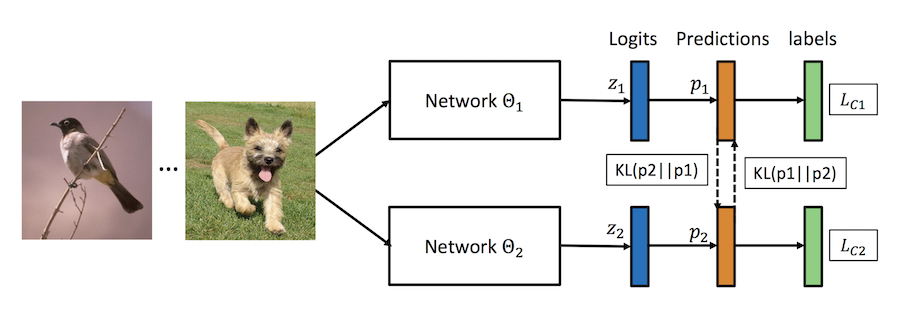

# 深度互学习DML(Deep Mutual Learning)
本示例介绍如何使用PaddleSlim的深度互学习DML方法训练模型，算法原理请参考论文 [Deep Mutual Learning](https://arxiv.org/abs/1706.00384)



## 使用数据

示例中使用cifar100数据集进行训练, 您可以在启动训练时等待自动下载，
也可以在自行下载[数据集](https://www.cs.toronto.edu/~kriz/cifar-100-python.tar.gz)之后，放在当前目录的`./dataset/cifar`路径下

## 启动命令

### 训练MobileNet-Mobilenet的组合

以0号GPU为例：

```bash
CUDA_VISIBLE_DEVICES=0 python dml_train.py
```
### 训练MobileNet-ResNet50的组合

以0号GPU为例：

```bash
CUDA_VISIBLE_DEVICES=0 python dml_train.py --models='mobilenet-resnet50'
```


## 实验结果

以下实验结果可以由默认实验配置(学习率、优化器等)训练得到，仅调整了DML训练的模型组合

如果想进一步提升实验结果可以尝试[更多优化tricks](https://arxiv.org/abs/1812.01187), 或进一步增加一次DML训练的模型数量。

| 数据集 | 网络模型 |  单独训练准确率 | 深度互学习准确率 |
| ------ | ------ | ------ | ------ |
| CIFAR100 | MobileNet X 2 | 73.65% | 76.34% (+2.69%) |
| CIFAR100 | MobileNet X 4 | 73.65% | 76.56% (+2.91%) |
| CIFAR100 | MobileNet + ResNet50 | 73.65%/76.52% | 76.00%/77.80% (+2.35%/+1.28%) |
