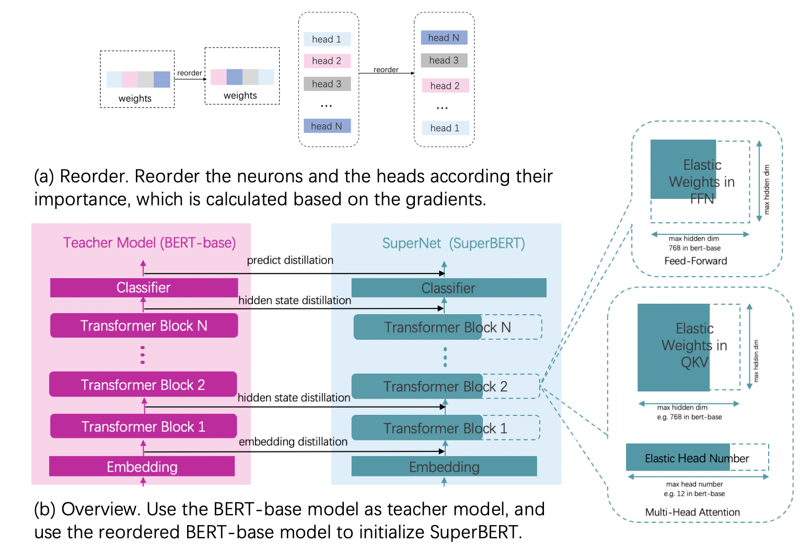

# OFA压缩PaddleNLP-BERT模型

BERT-base模型是一个迁移能力很强的通用语义表示模型，但是模型中也有一些参数冗余。本教程将介绍如何使用PaddleSlim对[PaddleNLP](https://github.com/PaddlePaddle/models/tree/develop/PaddleNLP/)中BERT-base模型进行压缩。

## 压缩结果

基于`bert-base-uncased` 在GLUE dev数据集上的finetune结果进行压缩。压缩后模型精度和压缩前模型在GLUE dev数据集上的精度对比如下表所示， 压缩后模型相比压缩前加速约2倍，模型参数大小减小26%（从110M减少到81M）。

| Task  | Metric                       | Result            | Result with PaddleSlim |
|:-----:|:----------------------------:|:-----------------:|:----------------------:|
| SST-2 | Accuracy                     |      0.93005      |       0.931193         |
| QNLI  | Accuracy                     |      0.91781      |       0.920740         |
| CoLA  | Mattehew's corr              |      0.59557      |       0.601244         |
| MRPC  | F1/Accuracy                  |  0.91667/0.88235  |   0.91740/0.88480      |
| STS-B | Person/Spearman corr         |  0.88847/0.88350  |   0.89271/0.88958      |
| QQP   | Accuracy/F1                  |  0.90581/0.87347  |   0.90994/0.87947      |
| MNLI  | Matched acc/MisMatched acc   |  0.84422/0.84825  |   0.84687/0.85242      |
| RTE   | Accuracy                     |      0.711191     |       0.718412         |

加速测试环境: T4, GPU单卡, batch_size=16, fp32
<table style="width:100%;" cellpadding="2" cellspacing="0" border="1" bordercolor="#000000">
        <tbody>
                <tr>
                        <td style="text-align:center;">
                                <span style="font-size:18px;">Batch Size</span>
                        </td>
                        <td style="text-align:center;">
                                <span style="font-size:18px;">Model</span>
                        </td>
                        <td style="text-align:center;">
                                <span style="font-size:18px;">TRT(FP16)</span>
                        </td>
                        <td style="text-align:center;">
                                <span style="font-size:18px;">Latency(ms)</span>
                        </td>
                </tr>
                <tr>
                        <td rowspan=4>**16** </td>
                        <td rowspan=2>**BERT** </td>
                        <td style="text-align:center;">
                                <span style="font-size:18px;">N</span>
                        </td>
                        <td style="text-align:center;">
                                <span style="font-size:18px;">110.71</span>
                        </td>
                </tr>
                <tr>
                        <td style="text-align:center;">
                                <span style="font-size:18px;">Y</span>
                        </td>
                        <td style="text-align:center;">
                                <span style="font-size:18px;">22.0</span>
                        </td>
                </tr>
                <tr>
                        <td rowspan=2>**Compressed BERT** </td>
                        <td style="text-align:center;">
                                <span style="font-size:18px;">N</span>
                        </td>
                        <td style="text-align:center;">
                                <span style="font-size:18px;">36.13</span>
                        </td>
                </tr>
                <tr>
                        <td style="text-align:center;">
                                <span style="font-size:18px;">Y</span>
                        </td>
                        <td style="text-align:center;">
                                <span style="font-size:18px;">9.78</span>
                        </td>
                </tr>
        </tbody>
</table>
<br />


## 快速开始
本教程示例以GLUE/SST-2 数据集为例。

### 安装PaddleNLP和Paddle
本教程基于PaddleNLP中BERT模型进行压缩，依赖PaddleNLP2.0beta及之后版本和Paddle2.0rc1及之后版本。

```shell
pip install paddlenlp
pip install paddlepaddle_gpu>=2.0rc1
```

### Fine-tuing
首先需要对Pretrain-Model在实际的下游任务上进行Fine-tuning，得到需要压缩的模型。Fine-tuning流程参考[Fine-tuning教程](https://github.com/PaddlePaddle/models/tree/develop/PaddleNLP/examples/bert)
Fine-tuning 在dev上的结果如压缩结果表格中Result那一列所示。

### 压缩训练

```python
python -u ./run_glue_ofa.py --model_type bert \
          --model_name_or_path ${task_pretrained_model_dir} \
          --task_name $TASK_NAME --max_seq_length 128     \
          --batch_size 32       \
          --learning_rate 2e-5     \
          --num_train_epochs 6     \
          --logging_steps 10     \
          --save_steps 100     \
          --output_dir ./tmp/$TASK_NAME \
          --n_gpu 1 \
          --width_mult_list 1.0 0.8333333333333334 0.6666666666666666 0.5
```
其中参数释义如下：
- `model_type` 指示了模型类型，当前仅支持BERT模型。
- `model_name_or_path` 指示了某种特定配置的模型，对应有其预训练模型和预训练时使用的 tokenizer。若模型相关内容保存在本地，这里也可以提供相应目录地址。
- `task_name` 表示 Fine-tuning 的任务。
- `max_seq_length` 表示最大句子长度，超过该长度将被截断。
- `batch_size` 表示每次迭代**每张卡**上的样本数目。
- `learning_rate` 表示基础学习率大小，将于learning rate scheduler产生的值相乘作为当前学习率。
- `num_train_epochs` 表示训练轮数。
- `logging_steps` 表示日志打印间隔。
- `save_steps` 表示模型保存及评估间隔。
- `output_dir` 表示模型保存路径。
- `n_gpu` 表示使用的 GPU 卡数。若希望使用多卡训练，将其设置为指定数目即可；若为0，则使用CPU。
- `width_mult_list` 表示压缩训练过程中，对每层Transformer Block的宽度选择的范围。

压缩训练之后在dev上的结果如压缩结果表格中Result with PaddleSlim那一列所示，速度相比原始模型加速2倍。

## OFA接口介绍
TODO

## 原理介绍

1. 对Fine-tuning得到模型通过计算参数及其梯度的乘积得到参数的重要性，把模型参数根据重要性进行重排序。
2. 超网络中最大的子网络选择和Bert-base模型网络结构一致的网络结构，其他小的子网络是对最大网络的进行不同的宽度选择来得到的，宽度选择
具体指的是网络中的参数进行裁剪，所有子网络在整个训练过程中都是参数共享的。
2. 用重排序之后的模型参数作为超网络模型的初始化参数。
3. Fine-tuning之后的模型作为教师网络，超网络作为学生网络，进行知识蒸馏。

<p align="center">
<br />
整体流程图
</p>
