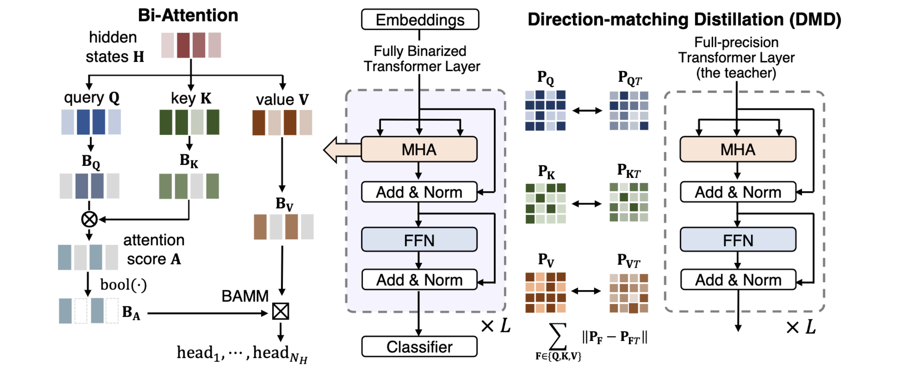

## BiBERT: Accurate Fully Binarized BERT

Created by [Haotong Qin](https://htqin.github.io/), [Yifu Ding](https://yifu-ding.github.io/), [Mingyuan Zhang](https://scholar.google.com/citations?user=2QLD4fAAAAAJ&hl=en), Qinghua Yan, [Aishan Liu](https://liuaishan.github.io/), Qingqing Dang, [Ziwei Liu](https://liuziwei7.github.io/), and [Xianglong Liu](https://xlliu-beihang.github.io/) from Beihang University, Nanyang Technological University, and Baidu Inc.



## Introduction

This project is the official implementation of our accepted ICLR 2022 paper *BiBERT: Accurate Fully Binarized BERT* [[PDF](https://openreview.net/forum?id=5xEgrl_5FAJ)]. The large pre-trained BERT has achieved remarkable performance on Natural Language Processing (NLP) tasks but is also computation and memory expensive. As one of the powerful compression approaches, binarization extremely reduces the computation and memory consumption by utilizing 1-bit parameters and bitwise operations. Unfortunately, the full binarization of BERT (i.e., 1-bit weight, embedding, and activation) usually suffer a significant performance drop, and there is rare study addressing this problem. In this paper, with the theoretical justification and empirical analysis, we identify that the severe performance drop can be mainly attributed to the information degradation and optimization direction mismatch respectively in the forward and backward propagation, and propose BiBERT, an accurate fully binarized BERT, to eliminate the performance bottlenecks. Specifically, BiBERT introduces an efficient Bi-Attention structure for maximizing representation information statistically and a Direction-Matching Distillation (DMD) scheme to optimize the full binarized BERT accurately. Extensive experiments show that BiBERT outperforms both the straightforward baseline and existing state-of-the-art quantized BERTs with ultra-low bit activations by convincing margins on the NLP benchmark. As the first fully binarized BERT, our method yields impressive $59.2\times$ and $31.2\times$ saving on FLOPs and model size, demonstrating the vast advantages and potential of the fully binarized BERT model in real-world resource-constrained scenarios.

## Quick start

This tutorial uses the GLUE/SST-2 dataset as an example to perform 1-bit quantization on the BERT model in PaddleNLP.

### Install PaddleNLP 和 Paddle

```shell
pip install paddlenlp
pip install paddlepaddle_gpu
```

### Acquisition of data and training models

When running the experiments in this directory, the dataset and the pretrained model will be automatically downloaded to the path of `paddlenlp.utils.env.DATA_HOME`. For example, under the Linux system, for the SST-2 dataset in GLUE, the default storage path is `~/.paddlenlp/datasets/Glue/SST-2`.

### Fine-tune the pretrained model

Following [GLUE](https://github.com/PaddlePaddle/PaddleNLP/tree/develop/examples/benchmark/glue/run_glue.py), the pre-trained model can be fine-tuned to obtain a full-precision teacher model

```shell
export TASK_NAME=SST-2
export LOG_FILENAME=$(date "+%Y-%m-%d-%H-%M-%S")

python -u ./run_glue.py \
    --model_type bert \
    --model_name_or_path bert-base-uncased \
    --task_name $TASK_NAME \
    --max_seq_length 128 \
    --batch_size 32   \
    --learning_rate 2e-5 \
    --num_train_epochs 3 \
    --logging_steps 1 \
    --save_steps 500 \
    --output_dir ./tmp/$TASK_NAME/ \
    --device gpu 2>&1 | tee ${LOG_FILENAME}.log
```

### Train a binarized model

```shell
export TASK_NAME=SST-2
export TEACHER_PATH=./tmp/SST-2/sst-2_ft_model_6315.pdparams.pdparams
export LOG_FILENAME=$(date "+%Y-%m-%d-%H-%M-%S")

python my_task_distill.py \
    --model_type bert \
    --student_model_name_or_path $TEACHER_PATH \
    --seed 1000000007 \
    --weight_decay 0.01 \
    --task_name $TASK_NAME \
    --max_seq_length 64 \
    --batch_size 16 \
    --teacher_model_type bert \
    --teacher_path $TEACHER_PATH \
    --learning_rate 1e-4 \
    --num_train_epochs 10 \
    --logging_steps 10 \
    --save_steps 10 \
    --output_dir ./tmp/$TASK_NAME/ \
    --device gpu \
    --pred_distill \
    --query_distill \
    --key_distill \
    --value_distill \
    --intermediate_distill \
    --bi 2>&1 | tee ${LOG_FILENAME}.log
```

Besides, parameters `pred_distill`, `query_distill`, `key_distill`, `value_distill` `intermediate_distill` are used for distillation configuration, and parameter `bi` is used to binarize the model.

## Acknowledgement

The original code is borrowed from [TinyBERT](https://github.com/PaddlePaddle/PaddleNLP/tree/develop/examples/model_compression/tinybert).

## Citation

If you find our work useful in your research, please consider citing:

```shell
@inproceedings{Qin:iclr22,
  author    = {Haotong Qin and Yifu Ding and Mingyuan Zhang and Qinghua Yan and 
  Aishan Liu and Qingqing Dang and Ziwei Liu and Xianglong Liu},
  title     = {BiBERT: Accurate Fully Binarized BERT},
  booktitle = {International Conference on Learning Representations (ICLR)},
  year      = {2022}
}
```

