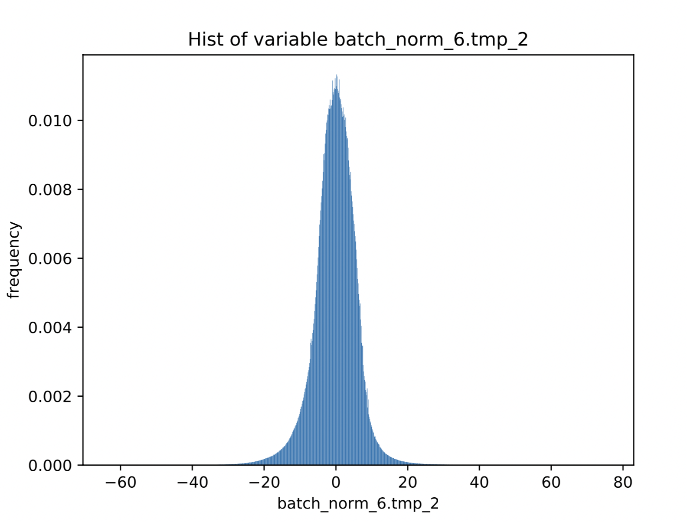

# 自定义量化方法使用示例

本示例介绍如何使用自定义量化方法，以PACT方法为例，量化训练好的分类模型MobileNetV3, 可以减少模型的存储空间和显存占用。

## 方法介绍
PACT(Parameterized Clipping Activation for Quantized Neural Networks)[论文地址](https://arxiv.org/abs/1805.06085)提出了在量化激活值之前去掉一些离群点来使量化精度提高。论文中给的PACT的公式是：

<p align="center">
 <br />
</p>

因为论文中的思想是将PACT公式代替ReLU激活函数，但是在实际使用中，将要进行量化的激活值不一定来自ReLU激活函数，有可能是其他函数，也有可能是来自elementwise op等，所以本demo中的方法是在激活值和量化op之间加入改进后的PACT方法，公式如下：

<p align="center">
 <br />
</p>


改进的原因是要量化的激活值不一定都是大于0，而量化时寻找的时激活值的最大值，所以小于0的值也要进行约束。

### 定义PACT函数

自定义量化方法支持对激活值或者权重定义预处理方式，同时也支持自定义量化方法。在 `quant_aware` 接口中，相关参数以及意义如下：

- `weight_quantize_func`: 自定义对权重量化的函数，该函数的输入是待量化的权重，输出是反量化之后的权重，可以快速验证此量化函数是否有效。此参数设置后，将会替代量化配置中 `weight_quantize_type` 定义的方法，如果此参数不设置，将继续使用 `weight_quantize_type` 定义的方法。
- `act_quantize_func`: 自定义对激活量化的函数，该函数的输入是待量化的激活，输出是反量化之后的激活，可以快速验证此量化函数是否有效。将会替代量化配置中 `activation_quantize_type` 定义的方法，如果此参数不设置，将继续使用 `activation_quantize_type` 定义的方法。

- `weight_preprocess_func` : 自定义在对权重做量化之前，对权重进行处理的函数。此方法的意义在于网络中的参数不一定适合于直接量化，如果对参数分布先进行处理再进行量化，或许可以提高量化精度。

- `act_preprocess_func` : 自定义在对激活做量化之前，对激活进行处理的函数。此方法的意义在于网络中的激活值不一定适合于直接量化，如果对激活值先进行处理再进行量化，或许可以提高量化精度。

- `optimizer_func` : 该参数是一个返回optimizer的函数。定义的optimizer函数将用于定义上述自定义函数中的参数的优化参数。

PACT方法属于自定义 `act_preprocess_func`, 输入是将要量化的激活值。

可如下定义：

```
import paddle
from paddle.fluid.layer_helper import LayerHelper

def pact(x):
    helper = LayerHelper("pact", **locals())
    dtype = 'float32'
    # 定义PACT初始阈值
    init_thres = 20
    u_param_attr = paddle.ParamAttr(
        name=x.name + '_pact',
        initializer=paddle.nn.initializer.Constant(value=init_thres),
        regularizer=paddle.regularizer.L2Decay(0.0001),
        learning_rate=1)
    u_param = helper.create_parameter(
        attr=u_param_attr, shape=[1], dtype=dtype)

    part_a = paddle.nn.functional.relu(x - u_param)
    part_b = paddle.nn.functional.relu(-u_param - x)
    x = x - part_a + part_b
    return x


```

函数中可以定义初始阈值，和初始阈值的l2正则项系数，在训练过程中可根据梯度传播训练阈值为一个合适的值。

优化器函数如下:

```
def get_optimizer():
    return paddle.optimizer.Momentum(args.lr, 0.9)
```
因为除了PACT阈值以外，其他参数都是训练好的，因此在训练时可以将PACT中阈值的学习率调大一些。

> 注意，因为PACT只是在量化时去掉了离群点，影响了量化scale的选择，因此使用PACT训练后，可以用普通量化的方法加载参数进行测试，是一个不影响预测的方法。

## MobileNetV3的量化训练流程

### 准备数据

在``demo``文件夹下创建``data``文件夹，将``ImageNet``数据集解压在``data``文件夹下，解压后``data/ILSVRC2012``文件夹下应包含以下文件：
- ``'train'``文件夹，训练图片
- ``'train_list.txt'``文件
- ``'val'``文件夹，验证图片
- ``'val_list.txt'``文件

### 准备需要量化的模型

我们将使用飞桨分类库[PaddleClas](https://github.com/PaddlePaddle/PaddleClas)中给出的MobileNetV3精度最高的模型进行量化。量化前精度top-1为78.9%.

```
mkdir pretrain
cd pretrain
wget https://paddle-imagenet-models-name.bj.bcebos.com/MobileNetV3_large_x1_0_ssld_pretrained.tar
tar xf MobileNetV3_large_x1_0_ssld_pretrained.tar
cd ..
```

使用该模型的原因是因为MobileNetV3这个使用ssld蒸馏之后的模型，激活值存在很多离群点，可有效地验证PACT的效果。下面的图是MobileNetV3的其中一个中间激活值分布的直方图:

<p align="center">
 <br />
</p>
图中直方图的横坐标的范围是激活值分布的最小值和最大值，从图中可以看出，最小值在-60左右，最大值在80左右，但是主要分布在-20到20之间。


### 开启 `image` 的梯度

因为目前实现的原因，需要将 `image` 的梯度开启。

```
image.stop_gradient = False
```

### 配置量化参数

```
quant_config = {
    'weight_quantize_type': 'channel_wise_abs_max',
    'activation_quantize_type': 'moving_average_abs_max',
    'weight_bits': 8,
    'activation_bits': 8,
    'quantize_op_types': ['conv2d', 'depthwise_conv2d', 'mul'],
    'dtype': 'int8',
    'window_size': 10000,
    'moving_rate': 0.9
}
```

### 对训练和测试program插入可训练量化op

普通量化：
```
val_program = quant_aware(val_program, place, quant_config, scope=None, for_test=True)

compiled_train_prog = quant_aware(train_prog, place, quant_config, scope=None, for_test=False)
```

使用PACT的量化：
```
val_program = quant_aware(val_program, place, quant_config, scope=None, act_preprocess_func=pact, executor=exe, for_test=True)

compiled_train_prog = quant_aware(train_prog, place, quant_config, scope=None, act_preprocess_func=pact, optimizer_func=get_optimizer,  executor=exe, for_test=False)
```

### 关掉指定build策略

```
build_strategy = paddle.static.BuildStrategy()
build_strategy.fuse_all_reduce_ops = False
build_strategy.sync_batch_norm = False
exec_strategy = paddle.static.ExecutionStrategy()
compiled_train_prog = compiled_train_prog.with_data_parallel(
        loss_name=avg_cost.name,
        build_strategy=build_strategy,
        exec_strategy=exec_strategy)
```


### 训练命令

普通量化：
```
python train.py --model MobileNetV3_large_x1_0 --pretrained_model ./pretrain/MobileNetV3_large_x1_0_ssld_pretrained --num_epochs 30 --lr 0.0001 --use_pact False

```

输出结果为:
```
2020-06-05 15:14:15,319-INFO: epoch[0]-batch[10] - loss: 2.50413322449; acc_top1: 0.515625; acc_top5: 0.75; time: 1.29066705704
2020-06-05 15:14:28,950-INFO: epoch[0]-batch[20] - loss: 3.14219880104; acc_top1: 0.3828125; acc_top5: 0.62890625; time: 1.29546618462
2020-06-05 15:14:42,479-INFO: epoch[0]-batch[30] - loss: 3.34660744667; acc_top1: 0.3671875; acc_top5: 0.609375; time: 1.20717287064
2020-06-05 15:14:56,196-INFO: epoch[0]-batch[40] - loss: 3.69098854065; acc_top1: 0.2890625; acc_top5: 0.5546875; time: 1.29232215881
2020-06-05 15:15:09,815-INFO: epoch[0]-batch[50] - loss: 3.5337202549; acc_top1: 0.30078125; acc_top5: 0.5546875; time: 1.34358000755
2020-06-05 15:15:23,550-INFO: epoch[0]-batch[60] - loss: 3.22006082535; acc_top1: 0.359375; acc_top5: 0.609375; time: 1.34181118011
2020-06-05 15:15:37,425-INFO: epoch[0]-batch[70] - loss: 3.06894540787; acc_top1: 0.4375; acc_top5: 0.65625; time: 1.33122491837
2020-06-05 15:15:51,161-INFO: epoch[0]-batch[80] - loss: 3.00548839569; acc_top1: 0.3828125; acc_top5: 0.6328125; time: 1.27601099014
2020-06-05 15:16:05,158-INFO: epoch[0]-batch[90] - loss: 2.52197813988; acc_top1: 0.484375; acc_top5: 0.71484375; time: 1.28280210495
```
可以看到普通量化loss不稳定，而且在实验进行到2个epoch时，loss会变为nan。普通量化很不稳定

使用PACT量化训练
```
# 先分析MobileNetV3模型激活值分布，来初始化PACT截断阈值
python train.py --analysis=True
# 启动PACT量化训练
python train.py
```

输出结果为
```
2020-06-05 15:25:37,647-INFO: epoch[0]-batch[10] - loss: 1.60160636902; acc_top1: 0.65625; acc_top5: 0.890625; time: 1.56788897514
2020-06-05 15:25:53,191-INFO: epoch[0]-batch[20] - loss: 1.4748904705; acc_top1: 0.6484375; acc_top5: 0.84375; time: 1.4936029911
2020-06-05 15:26:08,598-INFO: epoch[0]-batch[30] - loss: 1.427333951; acc_top1: 0.6953125; acc_top5: 0.875; time: 1.51066279411
2020-06-05 15:26:24,009-INFO: epoch[0]-batch[40] - loss: 1.43955898285; acc_top1: 0.6640625; acc_top5: 0.8671875; time: 1.49221611023
2020-06-05 15:26:39,501-INFO: epoch[0]-batch[50] - loss: 1.29342699051; acc_top1: 0.6953125; acc_top5: 0.90625; time: 1.50851297379
2020-06-05 15:26:54,927-INFO: epoch[0]-batch[60] - loss: 1.49478590488; acc_top1: 0.6171875; acc_top5: 0.875; time: 1.50131177902
2020-06-05 15:27:10,250-INFO: epoch[0]-batch[70] - loss: 1.34970903397; acc_top1: 0.7109375; acc_top5: 0.890625; time: 1.51333618164
2020-06-05 15:27:25,309-INFO: epoch[0]-batch[80] - loss: 1.51600492001; acc_top1: 0.6796875; acc_top5: 0.859375; time: 1.44952607155
2020-06-05 15:27:40,273-INFO: epoch[0]-batch[90] - loss: 1.5926772356; acc_top1: 0.6328125; acc_top5: 0.859375; time: 1.45620679855
2020-06-05 15:27:55,660-INFO: epoch[0]-batch[100] - loss: 1.40280032158; acc_top1: 0.671875; acc_top5: 0.875; time: 1.50846099854
```
可以看出loss值比较稳定，并且我们在实验时，可以得到top-1 77.5%的量化模型。除了上述命令中的配置外，还要设置为 `pact` 初始阈值为20。量化模型可点击[下载链接](https://paddlemodels.bj.bcebos.com/PaddleSlim/mobilenetv3_pact_quant.tar)。
