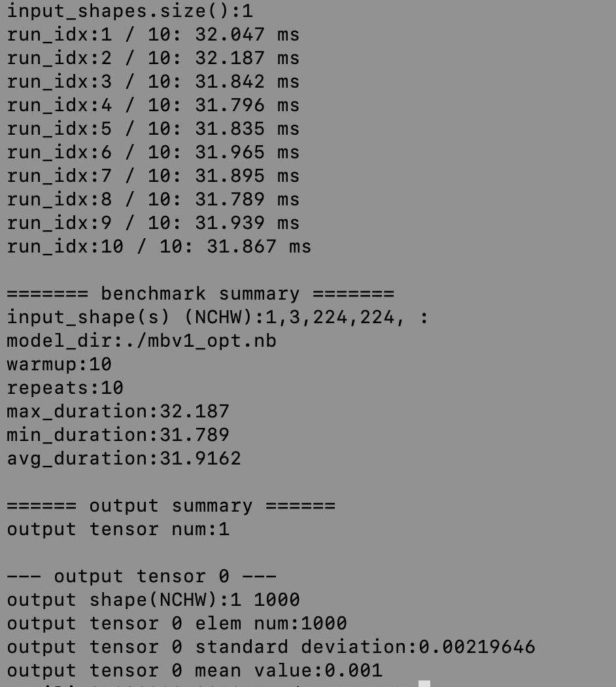
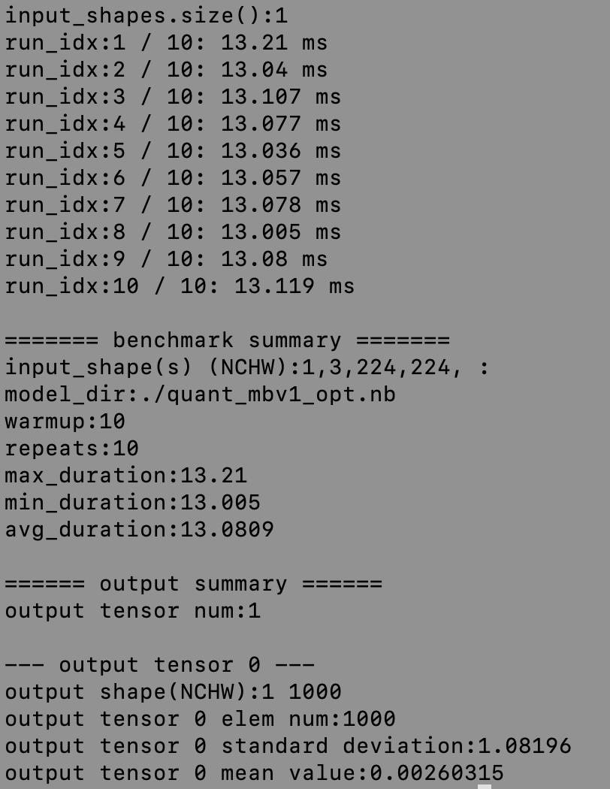

# 端侧部署

本教程以图像分类模型为例，介绍基于[Paddle Lite](https://github.com/PaddlePaddle/Paddle-Lite) 在移动端部署经过PaddleSlim压缩后的分类模型的详细步骤。

Paddle Lite是飞桨轻量化推理引擎，为手机、IOT端提供高效推理能力，并广泛整合跨平台硬件，为端侧部署及应用落地问题提供轻量化的部署方案。


## 1. 准备环境

该节主要介绍如何准备部署环境。

### 1.1 运行准备
- 电脑（编译Paddle Lite）
- 安卓手机（armv7或armv8）

### 1.2 准备交叉编译环境
交叉编译环境用于编译 Paddle Lite的C++ demo。
支持多种开发环境，不同开发环境的编译流程请参考对应文档。

1. [Docker](https://paddle-lite.readthedocs.io/zh/latest/source_compile/compile_env.html#docker)
2. [Linux](https://paddle-lite.readthedocs.io/zh/latest/source_compile/compile_env.html#linux)
3. [MAC OS](https://paddle-lite.readthedocs.io/zh/latest/source_compile/compile_env.html#mac-os)

### 1.3 准备预测库

编译Paddle-Lite得到预测库，Paddle-Lite的编译方式如下：
```
git clone https://github.com/PaddlePaddle/Paddle-Lite.git
cd Paddle-Lite
# 切换到Paddle-Lite 稳定分支，这里以release/v2.8为例
git checkout release/v2.8
./lite/tools/build_android.sh  --arch=armv8  --with_cv=ON

```
注意：编译Paddle-Lite获得预测库时，需要打开`--with_cv=ON --with_extra=ON`两个选项，`--arch`表示`arm`版本，这里指定为armv8，
更多编译命令介绍请参考[链接](https://paddle-lite.readthedocs.io/zh/latest/source_compile/compile_andriod.html)。
预测库的文件目录如下：
```
inference_lite_lib.android.armv8/
|-- cxx                                        C++ 预测库和头文件
|   |-- include                                C++ 头文件
|   |   |-- paddle_api.h
|   |   |-- paddle_image_preprocess.h
|   |   |-- paddle_lite_factory_helper.h
|   |   |-- paddle_place.h
|   |   |-- paddle_use_kernels.h
|   |   |-- paddle_use_ops.h
|   |   `-- paddle_use_passes.h
|   `-- lib                                           C++预测库
|       |-- libpaddle_api_light_bundled.a             C++静态库
|       `-- libpaddle_light_api_shared.so             C++动态库
|-- java                                     Java预测库
|   |-- jar
|   |   `-- PaddlePredictor.jar
|   |-- so
|   |   `-- libpaddle_lite_jni.so
|   `-- src
|-- demo                                     C++和Java示例代码
|   |-- cxx                                  C++  预测库demo
|   `-- java                                 Java 预测库demo
```

## 2. 模型准备

该节主要介绍如何准备Paddle-Lite的模型转换工具以及如何利用模型转换工具将模型转化为部署所需要的.nb文件。

### 2.1 准备模型转换工具

Paddle-Lite 提供了多种策略来自动优化原始的模型，其中包括量化、子图融合、混合调度、Kernel优选等方法，使用Paddle-lite的opt工具可以自动
对inference模型进行优化，优化后的模型更轻量，模型运行速度更快。

如果已经准备好了 `.nb` 结尾的模型文件，可以跳过此步骤。

模型优化需要Paddle-Lite的opt可执行文件，可以通过编译Paddle-Lite源码获得，编译步骤如下：
```
# 如果准备环境时已经clone了Paddle-Lite，则不用重新clone Paddle-Lite
git clone https://github.com/PaddlePaddle/Paddle-Lite.git
cd Paddle-Lite
git checkout release/v2.8
# 启动编译
./lite/tools/build.sh build_optimize_tool
```

编译完成后，opt文件位于`build.opt/lite/api/`下，可通过如下方式查看opt的运行选项和使用方式；
```
cd build.opt/lite/api/
./opt
```

|选项|说明|
|-|-|
|--model_dir |待优化的PaddlePaddle模型（非combined形式）的路径|
|--model_file |待优化的PaddlePaddle模型（combined形式）的网络结构文件路径|
|--param_file |待优化的PaddlePaddle模型（combined形式）的权重文件路径|
|--optimize_out_type |输出模型类型，目前支持两种类型：protobuf和naive_buffer，其中naive_buffer是一种更轻量级的序列化/反序列化实现。若您需要在mobile端执行模型预测，请将此选项设置为naive_buffer。默认为protobuf|
|--optimize_out |优化模型的输出路径|
|--valid_targets |指定模型可执行的backend，默认为arm。目前可支持x86、arm、opencl、npu、xpu，可以同时指定多个backend(以空格分隔)，Model Optimize Tool将会自动选择最佳方式。如果需要支持华为NPU（Kirin 810/990 Soc搭载的达芬奇架构NPU），应当设置为npu, arm|
|--record_tailoring_info|当使用 根据模型裁剪库文件 功能时，则设置该选项为true，以记录优化后模型含有的kernel和OP信息，默认为false|

`--model_dir`适用于待优化的模型是非combined方式，`--model_file`与`--param_file`用于待优化的combined模型，即模型结构和模型参数使用单独一个文件存储。通过[paddle.jit.save](https://www.paddlepaddle.org.cn/documentation/docs/zh/2.0-rc1/api/paddle/fluid/dygraph/jit/save_cn.html)保存的模型均为combined模型。

一般来讲，通过剪枝、蒸馏、NAS方法压缩得到的模型，和通用模型PaddleLite部署、模型转换步骤相同，下面以MobileNetv1的原始模型和经过PaddleSlim量化后的模型为例。

### 2.2 转换模型

#### 转换原始模型
```
wget https://paddle-inference-dist.bj.bcebos.com/PaddleLite/benchmark_0/benchmark_models.tgz && tar xf benchmark_models.tgz
./opt --model_dir=./benchmark_models/mobilenetv1 --optimize_out_type=naive_buffer --optimize_out=./mbv1_opt --valid_targets=arm
```

#### 转换量化模型
```
wget  https://paddlemodels.bj.bcebos.com/PaddleSlim/MobileNetV1_quant_aware.tar && tar xf MobileNetV1_quant_aware.tar
./opt --model_file=./MobileNetV1_quant_aware/model --param_file=./MobileNetV1_quant_aware/params --optimize_out_type=naive_buffer --optimize_out=./quant_mbv1_opt --valid_targets=arm
```

转换成功后，当前目录下会多出`.nb`结尾的文件，即是转换成功的模型文件。

注意：使用paddle-lite部署时，需要使用opt工具优化后的模型。 opt 工具的输入模型是paddle保存的inference模型

## 3. 运行模型

首先需要进行一些准备工作。
 1. 准备一台arm8的安卓手机，如果编译的预测库和opt文件是armv7，则需要arm7的手机，并修改Makefile中`ARM_ABI = arm7`。
 2. 打开手机的USB调试选项，选择文件传输模式，连接电脑。
 3. 电脑上安装adb工具，用于调试。 adb安装方式如下：

    3.1. MAC电脑安装ADB:
    ```
    brew cask install android-platform-tools
    ```
    3.2. Linux安装ADB
    ```
    sudo apt update
    sudo apt install -y wget adb
    ```
    3.3. Window安装ADB

    win上安装需要去谷歌的安卓平台下载adb软件包进行安装：[链接](https://developer.android.com/studio)

    打开终端，手机连接电脑，在终端中输入
    ```
    adb devices
    ```
    如果有device输出，则表示安装成功。
    ```
       List of devices attached
       744be294    device
    ```

 4. 准备优化后的模型、预测库文件
    ```
    # 创建临时目录
    mkdir /{user path}/temp
    cd /{lite repo path}/build.lite.android.armv8.gcc/inference_lite_lib.android.armv8/demo/cxx/mobile_light/
    # 编译部署程序
    make
    # 将部署程序拷贝到之前创建的临时目录
    cp mobilenetv1_light_api /{user path}/temp
    # 将链接文件拷贝到临时目录
    cp ../../../cxx/lib/libpaddle_light_api_shared.so /{user path}/temp
    ```

    将之前生成的模型文件：`mbv1_opt.nb`, `quant_mbv1_opt.nb` 同样拷贝到/{user path}/temp目录下。

 5. 启动调试

    上述步骤完成后就可以使用adb将文件push到手机上运行，步骤如下：

    ```
    # 进入/{user path}/temp
    cd /{user path}/temp
    # 将模型文件push到手机上
    adb push mbv1_opt.nb /data/local/tmp
    adb push quant_mbv1_opt.nb /data/local/tmp
    # 将部署文件和链接文件push到手机上
    adb push libpaddle_light_api_shared.so /data/local/tmp
    adb push mobilenetv1_light_api /data/local/tmp
    # 执行原始MobileNetV1模型
    adb shell 'cd /data/local/tmp && export LD_LIBRARY_PATH=$LD_LIBRARY_PATH:/data/local/tmp && ./mobilenetv1_light_api ./mbv1_opt.nb'
    # 执行原始MobileNetV1模型
    adb shell 'cd /data/local/tmp && export LD_LIBRARY_PATH=$LD_LIBRARY_PATH:/data/local/tmp && ./mobilenetv1_light_api ./quant_mbv1_opt.nb'
    ```

    如果对代码做了修改，则需要重新编译并push到手机上。

    运行效果如下：
    原始模型/量化模型：
    <div align="center">
        
        
    </div>
