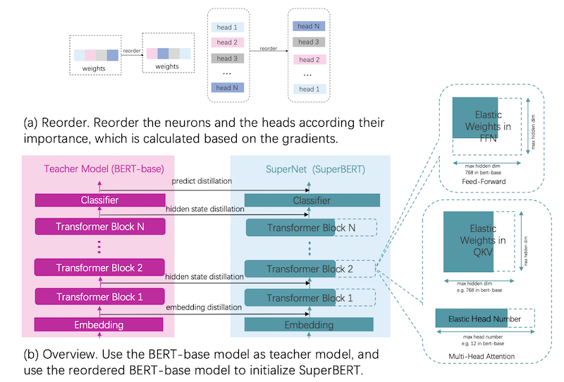

# BERT模型压缩教程

1. 本教程是对BERT模型进行压缩的原理介绍。并以PaddleNLP repo中BERT-base模型为例，说明如何快速把整体压缩流程迁移到其他NLP模型。

2. 本教程使用的是[DynaBERT-Dynamic BERT with Adaptive Width and Depth](https://arxiv.org/abs/2004.04037)中的训练策略。把原始模型作为超网络中最大的子模型，原始模型包括多个相同大小的Transformer Block。在每次训练前会选择当前轮次要训练的子模型，每个子模型包含多个相同大小的Sub Transformer Block，每个Sub Transformer Block是选择不同宽度的Transformer Block得到的，一个Transformer Block包含一个Multi-Head Attention和一个Feed-Forward Network，Sub Transformer Block获得方式为：<br/>
&emsp;&emsp;a. 一个Multi-Head Attention层中有多个Head，每次选择不同宽度的子模型时，会同时对Head数量进行等比例减少，例如：如果原始模型中有12个Head，本次训练选择的模型是宽度为原始宽度75%的子模型，则本次训练中所有Transformer Block的Head数量为9。<br/>
&emsp;&emsp;b. Feed-Forward Network层中Linear的参数大小进行等比例减少，例如：如果原始模型中FFN层的特征维度为3072，本次训练选择的模型是宽度为原始宽度75%的子模型，则本次训练中所有Transformer Block中FFN层的特征维度为2304。

## 整体原理介绍
1. 首先对预训练模型的参数和head根据其重要性进行重排序，把重要的参数和head排在参数的前侧，保证训练过程中的参数裁剪不会裁剪掉这些重要的参数。参数的重要性计算是先使用dev数据计算一遍每个参数的梯度，然后根据梯度和参数的整体大小来计算当前参数的重要性，head的的重要性计算是通过传入一个全1的对head的mask，并计算这个mask的梯度，根据mask的梯度来判断每个Multi-Head Attention层中每个Head的重要性。
2. 使用原本的预训练模型作为蒸馏过程中的教师网络。同时定义一个超网络，这个超网络中最大的子网络的结构和教师网络的结构相同其他小的子网络是对最大网络的进行不同的宽度选择来得到的，宽度选择具体指的是网络中的参数进行裁剪，所有子网络在整个训练过程中都是参数共享的。
3. 使用重排序之后的预训练模型参数初始化超网络，并把这个超网络作为学生网络。分别为embedding层，每个transformer block层和最后的logit添加蒸馏损失。
4. 每个batch数据在训练前首先中会选择当前要训练的子网络配置（子网络配置目前仅包括对整个模型的宽度的选择），参数更新时仅会更新当前子网络计算中用到的那部分参数。
5. 通过以上的方式来优化整个超网络参数，训练完成后选择满足加速要求和精度要求的子模型。


<center>整体流程</center>


## 基于PaddleNLP repo代码进行压缩
本教程基于PaddleSlim2.0及之后版本、Paddle2.0rc1及之后版本和PaddleNLP2.0beta及之后版本，请确认已正确安装Paddle、PaddleSlim和PaddleNLP。
基于PaddleNLP repo中BERT-base的整体代码示例请参考：[BERT-base](https://github.com/PaddlePaddle/PaddleSlim/blob/develop/demo/ofa/bert/README.md)

### 1. 定义初始网络
定义原始BERT-base模型并定义一个字典保存原始模型参数。普通模型转换为超网络之后，由于其组网OP的改变导致原始模型加载的参数失效，所以需要定义一个字典保存原始模型的参数并用来初始化超网络。
```python
model = BertForSequenceClassification.from_pretrained('bert', num_classes=2)
origin_weights = {}
for name, param in model.named_parameters():
    origin_weights[name] = param
```

### 2. 构建超网络
定义搜索空间，并根据搜索空间把普通网络转换为超网络。
```python
# 定义搜索空间
sp_config = supernet(expand_ratio=[0.25, 0.5, 0.75, 1.0])
# 转换模型为超网络
model = Convert(sp_config).convert(model)
paddleslim.nas.ofa.utils.set_state_dict(model, origin_weights)
```

### 3. 定义教师网络
调用paddlenlp中的接口直接构造教师网络。
```python
teacher_model = BertForSequenceClassification.from_pretrained('bert', num_classes=2)
```

### 4. 配置蒸馏相关参数
需要配置的参数包括教师模型实例；需要添加蒸馏的层，在教师网络和学生网络的Embedding层和每一个Tranformer Block层之间添加蒸馏损失，中间层的蒸馏损失使用默认的MSE损失函数；配置'lambda_distill'参数表示整体蒸馏损失的缩放比例。
```python
mapping_layers = ['bert.embeddings']
for idx in range(model.bert.config['num_hidden_layers']):
    mapping_layers.append('bert.encoder.layers.{}'.format(idx))

default_distill_config = {
    'lambda_distill': 0.1,
    'teacher_model': teacher_model,
    'mapping_layers': mapping_layers,
}
distill_config = DistillConfig(**default_distill_config)
```

### 5. 定义Once-For-All模型
普通模型和蒸馏相关配置传给OFA接口，自动添加蒸馏过程并把超网络训练方式转为OFA训练方式。
```python
ofa_model = paddleslim.nas.ofa.OFA(model, distill_config=distill_config)
```

### 6. 计算神经元和head的重要性并根据其重要性重排序参数
```python
head_importance, neuron_importance = utils.compute_neuron_head_importance(
    'sst-2',
    ofa_model.model,
    dev_data_loader,
    num_layers=model.bert.config['num_hidden_layers'],
    num_heads=model.bert.config['num_attention_heads'])
reorder_neuron_head(ofa_model.model, head_importance, neuron_importance)
```

### 7. 传入当前OFA训练所处的阶段
```python
ofa_model.set_epoch(epoch)
ofa_model.set_task('width')
```

### 8. 传入网络相关配置，开始训练
本示例使用DynaBERT的方式进行超网络训练。
```python
width_mult_list = [1.0, 0.75, 0.5, 0.25]
lambda_logit = 0.1
for width_mult in width_mult_list:
    net_config = paddleslim.nas.ofa.utils.dynabert_config(ofa_model, width_mult)
    ofa_model.set_net_config(net_config)
    logits, teacher_logits = ofa_model(input_ids, segment_ids, attention_mask=[None, None])
    rep_loss = ofa_model.calc_distill_loss()
    logit_loss = soft_cross_entropy(logits, teacher_logits.detach())
    loss = rep_loss + lambda_logit * logit_loss
    loss.backward()
optimizer.step()
lr_scheduler.step()
ofa_model.model.clear_gradients()
```

---
**NOTE**

由于在计算head的重要性时会利用一个mask来收集梯度，所以需要通过monkey patch的方式重新实现一下BERT的forward函数。示例如下:
```python
from paddlenlp.transformers import BertModel
def bert_forward(self,
                 input_ids,
                 token_type_ids=None,
                 position_ids=None,
                 attention_mask=[None, None]):
    wtype = self.pooler.dense.fn.weight.dtype if hasattr(
        self.pooler.dense, 'fn') else self.pooler.dense.weight.dtype
    if attention_mask[0] is None:
        attention_mask[0] = paddle.unsqueeze(
            (input_ids == self.pad_token_id).astype(wtype) * -1e9, axis=[1, 2])
    embedding_output = self.embeddings(
        input_ids=input_ids,
        position_ids=position_ids,
        token_type_ids=token_type_ids)
    encoder_outputs = self.encoder(embedding_output, attention_mask)
    sequence_output = encoder_outputs
    pooled_output = self.pooler(sequence_output)
    return sequence_output, pooled_output


BertModel.forward = bert_forward
```

---
