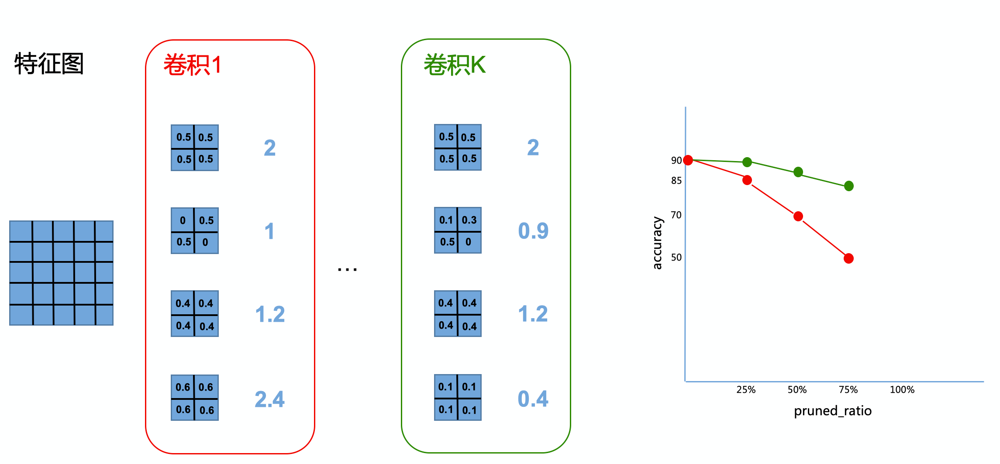
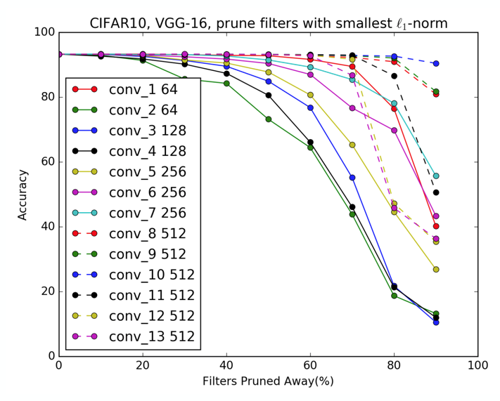
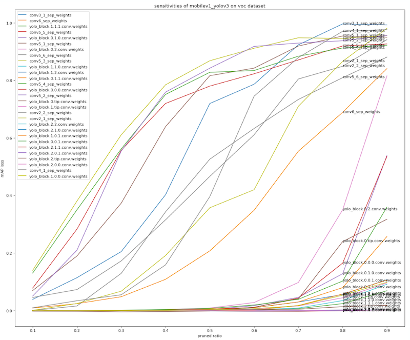

# Filter剪裁详细教程

该教程以MobileNetV1模型和Cifar10分类任务为例，介绍如何使用PaddleSlim对动态图卷积模型进行filter剪裁。

## 1. 模型定义

PaddlePaddle提供的`vision`模块提供了一些构建好的分类模型结构，并提供在`ImageNet`数据集上的预训练模型。为了简化教程，我们不再重新定义网络结构，而是直接从`vision`模块导入模型结构。代码如下所示，我们导入`MobileNetV1`模型，并查看模型的结构信息。

```python
import paddle
from paddle.vision.models import mobilenet_v1
net = mobilenet_v1(pretrained=False)
paddle.summary(net, (1, 3, 32, 32))
```

## 2. 准备数据

我们直接使用`vision`模块提供的`Cifar10`数据集，并通过飞桨高层API `paddle.vision.transforms`对数据进行预处理。在声明`paddle.vision.datasets.Cifar10`对象时，会自动下载数据并缓存到本地文件系统。代码如下所示：

```python
import paddle.vision.transforms as T
transform = T.Compose([
                    T.Transpose(),
                    T.Normalize([127.5], [127.5])
                ])
train_dataset = paddle.vision.datasets.Cifar10(mode="train", backend="cv2",transform=transform)
val_dataset = paddle.vision.datasets.Cifar10(mode="test", backend="cv2",transform=transform)
```

我们可以通过以下代码查看训练集和测试集的样本数量，并尝试取出训练集中的第一个样本，观察其图片的`shape`和对应的`label`。

```python
from __future__ import print_function
print(f'train samples count: {len(train_dataset)}')
print(f'val samples count: {len(val_dataset)}')
for data in train_dataset:
    print(f'image shape: {data[0].shape}; label: {data[1]}')
    break
```

## 3. 模型训练准备工作

在对卷积网络进行剪裁之前，我们需要在测试集上评估网络中各层的重要性。在剪裁之后，我们需要对得到的小模型进行重训练。在本示例中，我们将会使用Paddle高层API `paddle.Model`进行训练和评估工作。以下代码声明了`paddle.Model`实例，并指定了训练相关的一些设置，包括：
- 输入的shape
- 优化器
- 损失函数
- 模型评估指标


```python
from paddle.static import InputSpec as Input
optimizer = paddle.optimizer.Momentum(
        learning_rate=0.1,
        parameters=net.parameters())

inputs = [Input([None, 3, 224, 224], 'float32', name='image')]
labels = [Input([None, 1], 'int64', name='label')]

model = paddle.Model(net, inputs, labels)

model.prepare(
        optimizer,
        paddle.nn.CrossEntropyLoss(),
        paddle.metric.Accuracy(topk=(1, 5)))
```

以上代码声明了用于训练的`model`对象，接下来可以调用`model`的`fit`接口和`evaluate`接口分别进行训练和评估：

```python
model.fit(train_dataset, epochs=2, batch_size=128, verbose=1)
result = model.evaluate(val_dataset,batch_size=128, log_freq=10)
print(result)
```

## 4. 剪裁

本节内容分为两部分：卷积层重要性分析和`Filters`剪裁，其中『卷积层重要性分析』也可以被称作『卷积层敏感度分析』，我们定义越重要的卷积层越敏感。
PaddleSlim提供了工具类`Pruner`来进行重要性分析和剪裁操作，不同的`Pruner`的子类对应不同的分析和剪裁策略，本示例以`L1NormFilterPruner`为例说明。首先我们声明一个`L1NormFilterPruner`对象，如下所示：

```python
from paddleslim.dygraph import L1NormFilterPruner
pruner = L1NormFilterPruner(net, [1, 3, 224, 224])
```

如果本地文件系统已有一个存储敏感度信息（见4.1节）的文件，声明`L1NormFilterPruner`对象时，可以通过指定`sen_file`选项加载计算好的敏感度信息，如下：

```python
#pruner = L1NormFilterPruner(net, [1, 3, 224, 224]), sen_file="./sen.pickle")
```

### 4.1 卷积重要性分析

在对卷积网络中的filters进行剪裁时，我们需要判断哪些`filters`不重要，然后优先剪掉不重要的`filters`。
在一个卷积内，我们使用`filter`的`L1 Norm`来代表重要性，`L1 Norm`越大的`filters`越重要。在多个卷积间，我们通过敏感度代表卷积的重要性，越敏感的卷积越重要，重要的卷积会被剪掉相对较少的`filters`。
单个卷积内的filters重要性计算会在剪裁时进行，无需用户关注。本小节，我们只介绍多个卷积间如何分析重要性，即『敏感度分析』。

#### 敏感度定义

如图4-1所示，某个卷积网络包含K个卷积层，每个卷积层有4个`filters`，原始网络精度为90。

第一步：从『卷积1』中剪裁掉25%的filters，也就是『卷积1』中第2个Filters，然后直接在测试集上评估精度结果为85，得到左边坐标图的第二个红点。恢复模型到初始状态。
第二步：从『卷积1』中裁掉2个卷积，然后在测试集上评估精度为70，得到坐标图的第3个红点。恢复模型到初始状态。
第三步：同理得到第4个红点。把『卷积1』对应的4个红点链接成曲线，即为『卷积1』的敏感度曲线。
第四步：同理得到『卷积K』的敏感度曲线。


<center>图4-1</center>

如图4-2所示，为VGG-16在CIFAR10分类任务上的敏感度曲线示意图：


<center>图4-2</center>


考虑到不同的模型在不同的任务上的精度数值差别较大，甚至不在同一个量级，所以，PaddleSlim在计算和存储卷积层敏感度时，使用的是精度的损失比例。如图4-3所示，为PaddleSlim计算出的MobileNetV1-YOLOv3在VOC检测任务上的敏感度示意图，其中，纵轴为精度损失：


<center>图4-3</center>

#### 敏感度计算

调用`pruner`对象的`sensitive`方法进行敏感度分析，在调用`sensitive`之前，我们简单对`model.evaluate`进行包装，使其符合`sensitive`接口的规范。执行如下代码，会进行敏感度计算，并将计算结果存入本地文件系统：

```python
def eval_fn():
        result = model.evaluate(
            val_dataset,
            batch_size=128)
        return result['acc_top1']
pruner.sensitive(eval_func=eval_fn, sen_file="./sen.pickle")
```

上述代码执行完毕后，敏感度信息会存放在pruner对象中，可以通过以下方式查看敏感度信息内容：

```python
print(pruner.sensitive())
```


### 4.2 剪裁


`pruner`对象提供了`sensitive_prune`方法根据敏感度信息对模型进行剪裁，用户只需要传入期望的FLOPs减少比例。首先，我们记录下剪裁之前的模型的FLOPs数值，如下：

```python
from paddleslim.analysis import dygraph_flops
flops = dygraph_flops(net, [1, 3, 32, 32])
print(f"FLOPs before pruning: {flops}")
```

执行剪裁操作，期望跳过最后一层卷积层并剪掉40%的FLOPs：

```python
plan = pruner.sensitive_prune(0.4, skip_vars=["conv2d_26.w_0"])
flops = dygraph_flops(net, [1, 3, 32, 32])
print(f"FLOPs after pruning: {flops}")
print(f"Pruned FLOPs: {round(plan.pruned_flops*100, 2)}%")
```

剪裁之后，在测试集上重新评估精度，会发现精度大幅下降，如下所示：

```python
result = model.evaluate(val_dataset,batch_size=128, log_freq=10)
print(f"before fine-tuning: {result}")
```

对剪裁后的模型重新训练, 并再测试集上测试精度，如下：

```python
optimizer = paddle.optimizer.Momentum(
        learning_rate=0.1,
        parameters=net.parameters())
model.prepare(
        optimizer,
        paddle.nn.CrossEntropyLoss(),
        paddle.metric.Accuracy(topk=(1, 5)))
model.fit(train_dataset, epochs=2, batch_size=128, verbose=1)
result = model.evaluate(val_dataset,batch_size=128, log_freq=10)
print(f"after fine-tuning: {result}")
```

经过重新训练，精度有所提升，最后看下剪裁后模型的结构信息，如下：

```python
paddle.summary(net, (1, 3, 32, 32))
```
