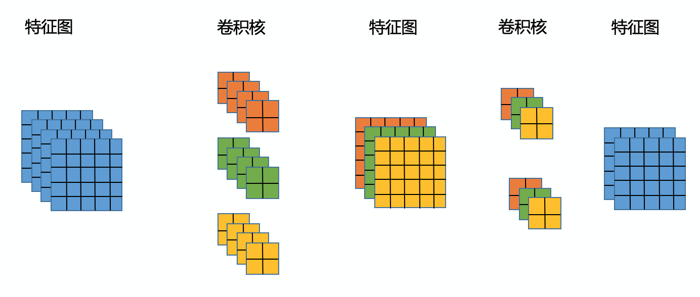
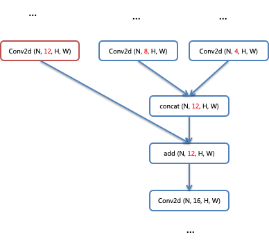
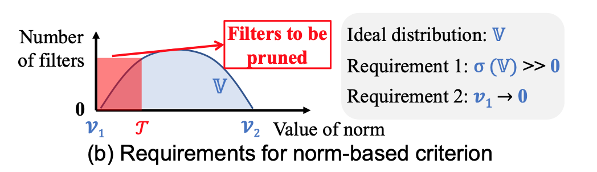
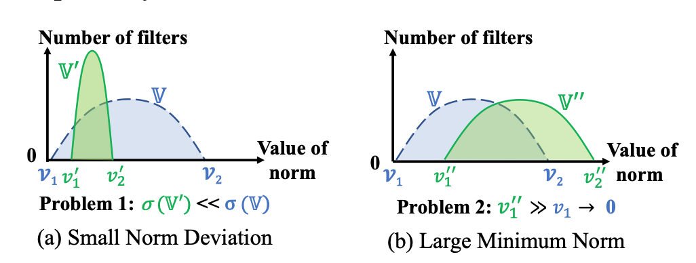
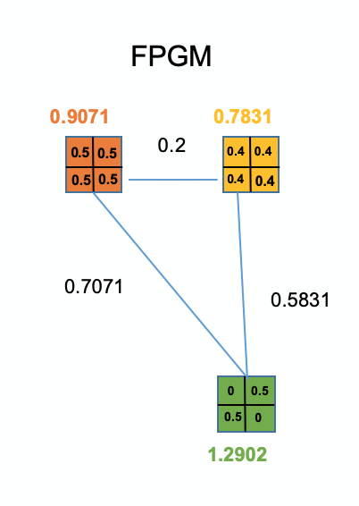

# 自定义剪裁

## 1. 概述

该教程介绍如果在PaddleSlim提供的接口基础上快速自定义`Filters`剪裁策略。
在PaddleSlim中，所有剪裁`Filters`的`Pruner`继承自基类`FilterPruner`。`FilterPruner`中自定义了一系列通用方法，用户只需要重载实现`FilterPruner`的`cal_mask`接口，`cal_mask`接口定义如下：

```python
def cal_mask(self, var_name, pruned_ratio, group):
    raise NotImplemented()
```

`cal_mask`接口接受的参数说明如下：
- **var_name:** 要剪裁的目标变量，一般为卷积层的权重参数的名称。在Paddle中，卷积层的权重参数格式为`[output_channel, input_channel, kernel_size, kernel_size]`，其中，`output_channel`为当前卷积层的输出通道数，`input_channel`为当前卷积层的输入通道数，`kernel_size`为卷积核大小。
- **pruned_ratio:** 对名称为`var_name`的变量的剪裁率。
- **group:** 与待裁目标变量相关的所有变量的信息。

### 1.1 Group概念介绍


<center><strong>图1-1 卷积层关联关系示意图</strong></center>

如图1-1所示，在给定模型中有两个卷积层，第一个卷积层有3个`filters`，第二个卷积层有2个`filters`。如果删除第一个卷积绿色的`filter`，第一个卷积的输出特征图的通道数也会减1，同时需要删掉第二个卷积层绿色的`kernels`。如上所述的两个卷积共同组成一个group，表示如下：

```python
group = {
            "conv_1.weight":{
                "pruned_dims": [0],
                "layer": conv_layer_1,
                "var": var_instance_1,
                "value": var_value_1,
            },
            "conv_2.weight":{
                "pruned_dims": [1],
                "layer": conv_layer_2,
                "var": var_instance_2,
                "value": var_value_2,
            }
        }
```

在上述表示`group`的数据结构示例中，`conv_1.weight`为第一个卷积权重参数的名称，其对应的value也是一个dict实例，存放了当前参数的一些信息，包括：
- **pruned_dims:** 类型为`list<int>`，表示当前参数在哪些维度上被裁。
- **layer:** 类型为[paddle.nn.Layer](https://www.paddlepaddle.org.cn/documentation/docs/zh/api_cn/dygraph_cn/Layer_cn.html#layer), 表示当前参数所在`Layer`。
- **var:** 类型为[paddle.Tensor](https://www.paddlepaddle.org.cn/documentation/docs/zh/api_cn/fluid_cn/Variable_cn.html#variable), 表示当前参数对应的实例。
- **value:** 类型为numpy.array类型，待裁参数所存的具体数值，方便开发者使用。

图1-2为更复杂的情况，其中，`Add`操作的所有输入的通道数需要保持一致，`Concat`操作的输出通道数的调整可能会影响到所有输入的通道数，因此`group`中可能包含多个卷积的参数或变量，可以是：卷积权重、卷积bias、`batch norm`相关参数等。



<center><strong>图1-2 复杂网络示例</strong></center>

## 2. 定义模型

```python
import paddle
from paddle.vision.models import mobilenet_v1
net = mobilenet_v1(pretrained=False)
paddle.summary(net, (1, 3, 32, 32))
```

## 3. L2NormFilterPruner

该小节参考`L1NormFilterPruner`实现`L2NormFilterPruner`，方式为集成`FIlterPruner`并重载`cal_mask`接口。代码如下所示：

```python
import numpy as np
from paddleslim.dygraph import FilterPruner

class L2NormFilterPruner(FilterPruner):

    def __init__(self, model, input_shape, sen_file=None):
        super(L2NormFilterPruner, self).__init__(
            model, input_shape, sen_file=sen_file)

    def cal_mask(self, var_name, pruned_ratio, group):
        value = group[var_name]['value']
        pruned_dims = group[var_name]['pruned_dims']
        reduce_dims = [
                    i for i in range(len(value.shape)) if i not in pruned_dims
                ]

        # scores = np.mean(np.abs(value), axis=tuple(reduce_dims))
        scores = np.sqrt(np.sum(np.square(value), axis=tuple(reduce_dims)))
        sorted_idx = scores.argsort()
        pruned_num = int(round(len(sorted_idx) * pruned_ratio))
        pruned_idx = sorted_idx[:pruned_num]
        mask_shape = [value.shape[i] for i in pruned_dims]
        mask = np.ones(mask_shape, dtype="int32")
        mask[pruned_idx] = 0
        return mask
```

如上述代码所示，我们重载了`FilterPruner`基类的`cal_mask`方法，并在`L1NormFilterPruner`代码基础上，修改了计算通道重要性的语句，将其修改为了计算L2Norm的逻辑：

```python
scores = np.sqrt(np.sum(np.square(value), axis=tuple(reduce_dims)))
```

接下来定义一个`L2NormFilterPruner`对象，并调用`prune_var`方法对单个卷积层进行剪裁，`prune_var`方法继承自`FilterPruner`，开发者不用再重载实现。
按以下代码调用`prune_var`方法后，参数名称为`conv2d_0.w_0`的卷积层会被裁掉50%的`filters`，与之相关关联的后续卷积和`BatchNorm`相关的参数也会被剪裁。`prune_var`不仅会对待裁模型进行`inplace`的裁剪，还会返回保存裁剪详细信息的`PruningPlan`对象，用户可以直接打印`PruningPlan`对象内容。
最后，可以通过调用`Pruner`的`restore`方法，将已被裁剪的模型恢复到初始状态。

```python
pruner = L2NormFilterPruner(net, [1, 3, 32, 32])
plan = pruner.prune_var("conv2d_0.w_0", 0, 0.5)
print(plan)
pruner.restore()
```

## 4. FPGMFilterPruner

参考：[Filter Pruning via Geometric Median for Deep Convolutional Neural Networks Acceleration](https://arxiv.org/abs/1811.00250)

### 4.1 原理介绍

如图4-1所示，传统基于Norm统计方法的filter重要性评估方式的有效性取决于卷积层权重数值的分布，比较理想的分布式要满足两个条件：

- 偏差(deviation)要大
- 最小值要小(图4-1中v1)

满足上述条件后，我们才能裁掉更多Norm统计值较小的参数，如图4-1中红色部分所示。



<center><strong>图 4-1</strong></center>

而现实中的模型的权重分布如图4-2中绿色分布所示，总是有较小的偏差或较大的最小值。


<center><strong>图 4-2</strong></center>

考虑到上述传统方法的缺点，FPGM则用filter之间的几何距离来表示重要性，其遵循的原则就是：几何距离比较近的filters，作用也相近。
如图4-3所示，有3个filters，将各个filter展开为向量，并两两计算几何距离。其中，绿色filter的重要性得分就是它到其它两个filter的距离和，即0.7071+0.5831=1.2902。同理算出另外两个filters的得分，绿色filter得分最高，其重要性最高。


<center><strong>图 4-3</strong></center>


### 4.2 实现

以下代码通过继承`FilterPruner`并重载`cal_mask`实现了`FPGMFilterPruner`，其中，`get_distance_sum`用于计算第`out_idx`个filter的重要性。

```python
import numpy as np
from paddleslim.dygraph import FilterPruner

class FPGMFilterPruner(FilterPruner):

    def __init__(self, model, input_shape, sen_file=None):
        super(FPGMFilterPruner, self).__init__(
            model, input_shape, sen_file=sen_file)

    def cal_mask(self, var_name, pruned_ratio, group):
        value = group[var_name]['value']
        pruned_dims = group[var_name]['pruned_dims']
        assert(pruned_dims == [0])

        dist_sum_list = []
        for out_i in range(value.shape[0]):
            dist_sum = self.get_distance_sum(value, out_i)
            dist_sum_list.append(dist_sum)
        scores = np.array(dist_sum_list)

        sorted_idx = scores.argsort()
        pruned_num = int(round(len(sorted_idx) * pruned_ratio))
        pruned_idx = sorted_idx[:pruned_num]
        mask_shape = [value.shape[i] for i in pruned_dims]
        mask = np.ones(mask_shape, dtype="int32")
        mask[pruned_idx] = 0
        return mask

    def get_distance_sum(self, value, out_idx):
        w = value.view()
        w.shape = value.shape[0], np.product(value.shape[1:])
        selected_filter = np.tile(w[out_idx], (w.shape[0], 1))
        x = w - selected_filter
        x = np.sqrt(np.sum(x * x, -1))
        return x.sum()
```

接下来声明一个FPGMFilterPruner对象进行验证:

```python
pruner = FPGMFilterPruner(net, [1, 3, 32, 32])
plan = pruner.prune_var("conv2d_0.w_0", 0, 0.5)
print(plan)
pruner.restore()
```

## 5. 敏感度剪裁

在第3节和第4节，开发者自定义实现的`L2NormFilterPruner`和`FPGMFilterPruner`也继承了`FilterPruner`的敏感度计算方法`sensitive`和剪裁方法`sensitive_prune`。

### 5.1 预训练

```python
import paddle.vision.transforms as T
transform = T.Compose([
                    T.Transpose(),
                    T.Normalize([127.5], [127.5])
                ])
train_dataset = paddle.vision.datasets.Cifar10(mode="train", backend="cv2",transform=transform)
val_dataset = paddle.vision.datasets.Cifar10(mode="test", backend="cv2",transform=transform)
from paddle.static import InputSpec as Input
optimizer = paddle.optimizer.Momentum(
        learning_rate=0.1,
        parameters=net.parameters())

inputs = [Input([None, 3, 32, 32], 'float32', name='image')]
labels = [Input([None, 1], 'int64', name='label')]
model = paddle.Model(net, inputs, labels)
model.prepare(
        optimizer,
        paddle.nn.CrossEntropyLoss(),
        paddle.metric.Accuracy(topk=(1, 5)))
model.fit(train_dataset, epochs=2, batch_size=128, verbose=1)
result = model.evaluate(val_dataset,batch_size=128, log_freq=10)
print(result)
```

### 5.2 计算敏感度

```python
pruner = FPGMFilterPruner(net, [1, 3, 32, 32])
def eval_fn():
        result = model.evaluate(
            val_dataset,
            batch_size=128)
        return result['acc_top1']
sen = pruner.sensitive(eval_func=eval_fn, sen_file="./fpgm_sen.pickle")
print(sen)
```

### 5.3 剪裁

```python
from paddleslim.analysis import dygraph_flops
flops = dygraph_flops(net, [1, 3, 32, 32])
print(f"FLOPs before pruning: {flops}")
plan = pruner.sensitive_prune(0.4, skip_vars=["conv2d_26.w_0"])
flops = dygraph_flops(net, [1, 3, 32, 32])
print(f"FLOPs after pruning: {flops}")
print(f"Pruned FLOPs: {round(plan.pruned_flops*100, 2)}%")
result = model.evaluate(val_dataset,batch_size=128, log_freq=10)
print(f"before fine-tuning: {result}")
```

### 5.4 重训练

```python
optimizer = paddle.optimizer.Momentum(
        learning_rate=0.1,
        parameters=net.parameters())
model.prepare(
        optimizer,
        paddle.nn.CrossEntropyLoss(),
        paddle.metric.Accuracy(topk=(1, 5)))
model.fit(train_dataset, epochs=2, batch_size=128, verbose=1)
result = model.evaluate(val_dataset,batch_size=128, log_freq=10)
print(f"after fine-tuning: {result}")
```
