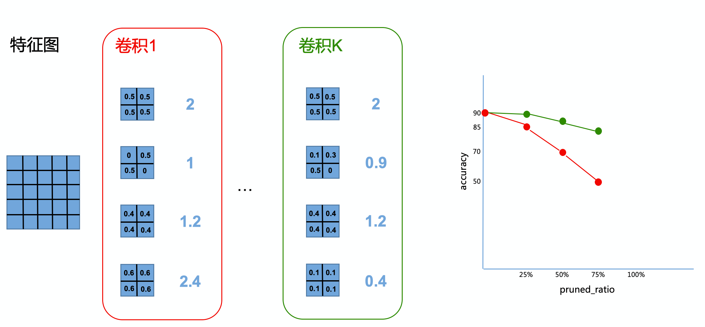
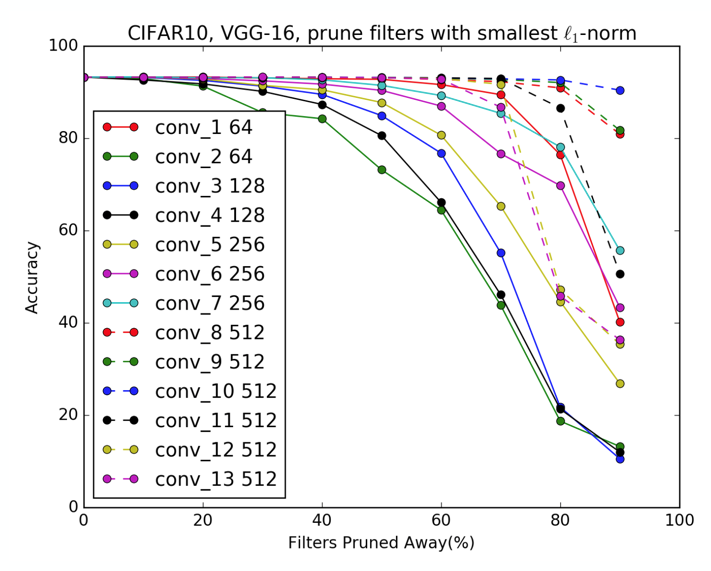
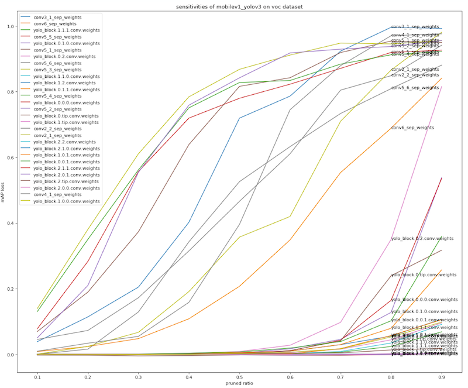
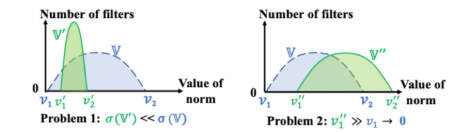

# PaddleSlim模型裁剪方法总览

PaddleSlim裁剪模块针对动态图目前实现了两种裁剪相关算法，并提供对应的接口给用户来实现自身的裁剪算法。

## 1. 基于敏感度的模型分析算法

本节内容分为两部分：卷积层敏感度分析和基于敏感度的`Filters`剪裁，其中『卷积层敏感度分析』也可以被称作『卷积层重要度分析』。我们定义越重要的卷积层越敏感。
PaddleSlim提供了工具类`Pruner`来进行重要性分析和剪裁操作，不同的`Pruner`的子类对应不同的分析和剪裁策略，本示例以`L1NormFilterPruner`为例说明。首先我们声明一个`L1NormFilterPruner`对象，如下所示：

```python
from paddleslim.dygraph import L1NormFilterPruner
pruner = L1NormFilterPruner(net, [1, 3, 224, 224])
```

如果本地文件系统已有一个存储敏感度信息（见1.1节）的文件，声明`L1NormFilterPruner`对象时，可以通过指定`sen_file`选项加载计算好的敏感度信息，如下：

```python
#pruner = L1NormFilterPruner(net, [1, 3, 224, 224]), sen_file="./sen.pickle")
```

### 1.1 卷积重要性分析

在对卷积网络中的filters进行剪裁时，我们需要判断哪些`filters`不重要，然后优先剪掉不重要的`filters`。
在一个卷积内，我们使用`filter`的`L1 Norm`来代表重要性，`L1 Norm`越大的`filters`越重要。在多个卷积间，我们通过敏感度代表卷积的重要性，越敏感的卷积越重要，重要的卷积会被剪掉相对较少的`filters`。
单个卷积内的filters重要性计算会在剪裁时进行，无需用户关注。本小节，我们只介绍多个卷积间如何分析重要性，即『敏感度分析』。

#### 敏感度定义

如图4-1所示，某个卷积网络包含K个卷积层，每个卷积层有4个`filters`，原始网络精度为90。

第一步：从『卷积1』中剪裁掉25%的filters，也就是『卷积1』中第2个Filters，然后直接在测试集上评估精度结果为85，得到左边坐标图的第二个红点。恢复模型到初始状态。
第二步：从『卷积1』中裁掉2个卷积，然后在测试集上评估精度为70，得到坐标图的第3个红点。恢复模型到初始状态。
第三步：同理得到第4个红点。把『卷积1』对应的4个红点链接成曲线，即为『卷积1』的敏感度曲线。
第四步：同理得到『卷积K』的敏感度曲线。

<div align="center">
    
</div>
<div align="center">
图1-1 敏感度计算过程示意图
</div>

如图1-2所示，为VGG-16在CIFAR10分类任务上的敏感度曲线示意图：

<div align="center">
    
</div>
<div align="center">
图1-2 VGG-16敏感度示例
</div>


考虑到不同的模型在不同的任务上的精度数值差别较大，甚至不在同一个量级，所以，PaddleSlim在计算和存储卷积层敏感度时，使用的是精度的损失比例。如图1-3所示，为PaddleSlim计算出的MobileNetV1-YOLOv3在VOC检测任务上的敏感度示意图，其中，纵轴为精度损失：

<div align="center">
    
</div>
<div align="center">
图1-3 用精度损失表示的敏感度
</div>


#### 敏感度计算

调用`pruner`对象的`sensitive`方法进行敏感度分析，在调用`sensitive`之前，我们简单对`model.evaluate`进行包装，使其符合`sensitive`接口的规范。执行如下代码，会进行敏感度计算，并将计算结果存入本地文件系统：

```python
def eval_fn():
        result = model.evaluate(
            val_dataset,
            batch_size=128)
        return result['acc_top1']
pruner.sensitive(eval_func=eval_fn, sen_file="./sen.pickle")
```

上述代码执行完毕后，敏感度信息会存放在pruner对象中，可以通过以下方式查看敏感度信息内容：

```python
print(pruner.sensitive())
```

### 1.2 根据敏感度数据对模型进行裁剪

选定模型的裁剪比例和需要跳过不裁剪的网络层，根据敏感度分析的数据对模型进行裁剪。
```python
plan = pruner.sensitive_prune(pruned_flops=0.4, skip_vars=["conv2d_26.w_0"])
```

### 2 基于几何中心（FPGM）的剪裁算法

在第1节中，我们采用了L1NormFilterPruner，在对一个卷积层进行裁剪的时候通过不同`filters`的`L1 Norm`来判定`filter`的重要性。然而这种方法基于两个前提：
1.    处于同一卷积网络层中的不同卷积核L1范数的标准差足够大，从而容易找到划分重要卷积核和非重要卷积核的阈值。
2.    每一个卷积层中均存在部分卷积核的L1范数足够小，使得这些卷积核可以被安全的移除而不损害模型的表现。
然而在很多情况下，网络模型的参数分布往往不满足上述两个前提：
<div align="center">
    
</div>
<div align="center">
    卷积层中卷积核的参数分布
</div>
针对这一问题PaddleSlim中提供了基于卷积层中卷积核的几何中心的判定方式（Filter Pruning via Geometric Median, FPGM）。通过同一卷积层中不同卷积核的权重向量与这些卷积核所构成高维空间几何中心的距离来判断其自身在所处卷积层中的重要程度。一个卷积核的权重向量与几何中心越近，说明其所含信息与其他卷积核的信息越近似，该卷积核的可替代性也就越强，因此可以被安全的从模型中移除。
基于FPGM的裁剪算法可以与第1节中的敏感度分析算法共同使用，只需将第一节中的

```python
from paddleslim.dygraph import L1NormFilterPruner
pruner = L1NormFilterPruner(net, [1, 3, 224, 224])
```
更改为

```python
from paddleslim.dygraph import FPGMFilterPruner
pruner = FPGMFilterPruner(net, [1, 3, 224, 224])
```

### 3 自定义裁剪方法

除了FPGM以外，PaddleSlim也提供了接口给用户来实现自己的裁剪算法。详细可参见：[自定义结构化裁剪](self_defined_filter_pruning.md)

## 裁剪结果
| 模型 | 压缩方法 | Top-1/Top-5 Acc | 模型体积（MB） | GFLOPs |PaddleLite推理耗时| 下载 |
|:--:|:---:|:--:|:--:|:--:|:--:|:--:|
| MobileNetV1 |    Baseline    |         70.99%/89.68%         |       17       |  1.11  |66.052\35.8014\19.5762|[下载链接](http://paddle-imagenet-models-name.bj.bcebos.com/MobileNetV1_pretrained.tar) |
| MobileNetV1 |  uniform -50%  | 69.4%/88.66% (-1.59%/-1.02%)  |       9        |  0.56  | 33.5636\18.6834\10.5076|[下载链接](https://paddlemodels.bj.bcebos.com/PaddleSlim/MobileNetV1_uniform-50.tar) |
| MobileNetV1 | sensitive -30% |  70.4%/89.3% (-0.59%/-0.38%)  |       12       |  0.74  | 46.5958\25.3098\13.6982|[下载链接](https://paddlemodels.bj.bcebos.com/PaddleSlim/MobileNetV1_sensitive-30.tar) |
| MobileNetV1 | sensitive -50% | 69.8% / 88.9% (-1.19%/-0.78%) |       9        |  0.56  |37.9892\20.7882\11.3144|[下载链接](https://paddlemodels.bj.bcebos.com/PaddleSlim/MobileNetV1_sensitive-50.tar) |
| MobileNetV1 | uniform+FPGM -50% | 69.56% / 89.14% (-1.43%/-0.53%) |       9        |  0.56  |33.5636\18.6834\10.5076|[下载链接](https://paddlemodels.bj.bcebos.com/PaddleSlim/MobileNetV1_sensitive-50.tar) |
