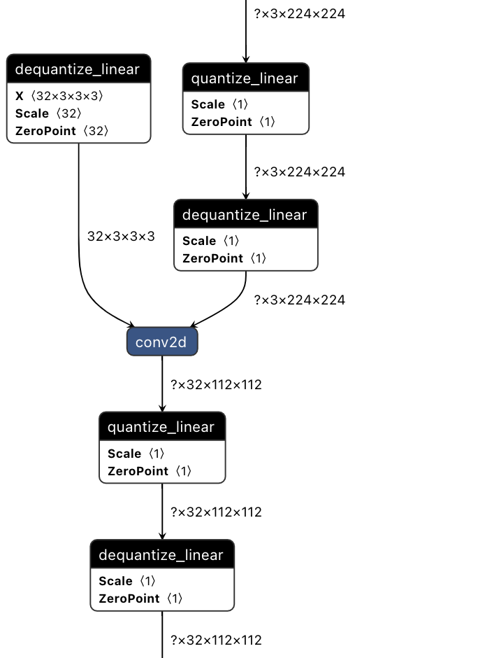
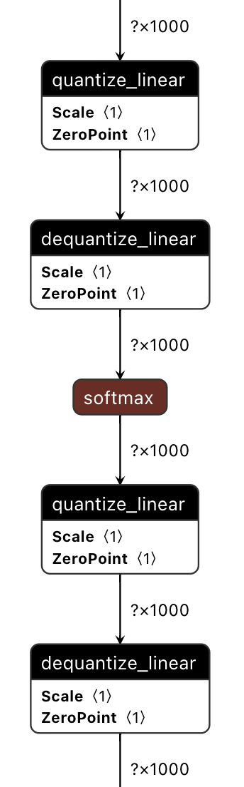
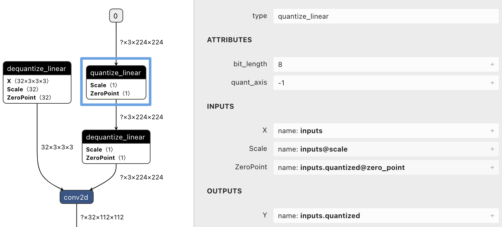

# PaddlePaddle 模型量化技术

目录：
- [1.量化概述](#1-量化概述)
- [2.量化格式](#2-量化格式)
    - [2.1量化类型](#21-量化类型)
    - [2.2量化算子](#22-量化算子)
- [3.量化方式](#3-量化方式)
- [4.FAQ](#4-FAQ)

## 1. 量化概述

在量化过程中，浮点实数值会映射到低比特量化空间，比如8bit、4bit等。从量化计算方式的角度，量化主要可以分为线性量化和非线性量化。线性量化方法由于计算方式简单以及较多硬件支持，应用最为广泛，目前PaddlePaddle中主要支持线性量化计算。线性量化又可以细分为对称量化，非对称量化等。

以线性对称量化为例，其计算公式为：

$$
s=\frac{2^{b-1}-1}{\alpha}
$$

$$
x_{q}=\operatorname{quantize}(x, b, s)=\operatorname{clip}\left(\operatorname{round}(s \cdot x),-2^{b-1}+1,2^{b-1}-1\right)
$$

其中，α为选定的全精度参数的表示范围range_abs_max，即全精度参数将被限制在[-α,α]内。

## 2. 量化格式

### 2.1 量化类型

- 对携带weight算子量化：

携带weight算子是指Conv、Linear这类其中一个输入是从weight参数中读取。如下图左所示，量化模型的weight存储的是低比特的形式（比如INT8格式），存储体积和FP32相比会减少几倍。在模型中weight输入前会插入反量化(dequantize_linear)算子算子。

在其激活输入前会插入量化(quantize_linear)和反量化(dequantize_linear)算子。在该算子输出位置插入量化(quantize_linear)和反量化(dequantize_linear)算子，方便预测库直接获取输出scale信息。

- 对激活层算子量化：

在对激活层算子(比如max_pool、add、sigmoid等)量化时，如下图右所示，在其输入前会插入量化(quantize_linear)和反量化(dequantize_linear)算子。在该算子输出位置插入量化(quantize_linear)和反量化(dequantize_linear)算子，方便预测库直接获取输出scale信息。

  
  

### 2.2 量化算子
#### quantize_linear

- 输入（INPUTS）
    - `X`: 将要被量化的N-D Tensor输入。
    - `Scale`: float标量或者1-D Tensor类型，存储当前输入浮点数截断值range_abs_max，即上方公式中的α。当Scale是float标量时，表示当前层是per-layer量化；当Scale是1-D Tensor时，表示当前层是per-channel量化。
    - `ZeroPoint`: 表示量化时的`零点`，类型和Scale完全一致。默认对称量化，ZeroPoint保持全0。

- 输出（OUTPUTS）
    - `Y`: 量化计算输出的的N-D Tensor，Y与输入X应保持完全一致。

- 属性（ATTRIBUTES）
    - `bit_length`: 类型为int，当前层量化的比特数，默认8。
    - `quant_axis`: 类型为int，多维Tensor量化在维度上的轴。当前层是per-layer量化时，quant_axis=-1；表示当前层是per-channel量化时，quant_axis根据不同算子可选0或1。
    - `round_type`: 类型为int，可选属性，表示近似计算的方法。目前可选0和1，0表示`rounding to nearest ties to even`；1表示`rounding to nearest ties away from zero`。如果该属性不存在，表示默认0。

#### dequantize_linear

- 输入（INPUTS）
    - `X`: 将要被反量化的N-D Tensor输入。
    - `Scale`: Scale值和上一层quantize_linear中Scale类型和数值应完全一致。
    - `ZeroPoint`: ZeroPoint值和上一层quantize_linear中ZeroPoint类型和数值应完全一致。

- 输出（OUTPUTS）
    - `Y`: 反量化计算输出的的N-D Tensor，Y与输入X应保持完全一致。

- 属性（ATTRIBUTES）
    - `bit_length`：类型为int，当前层量化的比特数，默认8。
    - `quant_axis`: 类型为int，多维Tensor量化在维度上的轴。当前层是per-layer量化时，quant_axis=-1；表示当前层是per-channel量化时，quant_axis根据不同算子可选0或1。

  

## 3. 量化方式

### 3.1 静态离线量化

静态离线量化后，在导出量化模型时会将所有observer（统计量化信息）节点转换成量化(quantize_linear)和反量化(dequantize_linear)，在离线量化校准时根据[量化统计白名单](https://github.com/PaddlePaddle/Paddle/blob/develop/python/paddle/fluid/contrib/slim/quantization/utils.py#L116) 插入observer节点。

具体内容可继续查看[静态离线量化详细文档](./post_training_quantization.md)

### 3.2 在线量化训练（QAT）

### 3.3 动态离线量化

## 4. FAQ
