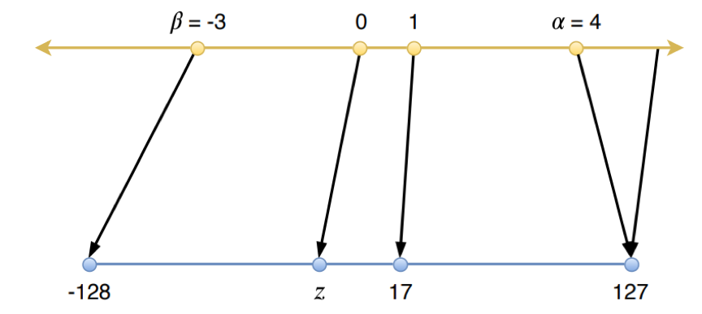

# PaddleSlim离线量化

## 简介

神经网络模型具有大规模的参数量，对存储和计算量往往需求较大，使得模型难以计算在低存储和低算力设备上运行。这给神经网络的部署和应用带来了巨大挑战。随着越来越多的硬件设备支持低精度的计算，量化已经成为给模型带来预测加速的通用方法。模型量化方法可以分为量化训练（quantization aware training）和离线量化（post training quantization）方法。其中，量化训练方法需要对全精度模型进行微调，而离线量化方法只需要少量数据对模型进行校准，快速且实用，因而得到广泛应用。PaddleSlim基于PaddlePaddle深度学习框架，实现了一系列离线量化方法，并配合Paddle Inference和Paddle Lite的推理引擎，实现了量化模型在端上的推理加速。本文将立足于此，对离线量化进行方法上和实践上的系统介绍。

## 量化方法

从量化计算方式的角度，量化主要可以分为线性量化和非线性量化。线性量化方法由于计算方式简单以及较多硬件支持，应用最为广泛。线性量化又可以细分为对称量化，非对称量化和ristretto等。目前PaddleSlim中已经支持的是对称量化。

### 对称量化
对称量化将参数限制在正负对称的范围内，如下图所示：(图片出自[论文](https://arxiv.org/abs/2004.09602))

  

上图所示的对称量化过程可以用如下公式表述：

$$
s=\frac{2^{b-1}-1}{\alpha}
$$

$$
x_{q}=\operatorname{quantize}(x, b, s)=\operatorname{clip}\left(\operatorname{round}(s \cdot x),-2^{b-1},2^{b-1}-1\right)
$$

反量化过程可以用以下公式表述：

$$
x_{dq}=\operatorname{dequantize}(x, s)=\frac{x}{s}
$$

其中，s为所选取的scale值，即将s作为尺度因子，将全精度参数映射到低比特取值范围；α为选定的全精度参数的表示范围，即全精度参数将被限制在[-α,α]内；b为量化的比特数，x为待量化的全精度参数。因此，如果给定量化的比特数b，我们只需要选定合适的α值，就可以确定量化所需的参数s。

### 权重量化和激活量化

- 权重量化：即仅需要对网络中的权重执行量化操作。因为模型的权重在推理时数值无变化，所以我们可以提前根据权重获得相应的量化参数scale。由于仅对权重执行了量化，这种量化方法不会加速推理流程。
- 激活量化：即不仅对网络中的权重进行量化，还对激活值进行量化。因为激活层的范围通常不容易提前获得，所以需要在网络实际推理的过程中进行计算scale值，此过程需要部分无标签数据。

几点说明：
1. 对于权重，可以选择逐层（layer-wise）或者逐通道（channel-wise）的量化粒度，也就是说每层或者每个通道选取一个量化scale。在PaddleSlim的[离线量化接口](https://github.com/PaddlePaddle/PaddleSlim/blob/develop/docs/zh_cn/api_cn/static/quant/quantization_api.rst#quant_post_static)中，通过`weight_quantize_type`的参数来配置权重量化，可选择`abs_max`或者`channel_wise_abs_max`，前者是layer-wise，后者是channel-wise，按照经验，`channel_wise_abs_max`的量化方式更精确，但部分部署硬件有可能不支持channel-wise量化推理。
2. 对于激活，一般只能采用逐层（layer-wise）的量化粒度，每层选取一个量化参数，从而在部署时实现计算的加速。在PaddleSlim的[离线量化接口](https://github.com/PaddlePaddle/PaddleSlim/blob/develop/docs/zh_cn/api_cn/static/quant/quantization_api.rst#quant_post_static)中，通过`activation_quantize_type`参数来配置激活量化，可选择`range_abs_max`或者`moving_average_abs_max`，一般保持默认`range_abs_max`即可。

## 方法介绍

### 对于激活量化

对于激活的离线量化，需要用少量数据进行校准，经过模型的前向过程，统计得到激活的量化scale参数。具体来说，我们支持了如下几种确定激活的量化截断值α的方法：

| 激活量化方法    |   详解     |
| :-------- | :--------: |
| abs_max | 选取所有激活值的绝对值的最大值作为截断值α。此方法的计算最为简单，但是容易受到某些绝对值较大的极端值的影响，适用于几乎不存在极端值的情况。 |
| KL |使用参数在量化前后的KL散度作为量化损失的衡量指标。此方法是TensorRT所使用的方法，我们根据[8-bit Inference with TensorRT](https://on-demand.gputechconf.com/gtc/2017/presentation/s7310-8-bit-inference-with-tensorrt.pdf) 进行了实现。在大多数情况下，使用KL方法校准的表现要优于abs_max方法。 |
| avg | 选取所有样本的激活值的绝对值最大值的平均数作为截断值α。此方法计算较为简单，可以在一定程度上消除不同数据样本的激活值的差异，抵消一些极端值影响，总体上优于abs_max方法。 |
| hist| 首先采用与KL散度类似的方式将所有参数映射为直方图，然后根据给定的百分比，选取直方图的百分位点作为截断值α。此方法可以去除掉一些极端值，并且可以灵活调节直方图百分比(hist_percent)来调整截断值大小，以适应不同模型。 |
| mse | 使用均方误差作为模型量化前后输出的损失的衡量指标。选取使得激活值在量化前后的均方误差最小的量化参数。此方法较为耗时，但是效果常常优于其他方法。 |
| emd | 使用推土距离(EMD)作为模型量化前后输出的损失的衡量指标。使用EMD距离做度量，量化前后EMD距离越小，量化精度越高。选取使得激活值在量化前后的均方误差最小的量化参数。 |

说明：
- 当模型量化效果不好时，可多尝试几种激活方法，具体的，可以在PaddleSlim的[离线量化接口](https://github.com/PaddlePaddle/PaddleSlim/blob/develop/docs/zh_cn/api_cn/static/quant/quantization_api.rst#quant_post_static)修改`algo`参数，目前支持：`abs_max`、`KL`、`avg`、`hist`、`mse`、`emd`。

### 对于权重量化

在对权重scale参数进行量化时，一般直接采用选取绝对值最大值的方式。对于权重量化，还可通过其他方法提升量化的精度，比如矫正weight偏差，Adaround/BRECQ/QDrop方法等，比如PaddleSlim中目前支持以下几种方法：

| 权重量化方法    |   详解     |
| :-------- | :--------: |
| bias_correction | 通过简单的校正常数来补偿权重weight量化前后的均值和方差的固有偏差，参考自[论文](https://arxiv.org/abs/1810.05723)。 |
|  Adaround | 对每层weight值进行量化时，不再采样固定四舍五入方法，而是自适应的决定weight量化时将浮点值近似到最近右定点值还是左定点值。具体的算法原理参考自[论文](https://arxiv.org/abs/2004.10568)。 |
|  BRECQ | 对每层weight值进行量化时，不再采样固定四舍五入方法，而是自适应的决定weight量化时将浮点值近似到最近右定点值还是左定点值，同时以region为单位调整weight。具体的算法原理参考自[论文](https://arxiv.org/abs/2102.05426)。 |
|  QDrop | 对每层weight值进行量化时，不再采样固定四舍五入方法，而是自适应的决定weight量化时将浮点值近似到最近右定点值还是左定点值，同时以dropout的方式引入激活量化的噪声。具体的算法原理参考自[论文](https://arxiv.org/abs/2203.05740)。 |

说明：
- 如果想使用bias_correction，可以在PaddleSlim的[离线量化接口](https://github.com/PaddlePaddle/PaddleSlim/blob/develop/docs/zh_cn/api_cn/static/quant/quantization_api.rst#quant_post_static)修改`bias_correction`参数为True即可，默认为False。
- 如果想使用Adaround方法，可以在PaddleSlim的[离线量化接口](https://github.com/PaddlePaddle/PaddleSlim/blob/develop/docs/zh_cn/api_cn/static/quant/quantization_api.rst#quant_post_static)修改`round_type`参数为`adaround`即可，默认为`round`。
- 如果想使用BRECQ方法，可以在PaddleSlim的[量化重构接口](https://github.com/PaddlePaddle/PaddleSlim/blob/develop/docs/zh_cn/api_cn/static/quant/quantization_api.rst#quant_post_static)修改`recon_level`参数为`region-wise`即可，默认为`layer-wise`。
- 如果想使用QDrop方法，可以在PaddleSlim的[量化重构接口](https://github.com/PaddlePaddle/PaddleSlim/blob/develop/docs/zh_cn/api_cn/static/quant/quantization_api.rst#quant_post_static)修改`simulate_activation_quant`参数为`True`即可，默认为`False`。

### 效果对比

以上离线量化方法在MobileNet模型上的效果对比如下：

  
<strong>表1：多种离线量化方法效果对比</strong>

更详细的使用可查看[PaddleSlim离线量化API文档](https://github.com/PaddlePaddle/PaddleSlim/blob/develop/docs/zh_cn/api_cn/static/quant/quantization_api.rst#quant_post_static)

## 快速体验

- 离线量化：参考PaddleSlim的[离线量化Demo](https://github.com/PaddlePaddle/PaddleSlim/tree/develop/demo/quant/quant_post)。
- 自动化压缩ACT：可试用PaddleSlim新功能[自动化压缩Demo](https://github.com/PaddlePaddle/PaddleSlim/tree/develop/demo/auto_compression)
