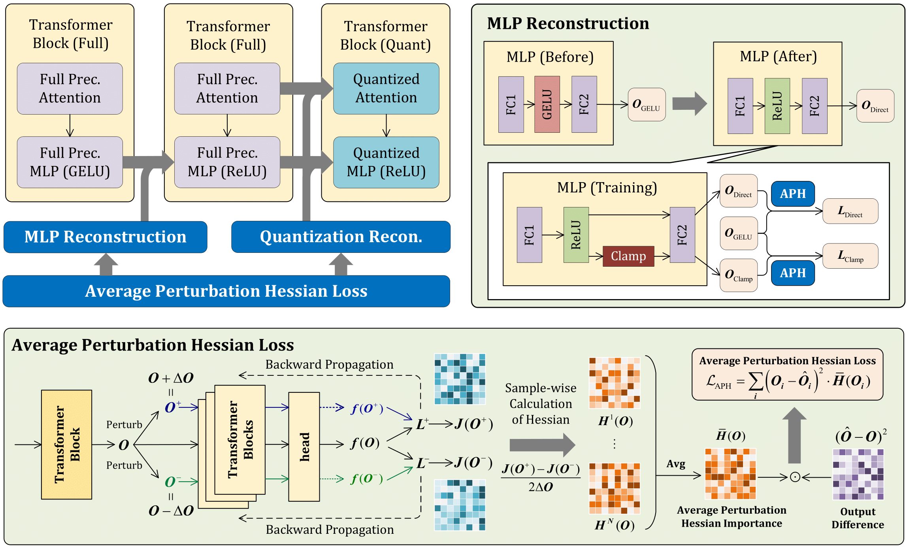

## APHQ-ViT: Post-Training Quantization with Average Perturbation Hessian Based Reconstruction for Vision Transformers

## 1. 简介

本示例介绍了一种对ViT模型的训练后量化方法，使用基于平均扰动海森的重要性度量与 MLP 重构技术，对视觉 Transformer 中 Post-GELU 激活范围进行调节，并将 GELU 激活函数替换为 ReLU，在提升模型量化精度的同时进一步实现推理加速。

技术详情见论文 [APHQ-ViT: Post-Training Quantization with Average Perturbation Hessian Based Reconstruction for Vision Transformers](https://arxiv.org/abs/2504.02508)



## 2.训练

### 2.1 环境准备

```bash
python -m pip install paddlepaddle-gpu==2.6.2.post117 -i
```

### 2.2 启动训练

```bash
python test_quant.py \
    --model vit_base --config ./configs/4bit/best.py\
    -cfg ./models/configs_vit/vit_base_patch16_224.yaml \
    -pretrained ./checkpoints/vit_base_patch16_224.pdparams \
    --reconstruct-mlp  --optimize 
```

## 致谢

本实现源于下列开源仓库:

- [https://github.com/GoatWu/APHQ-ViT](https://github.com/GoatWu/APHQ-ViT) (official implementation of APHQ-ViT).
- [https://github.com/BR-IDL/PaddleViT](https://github.com/BR-IDL/PaddleViT) (PaddlePaddle version for ViT).
