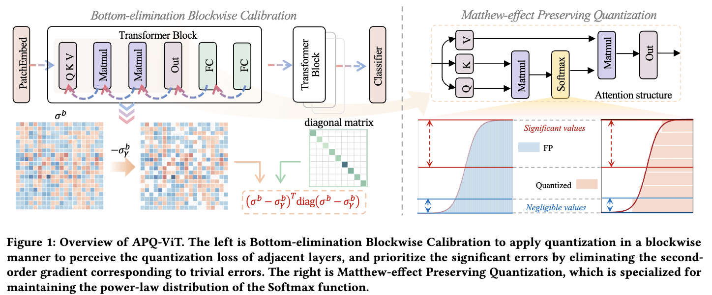

# APQ-ViT

## 1. 简介
本示例介绍了一种用于 Vision Transformer (ViT) 模型的后训练量化方法（APQ-ViT）。APQ-ViT 是一种简单而高效的 post-training 量化方法,无需重新训练即可实现模型量化。

## 2. Benchmark
| 模型            | w4a4  | w4a8  | w8a8  |
|-----------------|-------|-------|-------|
| ViT-S/16        | 47.95 | 72.30 | 81.25 |


## 3. APQ-ViT 的测试

APQ-ViT 整体方法如图所示，详情见论文 [Towards Accurate Post-Training Quantization for Vision Transformer](https://arxiv.org/abs/2303.14341)



### 3.1 准备环境
- PaddlePaddle >= 2.4 （可从Paddle官网下载安装）

安装 paddlepaddle：
```shell
# CPU
pip install paddlepaddle==2.4.2
# GPU 以Ubuntu、CUDA 11.2为例
python -m pip install paddlepaddle-gpu==2.4.2.post112 -f https://www.paddlepaddle.org.cn/whl/linux/mkl/avx/stable.html
```

### 3.2 准备数据集

本示例在 ImageNet 上进行分类实验。

### 3.3 校准与测试

```sh
CUDA_VISIBLE_DEVICES=2 python3 test_vit.py \
    --model_config_path ./configs/vit_base_patch16_224.yaml \
    --model_path /path/to/model/weight \
```

