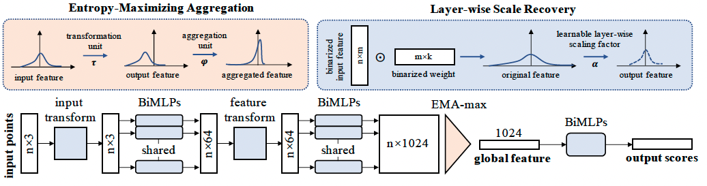

# BiPointNet

## 1. 简介
本示例介绍了一种用于点云模型 (PointNet) 的二值化方法（BiPointNet）。BiPointNet 通过引入熵最大化聚合（Entropy-Maximizing Aggregation）来调整聚合前的分布，以获得最大信息熵，并引入分层尺度因子（Layer-wise Scale Recovery）有效恢复特征表达能力，是一种简单而高效的二值化点云模型的方法。

## 2. Benchmark

| 模型         | Accuracy | 权重下载 |
| ------------- | --------- | --------- |
| PointNet      | 89.83     | [PointNet.pdparams](https://bj.bcebos.com/v1/paddle-slim-models/PointNet.pdparams) |
| BiPointNet    | 85.86     | [BiPointNet.pdparams](https://bj.bcebos.com/v1/paddle-slim-models/BiPointNet.pdparams) |


## 3. BiPointNet 的训练及测试
BiPointNet 整体结构如图所示，详情见论文 [BIPOINTNET: BINARY NEURAL NETWORK FOR POINT CLOUDS](https://arxiv.org/abs/2010.05501)



### 3.1 准备环境
- PaddlePaddle >= 2.4 （可从[Paddle官网](https://www.paddlepaddle.org.cn/install/quick?docurl=/documentation/docs/zh/install/pip/linux-pip.html)下载安装）

安装 paddlepaddle：
```shell
# CPU
pip install paddlepaddle==2.4.2
# GPU 以Ubuntu、CUDA 11.2为例
python -m pip install paddlepaddle-gpu==2.4.2.post112 -f https://www.paddlepaddle.org.cn/whl/linux/mkl/avx/stable.html
```

### 3.2 准备数据集

本示例在 [ModelNet40](https://modelnet.cs.princeton.edu) 数据集上进行了分类实验。

```shell
wget https://shapenet.cs.stanford.edu/media/modelnet40_normal_resampled.zip --no-check-certificate
unzip modelnet40_normal_resampled.zip
```

### 3.3 启动训练

- 训练基准模型 PointNet
```
export CUDA_VISIBLE_DEVICES=0
python train.py --save_dir 'pointnet'
```

- 训练 BiPointNet
```
export CUDA_VISIBLE_DEVICES=0
python train.py --save_dir 'bipointnet' --binary
```

### 3.4 验证精度

- 测试基准模型 PointNet
```shell
export CUDA_VISIBLE_DEVICES=0
python test.py --model_path 'PointNet.pdparams'
```

- 测试 BiPointNet
```shell
export CUDA_VISIBLE_DEVICES=0
python train.py --model_path 'BiPointNet.pdparams' --binary
```

## 致谢
感谢 [Macaronlin](https://github.com/Macaronlin) 贡献 BiPointNet。
