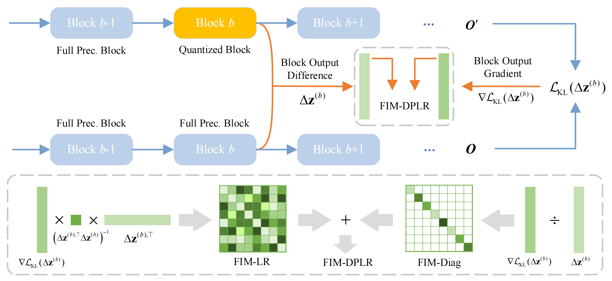

## FIMA-Q: Post-Training Quantization for Vision Transformers by Fisher Information Matrix Approximation

## 1. 简介

本示例介绍了一种对ViT模型的训练后量化方法，使用对角加低秩近似的费舍信息矩阵来近似海森矩阵，从而在量化重建阶段获得更准确的损失度量。

技术详情见论文 [FIMA-Q: Post-Training Quantization for Vision Transformers by Fisher Information Matrix Approximation](https://arxiv.org/abs/2506.11543)



## 2.训练

### 2.1 环境准备

```bash
python -m pip install paddlepaddle-gpu==2.6.2.post117 -i
```

### 2.2 启动训练

```bash
python test_quant.py \
    --model vit_small --config ./configs/4bit/best.py \
    -cfg ./models/configs_vit/vit_small_patch16_224.yaml \
    -pretrained ./checkpoints/vit_small_patch16_224.pdparams \
    --optimize --optim-metric fisher_dplr 
```

## 致谢

本实现源于下列开源仓库:

- [https://github.com/ShiheWang/FIMA-Q](https://github.com/ShiheWang/FIMA-Q) (official implementation of FIMA-Q).
- [https://github.com/BR-IDL/PaddleViT](https://github.com/BR-IDL/PaddleViT) (PaddlePaddle version for ViT).
