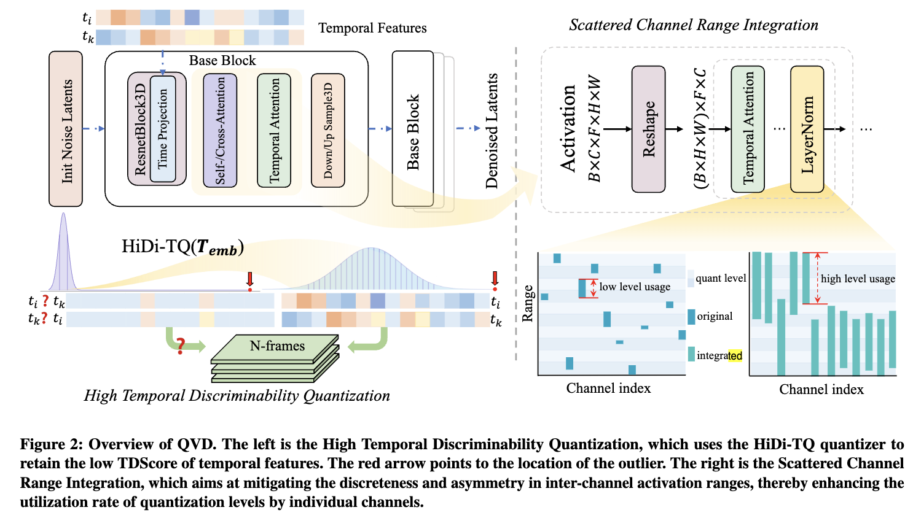

以下是为 `QVD` 算法撰写的专业化 README 文档草案，格式和内容对齐你给的 `BiPointNet` 示例，并结合论文：[https://arxiv.org/abs/2407.11585。](https://arxiv.org/abs/2407.11585。)

---

# QVD: Post-training Quantization for Video Diffusion Models

## 1. 简介

`QVD`（Quantization for Video Diffusion）是一种专为视频扩散模型（Video Diffusion Models, VDMs）设计的后训练量化（Post-Training Quantization, PTQ）方案。传统 PTQ 方法在图像领域已被广泛验证，但其在 VDM 中面临两大挑战：

* **时间特征显著偏斜**：VDM 的 temporal embedding 显示出高度偏斜性，直接量化会损失重要时序信息。
* **激活通道范围分散且不对称**：不同通道间存在明显的激活区间不一致，导致量化等级覆盖率低。

为此，QVD 提出两项核心技术：

* **HTDQ（High Temporal Discriminability Quantization）**：为时序特征定制，提升量化后特征的可辨识度，增强跨帧一致性。
* **SCRI（Scattered Channel Range Integration）**：通过融合通道范围，提升量化等级的有效利用率。

QVD 适配于主流视频扩散模型，无需重新训练，可在低比特精度下显著降低内存和推理延迟，同时保持生成质量。

---

## 2. Benchmark

| 模型             | W/A 位宽 | FVD↓    | 权重下载                                     |
| -------------- | ------ | ----  | ------------------------------------------------------------------------- |
| + QVD (W8A8)   | 8/8    | 442     |  ckpt/sz_w8a8.pth                                                            |

> 注：FVD（Fréchet Video Distance）越低越好。

---

## 3. QVD 架构与方法

QVD 的整体结构如下图所示。更多细节见原论文：[QVD: Post-training Quantization for Video Diffusion Models](https://arxiv.org/abs/2407.11585)



---

## 4. 环境配置

### 4.1 安装依赖

本项目基于 PyTorch >= 2.0 和 `diffusers` 生态。

```bash
conda create -n qvd python=3.10 -y
conda activate qvd
pip install -r requirements.txt
```

### 4.2 准备数据集

本项目使用以下公开数据集进行训练和评估:

- **FS COCO**: 用于图像生成任务的基准数据集,包含大量自然场景图像。

- **COCO Caption**: 提供了丰富的图像描述标注,用于文本条件生成。

- **TED Talk Video**: 包含大量 TED 演讲视频片段,用于视频生成任务的训练和评估。

---

## 5. 运行示例

```sh
n_bits_w=8
n_bits_a=8
run_name="w${n_bits_w}a${n_bits_a}"
sz_ckpt_output_name="sz_w${n_bits_w}a${n_bits_a}"
export CUDA_VISIBLE_DEVICES=0

python3  inference_quant.py \
        --sz_ckpt_path ckpt/sz_w8a8.pth \
        --sz_ckpt_output_path ckpt/${sz_ckpt_output_name}.pth \
        --image /path/to/img.png \
        --motion /path/to/motion/video.mp4 \
        --cali_image /path/to/img.png \
        --cali_motion /path/to/motion/video.mp4 \
        --steps 32 \
        --n_bits_w $n_bits_w \
        --n_bits_a $n_bits_a \
        --act_quant \
        --save_dir output/pred \
        --resume_sz \
        
```

