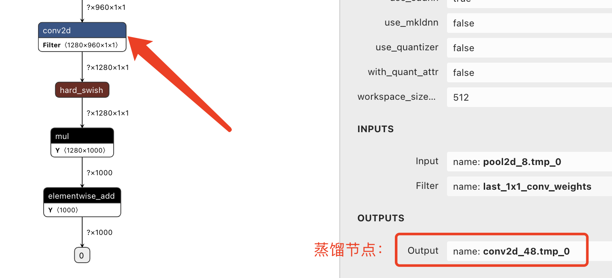

# 1. ACT超参详细教程

## 1.1 各压缩方法超参解析

### 1.1.1 量化训练（quantization）

量化参数主要设置量化比特数和量化op类型，其中量化op包含卷积层（conv2d, depthwise_conv2d）和全连接层（mul, matmul_v2）。以下为只量化卷积层的示例：
```yaml
Quantization:
    use_pact: false                               # 量化训练是否使用PACT方法
    weight_quantize_type: 'channel_wise_abs_max'  # 权重量化方式
    quantize_op_types: [conv2d, depthwise_conv2d] # 量化OP列表
    onnx_format: false                            # 是否采用ONNX量化标准格式
    ############### 不常用，以下参数不用设置 #########################
    activation_bits: 8                            # 激活量化比特数
    weight_bits: 8                                # 权重量化比特数
    activation_quantize_type: 'moving_average_abs_max'     # 激活量化方式 [保持默认即可]
    not_quant_pattern: [skip_quant]               # 跳过量化层的name_scpoe命名  [保持默认即可]
    dtype: 'int8'                                 # 量化后的参数类型，默认 int8 , 目前仅支持 int8  [保持默认即可]
    window_size: 10000                            # 'range_abs_max' 量化方式的 window size ，默认10000。  [保持默认即可]
    moving_rate: 0.9                              # 'moving_average_abs_max' 量化方式的衰减系数，默认 0.9。  [保持默认即可]
    for_tensorrt: false                           # 量化后的模型是否使用 TensorRT 进行预测。如果是的话，量化op类型为： TENSORRT_OP_TYPES 。默认值为False.  [保持默认即可]
    is_full_quantize: false                       # 是否全量化  [保持默认即可]
```

以上配置项说明如下：


- use_pact: 是否开启PACT。一般情况下，开启PACT后，量化产出的模型精度会更高。算法原理请参考：[PACT: Parameterized Clipping Activation for Quantized Neural Networks](https://arxiv.org/abs/1805.06085)
- weight_quantize_type: 参数量化方式。可选 'abs_max' , 'channel_wise_abs_max' , 'range_abs_max' , 'moving_average_abs_max' 。如果使用 TensorRT 加载量化后的模型来预测，请使用 'channel_wise_abs_max' 。 默认 'channel_wise_abs_max' 。
- quantize_op_types：需要进行量化的OP类型。通过以下代码输出所有支持量化的OP类型：
```
from paddleslim.quant.quanter import TRANSFORM_PASS_OP_TYPES,QUANT_DEQUANT_PASS_OP_TYPES
print(TRANSFORM_PASS_OP_TYPES + QUANT_DEQUANT_PASS_OP_TYPES)
```
- onnx_format: 是否采用ONNX量化格式标准，如果需要导出成ONNX，则需要设置为True。
- activation_bits:  激活量化bit数，可选1~8。默认为8。
- weight_bits: 参数量化bit数，可选1~8。默认为8。
- activation_quantize_type: 激活量化方式，可选 'abs_max' , 'range_abs_max' , 'moving_average_abs_max' 。如果使用 TensorRT 加载量化后的模型来预测，请使用 'range_abs_max' 或 'moving_average_abs_max' 。默认为 'moving_average_abs_max'。
- not_quant_pattern: 所有 `name_scope` 包含 'not_quant_pattern' 字符串的 op ，都不量化。 `name_scope` 设置方式请参考 [paddle.static.name_scope](https://www.paddlepaddle.org.cn/documentation/docs/zh/api/paddle/static/name_scope_cn.html#name-scope)。
- dtype: 量化后的参数类型，默认 int8 , 目前仅支持 int8
- window_size: 'range_abs_max' 量化方式的 window size ，默认10000。
- moving_rate: 'moving_average_abs_max' 量化方式的衰减系数，默认 0.9。
- for_tensorrt: 量化后的模型是否使用 TensorRT 进行预测。默认值为False. 通过以下代码，输出for_tensorrt=True时会量化到的OP：
```
from paddleslim.quant.quanter import TENSORRT_OP_TYPES
print(TENSORRT_OP_TYPES)
```
- is_full_quantize: 是否量化所有可支持op类型。默认值为False.


### 1.1.2 离线量化（post-traing quantization）
离线量化中基本的量化参数和量化训练相同，不再赘述。以下介绍离线量化特有的参数：
```yaml
QuantPost:
    batch_size: 32
    batch_nums: None
    algo: 'hist'
    hist_percent: 0.999
    bias_correct: False
    recon_level: None
    regions: None
    epochs: 20
    lr: 0.1
    simulate_activation_quant: False
    skip_tensor_list: None
```
以上配置项说明如下：
- batch_size: 设置每个 batch 的图片数量。默认值为32。
- batch_nums: 离线量化迭代次数。如果设置为 None ，则会一直运行到全部训练数据迭代结束；否则，迭代次数为 batch_nums, 即参与对 Scale 进行校正的样本个数为 batch_nums * batch_size 。
- algo: 量化时使用的算法名称，可为 'KL'，'mse', 'hist'， 'avg' 或 'abs_max'。当 algo 设置为 'abs_max' 时，使用校正数据的激活值的绝对值的最大值当作 scale 值，当设置为 'KL' 时，则使用KL散度的方法来计算 Scale 值，当设置为 'avg' 时，使用校正数据激活值的最大绝对值平均数作为 scale 值，当设置为 'hist' 时，则使用基于百分比的直方图的方法来计算 scale 值，当设置为 'mse' 时，则使用搜索最小mse损失的方法来计算 scale 值。默认值为 'hist' 。
- hist_percent: 'hist' 方法的百分位数。默认值为0.9999。
- bias_correct: 是否使用 bias correction 算法。默认值为 False 。
- recon_level: 设置该参数将在离线量化之后进行逐区域重建训练，目前支持 'layer-wise' 和 'region-wise'。当设置为'layer-wise'时， 以层为单位进行重建训练；当设置为'region-wise'时，以 `regions` 中每个块区域为单位进行重建训练；当设置为 None 时，则不进行重建训练。 默认值为 None 。
- regions(list[list]): 当 recon_level 是 'region-wise' 时，需要设置该参数。该列表中每个元素由一个区域的输入和输出变量名组成，可参考该[示例](https://github.com/PaddlePaddle/PaddleSlim/blob/develop/example/post_training_quantization/pytorch_yolo_series/configs/yolov6s_fine_tune.yaml#L11)。
- epochs: 逐区域重建训练的训练次数。每个 epoch 内的样本数量为 batch_nums * batch_size 。默认值为20。
- lr: 设置逐区域重建训练的学习率。
- simulate_activation_quant: 是否在重建训练中引入激活量化噪声。默认值为 False 。
- skip_tensor_list: 不进行量化的 Tensor 列表，需填入 Tensor 的 name。Tensor 的name 可以通过可视化工具查看。默认值为 None 。


### 1.1.3 离线量化超参优化（hyper parameter optimization）
超参优化是对离线量化中的超参数进行搜索，以选择最优的超参实现更好的量化效果。离线量化超参优化需要设置 `QuantPost` 和 `HyperParameterOptimization`。
```yaml
HyperParameterOptimization:
    ptq_algo: ["KL", "hist", "avg", "mse"]
    bias_correct: [True, False]
    hist_percent: [0.98, 0.999],
    batch_num: [10, 30],
```
以上配置项说明如下：
- ptq_algo: 设置待搜索的离线量化算法。
- bias_correct: 是否使用 bias correction 算法。
- hist_percent: 设置 'hist' 算法阈值的上限和下限，实际百分比在此范围内均匀采样而得。
- batch_num: 设置 'batch_num' 的上下限，实际数值在此范围内均匀采样而得。


### 1.1.4 知识蒸馏（knowledge distillation）

蒸馏参数主要设置蒸馏节点（`node`）和教师预测模型路径，如下所示：
```yaml
Distillation:
    alpha: 1.0
    loss: l2
    node:  # 会默认选择，一般不用设置，除非自动选择的节点有问题，需要手动调整时，再设置
    - relu_30.tmp_0
    ############ 以下参数无需设置，默认teacher模型为压缩前模型，除非指定其他模型为teacher模型才需设置以下参数  ##############
    teacher_model_dir: ./inference_model       # 模型路径
    teacher_model_filename: model.pdmodel      # 预测模型文件
    teacher_params_filename: model.pdiparams   # 预测模型参数文件
```
以上配置项说明如下：

- alpha: 蒸馏loss所占权重；可输入多个数值，支持不同节点之间使用不同的alpha值。
- loss: 蒸馏loss算法；可输入多个loss，支持不同节点之间使用不同的loss算法。 可选"soft_label"、“l2”或“fsp”。也可自定义loss。具体定义和使用可参考[知识蒸馏API文档](https://paddleslim.readthedocs.io/zh_CN/latest/api_cn/static/dist/single_distiller_api.html)。
- node: 蒸馏节点，即某层输出的变量名称。该选项设置方式分两种情况：

  - 自蒸馏：教师模型为压缩前的推理模型，学生模型为压缩后的推理模型。‘node’ 可设置为变量名称的列表，ACT会自动在该列表中的变量上依次添加知识蒸馏loss。示例如下：
  ```
  node:
  - relu_30.tmp_0
  - relu_31.tmp_0
  ```
  上述示例，会添加两个知识蒸馏loss。第一个loss的输入为教师模型和学生模型的 'relu_30.tmp_0'，第二个loss的输入为教师模型和学生模型的'relu_31.tmp_0'。
  - 普通蒸馏：教师模型为任意模型，学生模型为压缩后的推理模型。‘node’ 可设置为变量名称的列表，列表中元素数量必须为偶数。示例如下：

  ```
  node:
  - teacher_relu_0.tmp_0
  - student_relu_0.tmp_0
  - teacher_relu_1.tmp_0
  - student_relu_1.tmp_0
  ```

  上述示例，会添加两个知识蒸馏loss。第一个loss的输入为教师模型的变量“teacher_relu_0.tmp_0”和学生模型的变量“student_relu_0.tmp_0”，第二个loss的输入为教师模型的变量“teacher_relu_1.tmp_0”和学生模型的“student_relu_1.tmp_0”。

  如果不设置`node`，则分别取教师模型和学生模型的最后一个带参数的层的输出，组成知识蒸馏loss.

- teacher_model_dir: 用于监督压缩后模型训练的教师模型所在的路径。如果不设置该选项，则使用压缩前的模型做为教师模型。
- teacher_model_filename: 教师模型的模型文件名称，格式为 *.pdmodel 或 __model__。仅当设置`teacher_model_dir`后生效。
- teacher_params_filename: 教师模型的参数文件名称，格式为 *.pdiparams 或 __params__。仅当设置`teacher_model_dir`后生效。


### 1.1.5 结构化稀疏（sparsity）

结构化稀疏参数设置如下所示：
```yaml
ChannelPrune:
  pruned_ratio: 0.25
  prune_params_name:
  - conv1_weights
  criterion: l1_norm
```

- pruned_ratio: 每个卷积层的通道数被剪裁的比例。
- prune_params_name: 待剪裁的卷积层的权重名称。通过以下脚本获得推理模型中所有卷积层的权重名称：

```
import paddle
paddle.enable_static()
model_dir="./inference_model"
exe = paddle.static.Executor(paddle.CPUPlace())
[inference_program, feed_target_names, fetch_targets] = (
    paddle.static.load_inference_model(model_dir, exe))
for var_ in inference_program.list_vars():
    if var_.persistable and "conv2d" in var_.name:
        print(f"{var_.name}")
```

或者，使用[Netron工具](https://netron.app/) 可视化`*.pdmodel`模型文件，选择合适的卷积层进行剪裁。

- criterion: 评估卷积通道重要性的指标。可选 “l1_norm” , “bn_scale” , “geometry_median”。具体定义和使用可参考[结构化稀疏API文档](https://paddleslim.readthedocs.io/zh_CN/latest/api_cn/static/prune/prune_api.html)。

### 1.1.6 ASP半结构化稀疏

半结构化稀疏参数设置如下所示：
```yaml
ASPPrune:
  prune_params_name:
  - conv1_weights
```

- prune_params_name: 待剪裁的卷积层的权重名称。通过以下脚本获得推理模型中所有卷积层的权重名称：

```
import paddle
paddle.enable_static()
model_dir="./inference_model"
exe = paddle.static.Executor(paddle.CPUPlace())
[inference_program, feed_target_names, fetch_targets] = (
    paddle.static.load_inference_model(model_dir, exe))
for var_ in inference_program.list_vars():
    if var_.persistable and "conv2d" in var_.name:
        print(f"{var_.name}")
```

或者，使用[Netron工具](https://netron.app/) 可视化`*.pdmodel`模型文件，选择合适的卷积层进行剪裁。

### 1.1.7 Transformer结构化剪枝

针对Transformer结构的结构化剪枝参数设置如下所示：
```yaml
TransformerPrune:
  pruned_ratio: 0.25
```
- pruned_ratio: 每个全链接层的被剪裁的比例。

### 1.1.8 非结构化稀疏策略

非结构化稀疏参数设置如下所示：
```yaml
UnstructurePrune:
    # prune_strategy: 稀疏策略，可设置 None 或 'gmp'
    prune_strategy: gmp
    # prune_mode: 稀疏化的模式，可设置 'ratio' 或 'threshold'
    prune_mode: ratio
    # ratio: 设置稀疏化比例，只有在 prune_mode=='ratio' 时才会生效
    ratio: 0.75
    # threshold: 设置稀疏化阈值，只有在 prune_mod=='threshold' 时才会生效
    threshold: 0.001
    # gmp_config: 传入额外的训练超参用以指导GMP训练过程
    gmp_config:
      stable_iterations: 0
      pruning_iterations: 4500 # total_iters * 0.4~0.45
      tunning_iterations: 4500 # total_iters * 0.4~0.45
      resume_iteration: -1
      pruning_steps: 100
      initial_ratio: 0.15
    # prune_params_type: 用以指定哪些类型的参数参与稀疏。
    prune_params_type: conv1x1_only
    # local_sparsity: 剪裁比例（ratio）应用的范围
    local_sparsity: True
```
- prune_strategy: GMP 训练策略能取得更优的模型精度。
- gmp_config参数介绍如下：
```
{'stable_iterations': int} # the duration of stable phase in terms of global iterations
{'pruning_iterations': int} # the duration of pruning phase in terms of global iterations
{'tunning_iterations': int} # the duration of tunning phase in terms of global iterations
{'resume_iteration': int} # the start timestamp you want to train from, in terms if global iteration
{'pruning_steps': int} # the total times you want to increase the ratio
{'initial_ratio': float} # the initial ratio value
```
- prune_params_type 目前只支持None和"conv1x1_only"两个选项，前者表示稀疏化除了归一化层的参数，后者表示只稀疏化1x1卷积。
- local_sparsity 表示剪裁比例（ratio）应用的范围，仅在 'ratio' 模式生效。local_sparsity 开启时意味着每个参与剪裁的参数矩阵稀疏度均为 'ratio'， 关闭时表示只保证模型整体稀疏度达到'ratio'，但是每个参数矩阵的稀疏度可能存在差异。各个矩阵稀疏度保持一致时，稀疏加速更显著。
- 更多非结构化稀疏的参数含义详见[非结构化稀疏API文档](https://github.com/PaddlePaddle/PaddleSlim/blob/develop/docs/zh_cn/api_cn/dygraph/pruners/unstructured_pruner.rst)

### 1.1.9 训练超参

训练参数主要设置学习率、训练次数（epochs）和优化器等。
```yaml
TrainConfig:
  epochs: 14
  eval_iter: 400
  learning_rate: 5.0e-03
  optimizer_builder:
    optimizer:
      type: SGD
    weight_decay: 0.0005

```
- 学习率衰减策略：主要设置策略类名和策略参数，如下所示。目前在paddle中已经实现了多种衰减策略，请参考[lr文档](https://www.paddlepaddle.org.cn/documentation/docs/zh/2.2/api/paddle/optimizer/lr/LRScheduler_cn.html)，策略参数即类初始化参数。
```yaml
  learning_rate:
    type: PiecewiseDecay # 学习率衰减策略类名
    boundaries: [4500] # 设置策略参数
    values: [0.005, 0.0005] # 设置策略参数
```
## 1.2 FAQ

### 1.自动蒸馏效果不理想，怎么自主选择蒸馏节点？

首先使用[Netron工具](https://netron.app/) 可视化`model.pdmodel`模型文件，选择模型中某些层输出Tensor名称，对蒸馏节点进行配置。（一般选择Backbone或网络的输出等层进行蒸馏）

<div align="center">
    
</div>

### 2.如何获得推理模型中的OP类型

执行以下代码获取推理模型中的OP类型，其中`model_dir`为推理模型存储路径。

```
import paddle
paddle.enable_static()
model_dir="./inference_model"
exe = paddle.static.Executor(paddle.CPUPlace())
inference_program, _, _ = (
    paddle.static.load_inference_model(model_dir, exe))
op_types = {}
for block in inference_program.blocks:
    for op in block.ops:
        op_types[op.type] = 1
print(f"Operators in inference model:\n{op_types.keys()}")
```

所用飞桨框架接口：

- [load_inference_model](https://www.paddlepaddle.org.cn/documentation/docs/zh/api/paddle/static/load_inference_model_cn.html#load-inference-model)
- [Program](https://www.paddlepaddle.org.cn/documentation/docs/zh/api/paddle/static/Program_cn.html#program)
- [Executor](https://www.paddlepaddle.org.cn/documentation/docs/zh/api/paddle/static/Executor_cn.html#executor)

### 3. 量化支持对哪些OP进行量化

执行以下代码，查看当前PaddlePaddle版本的量化功能所支持的OP类型：
```
from paddle.fluid.contrib.slim.quantization.utils import _weight_supported_quantizable_op_type, _act_supported_quantizable_op_type
print(f"_supported_quantizable_op_type:\n{_weight_supported_quantizable_op_type}")
print(f"_supported_quantizable_op_type:\n{_act_supported_quantizable_op_type}")
```

### 4. 如何设置推理模型中OP的‘name_scope’属性

以下代码，将输出变量为`conv2d_52.tmp_0`的OP的`name_scope`设置为'skip_quant':
```
import paddle
paddle.enable_static()
model_dir="./original_model"
exe = paddle.static.Executor(paddle.CPUPlace())
[inference_program, feed_target_names, fetch_targets] = (
    paddle.static.load_inference_model(model_dir, exe))
skips = ['conv2d_52.tmp_0']
for block in inference_program.blocks:
    for op in block.ops:
        if op.output_arg_names[0] in skips:
            op._set_attr("name_scope", "skip_quant")

feed_vars = []
for var_ in inference_program.list_vars():
    if var_.name in feed_target_names:
        feed_vars.append(var_)
paddle.static.save_inference_model("./infer_model", feed_vars, fetch_targets, exe, program=inference_program)

```
