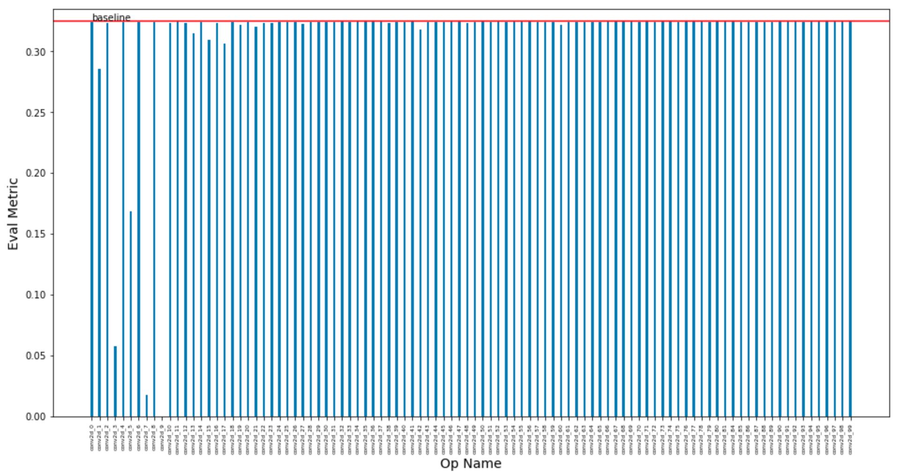
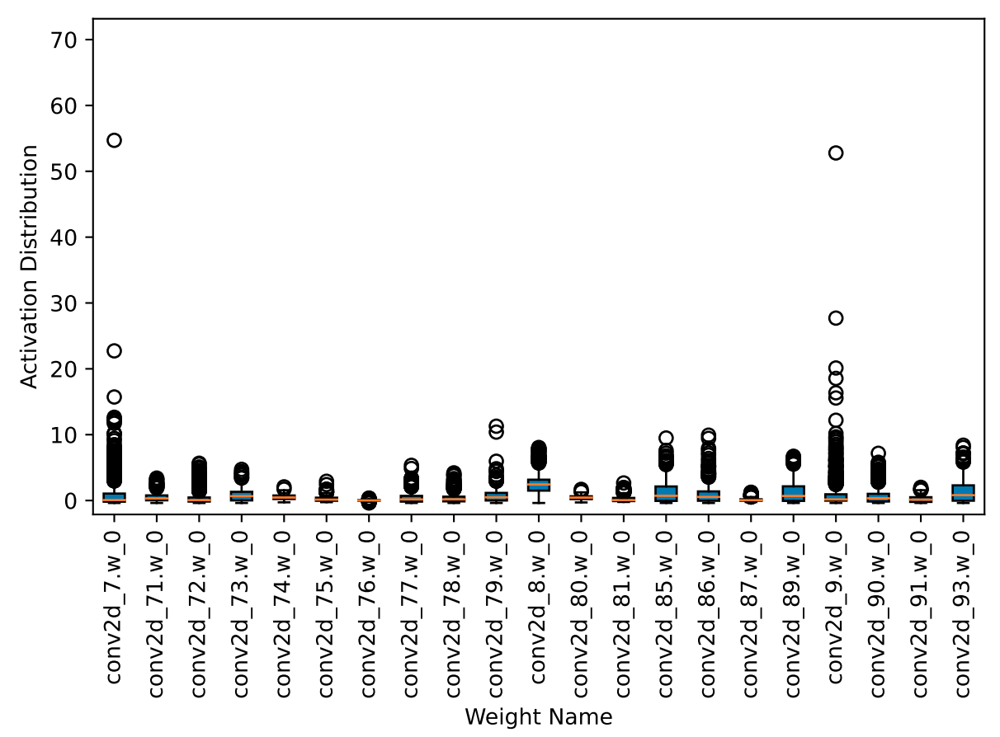

# 目标检测模型离线量化示例

目录：
- [1.简介](#1简介)
- [2.Benchmark](#2Benchmark)
- [3.开始离线量化](#离线量化流程)
  - [3.1 准备环境](#31-准备环境)
  - [3.2 准备数据集](#32-准备数据集)
  - [3.3 准备预测模型](#33-准备预测模型)
  - [3.4 测试模型精度](#34-测试模型精度)
  - [3.5 离线量化并产出模型](#35-离线量化并产出模型)
  - [3.6 提高离线量化精度](#36-提高离线量化精度)

- [4.预测部署](#4预测部署)
- [5.FAQ](5FAQ)

## 1. 简介
本示例将以目标检测模型PP-YOLOE和PicoDet为例，介绍如何使用PaddleDetection中Inference部署模型，使用离线量化功能进行压缩，并使用敏感度分析功能提升离线量化精度。
注意:[Paddle-Inference-demo/c++/gpu/yolov3](https://github.com/PaddlePaddle/Paddle-Inference-Demo/tree/master/python/gpu/yolov3)使用量化校准表会有精度不对齐的情况，可对yolov3_r50vd_dcn_270e_coco模型进行离线量化。

## 2.Benchmark

| 模型  |  策略  | 输入尺寸 | mAP<sup>val<br>0.5:0.95 | 预测时延<sup><small>FP32</small><sup><br><sup>(ms) |预测时延<sup><small>FP16</small><sup><br><sup>(ms) | 预测时延<sup><small>INT8</small><sup><br><sup>(ms) |  配置文件 | Inference模型  |
| :-------- |:-------- |:--------: | :---------------------: | :----------------: | :----------------: | :---------------: | :-----------------------------: | :-----------------------------: |
| yolov3_r50vd_dcn_270e_coco |  Base模型 | 608*608  |  40.6   |   92.2ms  |   41.3ms   |    -    |    -   | [Model](https://paddle-inference-dist.bj.bcebos.com/Paddle-Inference-Demo/yolov3_r50vd_dcn_270e_coco.tgz) |
| yolov3_r50vd_dcn_270e_coco |  离线量化 | 608*608  |  40.3    |     -     |     -     |  27.9ms  |    -   |    |
|  |  |  |  |  |  |  |  |  |
| PicoDet-s |  Base模型 | 416*416  |  32.5   |   82.5ms  |   59.7ms   |  -  |  - | [Model](https://paddledet.bj.bcebos.com/deploy/Inference/picodet_s_416_coco_lcnet.tar) |
| PicoDet-s |  离线量化(量化分析前) | 416*416  |  0.0   |   - |   -   |  39.1ms  |  -  | - |
| PicoDet-s |  离线量化(量化分析后) | 416*416  |  24.9   |   - |   -   |  64.8ms  |  -  | [Infer Model](https://bj.bcebos.com/v1/paddle-slim-models/act/picodet_s_ptq.tar) |

- mAP较低，导致目标框增多，NMS会增加耗时。
- mAP的指标均在COCO val2017数据集中评测得到，IoU=0.5:0.95。
测速环境:Tesla T4,TensorRT 8.6.1,CUDA 11.2,batch_size=1,cudnn 8.2.0  Intel(R)Xeon(R)Gold 6271C CPU,测速脚本[paddle_inference_eval.py](https://github.com/PaddlePaddle/PaddleSlim/blob/develop/example/auto_compression/detection/paddle_inference_eval.py)

## 3. 离线量化流程

#### 3.1 准备环境
- PaddlePaddle  2.6 （可从[Paddle官网](https://www.paddlepaddle.org.cn/install/quick?docurl=/documentation/docs/zh/install/pip/linux-pip.html)下载安装）
- PaddleSlim 2.6
- PaddleDet >= 2.4
- opencv-python

安装paddlepaddle：
```shell
# CPU
python -m pip install paddlepaddle==2.6.0 -i https://pypi.tuna.tsinghua.edu.cn/simple
# GPU 以cuda11.2为例子
python -m pip install paddlepaddle-gpu==2.6.0.post112 -f https://www.paddlepaddle.org.cn/whl/linux/mkl/avx/stable.html
```

安装paddleslim：
```shell
pip install paddleslim
```

安装paddledet：
```shell
pip install paddledet
```

注：安装PaddleDet的目的是为了直接使用PaddleDetection中的Dataloader组件。

#### 3.2 准备数据集

本案例默认以COCO数据进行离线量化实验，如果自定义COCO数据，或者其他格式数据，请参考[PaddleDetection数据准备文档](https://github.com/PaddlePaddle/PaddleDetection/blob/release/2.4/docs/tutorials/PrepareDataSet.md) 来准备数据。

如果数据集为非COCO格式数据，请修改[configs](./configs)中reader配置文件中的Dataset字段。

以PP-YOLOE模型为例，如果已经准备好数据集，请直接修改[./configs/ppyoloe_s_ptq.yml]中`EvalDataset`的`dataset_dir`字段为自己数据集路径即可。

#### 3.3 准备预测模型

预测模型的格式为：`model.pdmodel` 和 `model.pdiparams`两个，带`pdmodel`的是模型文件，带`pdiparams`后缀的是权重文件。

注：其他像`__model__`和`__params__`分别对应`model.pdmodel` 和 `model.pdiparams`文件。


根据[PaddleDetection文档](https://github.com/PaddlePaddle/PaddleDetection/blob/develop/docs/tutorials/GETTING_STARTED_cn.md#8-%E6%A8%A1%E5%9E%8B%E5%AF%BC%E5%87%BA) 导出Inference模型，具体可参考下方PP-YOLOE模型的导出示例：
- 下载代码
```
git clone https://github.com/PaddlePaddle/PaddleDetection.git
```
- 导出预测模型


- PPYOLOE-s模型，不包含NMS：如快速体验，可直接下载[PP-YOLOE-s导出模型](https://bj.bcebos.com/v1/paddle-slim-models/act/ppyoloe_crn_s_300e_coco.tar)
```shell
python tools/export_model.py \
        -c configs/ppyoloe/ppyoloe_crn_s_300e_coco.yml \
        -o weights=https://paddledet.bj.bcebos.com/models/ppyoloe_crn_s_300e_coco.pdparams \
        trt=True exclude_nms=True \
```

- PicoDet-s模型，包含NMS：如快速体验，可直接下载[PicoDet-s导出模型](https://paddledet.bj.bcebos.com/deploy/Inference/picodet_s_416_coco_lcnet.tar)

```shell
python tools/export_model.py -c configs/picodet/picodet_s_416_coco_lcnet.yml \
       -o weights=https://paddledet.bj.bcebos.com/models/picodet_s_416_coco_lcnet.pdparams \
       --output_dir=output_inference \
```

#### 3.4 离线量化并产出模型

离线量化示例通过post_quant.py脚本启动，会使用接口```paddleslim.quant.quant_post_static```对模型进行量化。配置config文件中模型路径、数据路径和量化相关的参数，配置完成后便可对模型进行离线量化。具体运行命令为：

- yolov3_r50vd_dcn_270e_coco：

```
export CUDA_VISIBLE_DEVICES=0
python post_quant.py --config_path=./configs/yolov3_r50vd_dcn.yaml --save_dir=./yolov3_r50vd_dcn_270e_coco_ptq
```

- PicoDet-s：

```
export CUDA_VISIBLE_DEVICES=0
python post_quant.py --config_path=./configs/picodet_s_ptq.yaml --save_dir=./picodet_s_ptq
```


#### 3.5 测试模型精度

使用eval.py脚本得到模型的mAP：
ppyoloe_s这个模型测试不出来精度，因为没有NMS
```
export CUDA_VISIBLE_DEVICES=0
python eval.py --config_path=./configs/picodet_s_ptq.yaml
```
```
export CUDA_VISIBLE_DEVICES=0
python eval.py --config_path=./configs/yolov3_r50vd_dcn.yaml
```

**注意**：
- 要测试的模型路径可以在配置文件中`model_dir`字段下进行修改。

#### 3.6 提高离线量化精度
本节介绍如何使用量化分析工具提升离线量化精度。离线量化功能仅需使用少量数据，且使用简单、能快速得到量化模型，但往往会造成较大的精度损失。PaddleSlim提供量化分析工具，会使用接口```paddleslim.quant.AnalysisPTQ```，可视化展示出不适合量化的层，通过跳过这些层，提高离线量化模型精度。```paddleslim.quant.AnalysisPTQ```详解见[AnalysisPTQ.md](https://github.com/PaddlePaddle/PaddleSlim/blob/develop/docs/zh_cn/tutorials/quant/post_training_quantization.md)。


经过多个实验，包括尝试多种激活算法（avg，KL等）、weight的量化方式（abs_max，channel_wise_abs_max），对PicoDet-s进行离线量化后精度均为0，以PicoDet-s为例，量化分析工具具体使用方法如下：

```shell
python analysis.py --config_path=./configs/picodet_s_analysis.yaml
```


如下图，经过量化分析之后，可以发现`conv2d_1.w_0`， `conv2d_3.w_0`，`conv2d_5.w_0`， `conv2d_7.w_0`， `conv2d_9.w_0` 这些层会导致较大的精度损失，这些层均为主干网络中靠前部分的`depthwise_conv`。

<p align="center">
 <br />
</p>

在保存的 `activation_distribution.pdf` 中，也可以发现以上这些层的 `activation` 存在较多离群点，导致量化效果较差。
<p align="center">
 <br />
</p>

经此分析，在进行离线量化时，可以跳过这些导致精度下降较多的层，可使用 [picodet_s_analyzed_ptq.yaml](./configs/picodet_s_analyzed_ptq.yaml)，然后再次进行离线量化。跳过这些层后，离线量化精度上升24.9个点。

```shell
python post_quant.py --config_path=./configs/picodet_s_analyzed_ptq.yaml --save_dir=./picodet_s_analyzed_ptq_out
```

如想分析之后直接产出符合目标精度的量化模型，可在 `picodet_s_analysis.yaml` 中将`get_target_quant_model`设置为True，并填写 `target_metric`，注意 `target_metric` 不能比原模型精度高。

**加速分析过程**

使用量化分析工具时，因需要逐层量化模型并进行验证，因此过程可能较慢，若想加速分析过程，可以在配置文件中设置 `FastEvalDataset` ，输入一个图片数量较少的annotation文件路径。注意，用少量数据验证的模型精度不一定等于全量数据验证的模型精度，若只需分析时获得不同层量化效果的相对排序，可以使用少量数据集；若要求准确精度，请使用全量验证数据集。如需要全量验证数据，将 `FastEvalDataset` 字段删掉即可。
若需要少量验证数据集来快速验证，可下载：[单张COCO验证数据集](https://bj.bcebos.com/v1/paddle-slim-models/data/small_instances_val2017.json)。

注：分析之后若需要直接产出符合目标精度的量化模型，demo代码不会使用少量数据集验证，会自动使用全量验证数据。


## 4.预测部署
预测部署可参考[Detection模型自动压缩示例](https://github.com/PaddlePaddle/PaddleSlim/tree/develop/example/auto_compression/detection)


量化模型可在GPU上可以使用TensorRT进行预测，在CPU上可以使用MKLDNN进行预测。

以下字段可用于配置预测参数:

| 参数名 | 含义 |
|:------:|:------:|
| model_path | inference 模型文件所在目录，该目录下需要有文件 model.pdmodel 和 model.pdiparams 两个文件 |
| reader_config | eval时模型reader的配置文件路径 |
| image_file | 如果只测试单张图片效果，直接根据image_file指定图片路径 |
| device | 使用GPU或者CPU预测，可选CPU/GPU   |
| use_trt | 是否使用 TesorRT 预测引擎   |
| use_mkldnn | 是否启用```MKL-DNN```加速库，注意```use_mkldnn```与```use_gpu```同时为```True```时，将忽略```enable_mkldnn```，而使用```GPU```预测  |
| cpu_threads | CPU预测时，使用CPU线程数量，默认10  |
| precision | 预测精度，包括`fp32/fp16/int8`  |
| include_nms | 是否包含nms，如果不包含nms，则设置False，如果包含nms，则设置为True  |
| use_dynamic_shape | 是否使用动态shape，如果使用动态shape，则设置为True，否则设置为False  |
| img_shape | 输入图片的大小。这里默认为640,意味着图像将被调整到640*640  |
| trt_calib_mode | 如果模型是通过TensorRT离线量化校准生成的，那么需要将此参数设置为True。|

-Paddle-TesorRT预测示例：

yolov3_r50vd_dcn_270e_coco模型
```shell
python paddle_inference_eval.py \
       --model_path=yolov3_r50vd_dcn_270e_coco \
       --reader_config=configs/yolov3_r50vd_dcn.yml \
       --use_trt=True \
       --precision=fp32 \
       --include_nms=True \
       --benchmark=True
```
```shell
python paddle_inference_eval.py \
       --model_path=yolov3_r50vd_dcn_270e_coco_ptq \
       --reader_config=configs/yolov3_r50vd_dcn.yml \
       --use_trt=True \
       --precision=int8 \
       --include_nms=True \
       --benchmark=True
```
picodet_s模型
```shell
python paddle_inference_eval.py \
    --model_path=picodet_s_416_coco_lcnet \
    --reader_config=configs/picodet_reader.yml \
    --use_trt=True \
    --precision=fp16 \
    --include_nms=True \
    --benchmark=True
```
量化分析前
```shell
python paddle_inference_eval.py \
    --model_path=picodet_s_ptq \
    --reader_config=configs/picodet_reader.yml \
    --use_trt=True \
    --precision= \
    --include_nms=True \
    --benchmark=True
```
量化分析后
```shell
python paddle_inference_eval.py \
    --model_path=picodet_s_analyzed_ptq_out \
    --reader_config=configs/picodet_reader.yml \
    --use_trt=True \
    --precision=int8 \
    --include_nms=True \
    --benchmark=True
```
#### 4.1 C++部署
请参考[YOLOv3推理](https://github.com/PaddlePaddle/Paddle-Inference-Demo/tree/master/c%2B%2B/gpu/yolov3)

编译样例
- 文件yolov3_test.cc改成PicoDet-s.cc，为预测的样例程序(程序中的输入为固定值，如果您有opencv或其他方式进行数据读取的需求，需要对程序进行一定的修改)。
- 脚本compile.sh包含了第三方库、预编译库的信息配置。
- 脚本run.sh为一键运行脚本。
编译前，需要根据自己的环境修改compile.sh中的相关代码配置依赖库:

```shell
# 编译的 demo 名称
DEMO_NAME=picoDet-s

# 根据预编译库中的version.txt信息判断是否将以下三个标记打开
WITH_MKL=ON
WITH_GPU=ON
USE_TENSORRT=ON

# 配置预测库的根目录
LIB_DIR=${work_path}/../lib/paddle_inference

# 如果上述的WITH_GPU 或 USE_TENSORRT设为ON，请设置对应的CUDA， CUDNN， TENSORRT的路径。
CUDNN_LIB=/usr/lib/x86_64-linux-gnu/
CUDA_LIB=/usr/local/cuda/lib64
TENSORRT_ROOT=/usr/local/TensorRT-7.1.3.4
```
运行bash compile.sh编译样例

- 运行样例
使用原生GPU运行样例
```shell
./build/picodet-s --model_file picodet_s_416_coco_lenet/model.pdmodel --params_file picodet_s_416_coco_lenet/model.pdiparams
```
使用Trt FP32运行样例
```shell
./build/picodet-s --model_file picodet_s_416_coco_lenet/model.pdmodel --params_file picodet_s_416_coco_lenet/model.pdiparams --run_mode=trt_fp32
```
使用Trt FP16运行样例
```shell
./build/picodet-s --model_file picodet_s_416_coco_lenet/model.pdmodel --params_file picodet_s_416_coco_lenet/model.pdiparams --run_mode=trt_fp16
```
使用Trt Int8运行样例
在使用Trt Int8运行样例时，相同的运行命令需要执行两次。
生成量化校准表
```shell
./build/picodet-s --model_file picodet_s_416_coco_lcnet/model.pdmodel --params_file picodet_s_416_coco_lcnet/model.pdiparams --run_mode=trt_int8
```
加载校准表预测的log:
```shell
I0623 08:40:49.386909 107053 tensorrt_engine_op.h:159] This process is generating calibration table for Paddle TRT int8...
I0623 08:40:49.387279 107057 tensorrt_engine_op.h:352] Prepare TRT engine (Optimize model structure, Select OP kernel etc). This process may cost a lot of time.
I0623 08:41:13.784473 107053 analysis_predictor.cc:791] Wait for calib threads done.
I0623 08:41:14.419198 107053 analysis_predictor.cc:793] Generating TRT Calibration table data, this may cost a lot of time...
```
使用Trt dynamic shape运行样例(以Trt FP32为例)
```shell
./build/picodet-s --model_file picodet_s_416_coco_lcnet/model.pdmodel --params_file picodet_s_416_coco_lcnet/model.pdiparams --run_mode=trt_fp32 --use_dynamic_shape=1
```
| 模型 | trt-fp32 | trt-fp16 | trt-int8 | paddle_gpu fp32 | trt_fp32(dynamic_shape) |
|:------:|:------:|:------:|:------:| :------:| :------:|
| PicoDet-s | 3.05ms | 2.66ms | 2.40ms | 7.51ms | 2.82ms |

- 测速环境:Tesla T4,TensorRT 8.6.1,CUDA 11.6,batch_size=1,cudnn 8.4.0  Intel(R)Xeon(R)Gold 6271C CPU

## 5.FAQ

- 如果想对模型进行自动压缩，可进入[Detection模型自动压缩示例](https://github.com/PaddlePaddle/PaddleSlim/tree/develop/example/auto_compression/detection)中进行实验。
