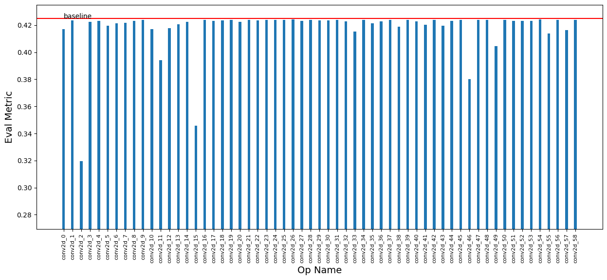
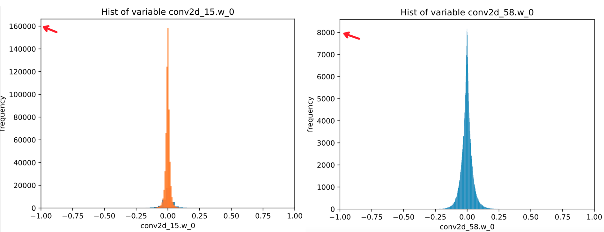
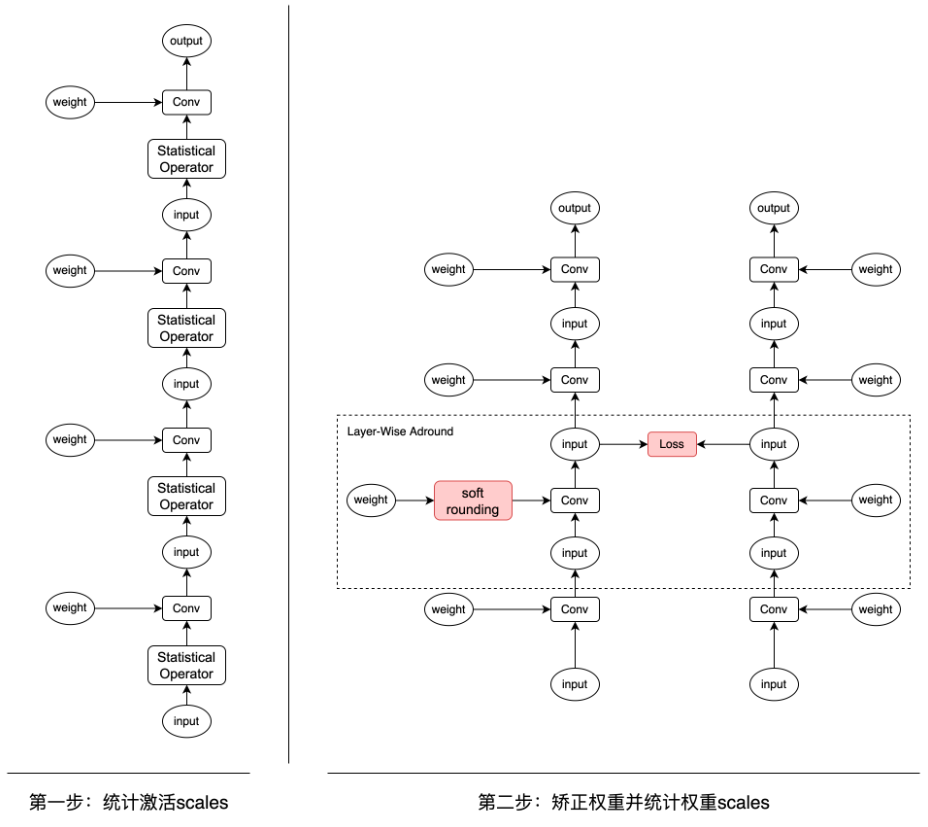
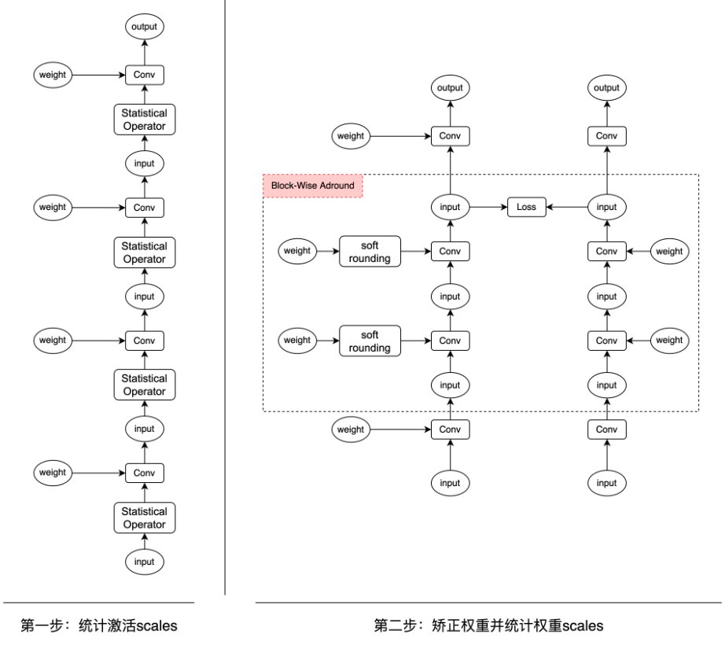

# YOLO系列离线量化示例

目录：
- [1.简介](#1简介)
- [2.Benchmark](#2Benchmark)
- [3.离线量化流程](#离线量化流程)
  - [3.1 准备环境](#31-准备环境)
  - [3.2 准备数据集](#32-准备数据集)
  - [3.3 准备预测模型](#33-准备预测模型)
  - [3.4 离线量化并产出模型](#34-离线量化并产出模型)
  - [3.5 测试模型精度](#35-测试模型精度)
  - [3.6 提高离线量化精度](#36-提高离线量化精度)
- [4.预测部署](#4预测部署)
- [5.FAQ](5FAQ)


本示例将以[ultralytics/yolov5](https://github.com/ultralytics/yolov5)，[meituan/YOLOv6](https://github.com/meituan/YOLOv6) 和 [WongKinYiu/yolov7](https://github.com/WongKinYiu/yolov7) YOLO系列目标检测模型为例，将PyTorch框架产出的推理模型转换为Paddle推理模型，使用离线量化功能进行压缩，并使用敏感度分析功能提升离线量化精度。离线量化产出的模型可以用PaddleInference部署，也可以导出为ONNX格式模型文件，并用TensorRT部署。


## 2.Benchmark
| 模型  |  策略  | 输入尺寸 | mAP<sup>val<br>0.5:0.95 | 预测时延<sup><small>FP32</small><sup><br><sup>(ms) |预测时延<sup><small>FP16</small><sup><br><sup>(ms) | 预测时延<sup><small>INT8</small><sup><br><sup>(ms) |  配置文件 | Inference模型  |
| :-------- |:-------- |:--------: | :---------------------: | :----------------: | :----------------: | :---------------: | :-----------------------------: | :-----------------------------: |
| YOLOv5s |  Base模型 | 640*640  |  37.4   |   5.95ms  |   2.44ms   |  -  |  - | [Model](https://paddle-slim-models.bj.bcebos.com/act/yolov5s.onnx) |
| YOLOv5s |  KL离线量化 | 640*640  |  36.0   |   - |   -   |  1.87ms  |  -  | - |
|  |  |  |  |  |  |  |  |  |
| YOLOv6s |  Base模型 | 640*640  |  42.4   |   9.06ms  |   2.90ms   |  -  |  - | [Model](https://paddle-slim-models.bj.bcebos.com/act/yolov6s.onnx) |
| YOLOv6s |  KL离线量化(量化分析前) | 640*640  |  30.3   |   - |   -   |  1.83ms  |  -  | - |
| YOLOv6s |  KL离线量化(量化分析后) | 640*640  |  39.7   |   - |   -   |  -  |  -  | [Infer Model](https://bj.bcebos.com/v1/paddle-slim-models/act/yolov6s_analyzed_ptq.tar) |
| YOLOv6s | avg离线量化 | 640*640  |  33.8   |   - |   -   |  1.83ms  |  -  | - |
| YOLOv6s |  avg离线量化(+Adaround) | 640*640  |  39.2 |   - |   -   |  -  |  -  | - |
| YOLOv6s |  avg离线量化(+BRECQ) | 640*640  |  38.7   |   - |   -   |  -  |  -  | - |
| YOLOv6s |  avg离线量化(+QDrop) | 640*640  |  38.0   |   - |   -   |  -  |  -  | - |
|  |  |  |  |  |  |  |  |  |
| YOLOv7 |  Base模型 | 640*640  |  51.1   |   26.84ms  |   7.44ms   |  -  |  - | [Model](https://paddle-slim-models.bj.bcebos.com/act/yolov7.onnx) |
| YOLOv7 |  KL离线量化 | 640*640  |  50.2   |   -  |   -   |  4.55ms  |  - | - |

说明：
- mAP的指标均在COCO val2017数据集中评测得到。

## 3. 离线量化流程

#### 3.1 准备环境
- PaddlePaddle ==2.5 （可从[Paddle官网](https://www.paddlepaddle.org.cn/install/quick?docurl=/documentation/docs/zh/install/pip/linux-pip.html)下载安装）
- PaddleSlim == 2.5
- X2Paddle >= 1.3.9
- opencv-python


（1）安装paddlepaddle：
```shell
# CPU
python -m pip install paddlepaddle==2.5.0 -i https://pypi.tuna.tsinghua.edu.cn/simple
# GPU
python -m pip install paddlepaddle-gpu==2.5.0.post116 -f https://www.paddlepaddle.org.cn/whl/linux/mkl/avx/stable.html
```

（2）安装paddleslim：
注意，PaddleSlim这里setup.py需要更改 slim_version='2.5'
```shell
git clone -b release/2.5 https://github.com/PaddlePaddle/PaddleSlim.git & cd PaddleSlim
python setup.py install
```

#### 3.2 准备数据集
本示例默认以COCO数据进行自动压缩实验，可以从 [MS COCO官网](https://cocodataset.org) 下载 [Train](http://images.cocodataset.org/zips/train2017.zip)、[Val](http://images.cocodataset.org/zips/val2017.zip)、[annotation](http://images.cocodataset.org/annotations/annotations_trainval2017.zip)。

目录格式如下：
```
dataset/coco/
├── annotations
│   ├── instances_train2017.json
│   ├── instances_val2017.json
│   |   ...
├── train2017
│   ├── 000000000009.jpg
│   ├── 000000580008.jpg
│   |   ...
├── val2017
│   ├── 000000000139.jpg
│   ├── 000000000285.jpg
```

#### 3.3 准备预测模型
（1）准备ONNX模型：

- YOLOv5：可通过[ultralytics/yolov5](https://github.com/ultralytics/yolov5) 官方的[导出教程](https://github.com/ultralytics/yolov5/issues/251)来准备ONNX模型，也可以下载准备好的[yolov5s.onnx](https://paddle-slim-models.bj.bcebos.com/act/yolov5s.onnx)。

- YOLOv6：可通过[meituan/YOLOv6](https://github.com/meituan/YOLOv6)官方的[导出教程](https://github.com/meituan/YOLOv6/blob/main/deploy/ONNX/README.md)来准备ONNX模型，也可以下载已经准备好的[yolov6s.onnx](https://paddle-slim-models.bj.bcebos.com/act/yolov6s.onnx)。

- YOLOv7：可通过[WongKinYiu/yolov7](https://github.com/WongKinYiu/yolov7)的导出脚本来准备ONNX模型，也可以直接下载我们已经准备好的[yolov7.onnx](https://paddle-slim-models.bj.bcebos.com/act/yolov7.onnx)。


#### 3.4 离线量化并产出模型
离线量化示例通过post_quant.py脚本启动，会使用接口```paddleslim.quant.quant_post_static```对模型进行量化。配置config文件中模型路径、数据路径和量化相关的参数，配置完成后便可对模型进行离线量化。具体运行命令为：
- YOLOv5

```shell
python post_quant.py --config_path=./configs/yolov5s_ptq.yaml --save_dir=./yolov5s_ptq_out
```

- YOLOv6

```shell
python post_quant.py --config_path=./configs/yolov6s_ptq.yaml --save_dir=./yolov6s_ptq_out
```

- YOLOv7

```shell
python post_quant.py --config_path=./configs/yolov7s_ptq.yaml --save_dir=./yolov7s_ptq_out
```


#### 3.5 测试模型精度

修改 [yolov5s_ptq.yaml](./configs/yolov5s_ptq.yaml) 中`model_dir`字段为模型存储路径，然后使用eval.py脚本得到模型的mAP：

```shell
export CUDA_VISIBLE_DEVICES=0
python eval.py --config_path=./configs/yolov5s_ptq.yaml
```


#### 3.6 提高离线量化精度

###### 3.6.1 量化分析工具
本节介绍如何使用量化分析工具提升离线量化精度。离线量化功能仅需使用少量数据，且使用简单、能快速得到量化模型，但往往会造成较大的精度损失。PaddleSlim提供量化分析工具，会使用接口```paddleslim.quant.AnalysisPTQ```，可视化展示出不适合量化的层，通过跳过这些层，提高离线量化模型精度。```paddleslim.quant.AnalysisPTQ```详解见[离线量化](https://github.com/PaddlePaddle/PaddleSlim/blob/develop/docs/zh_cn/tutorials/quant/post_training_quantization.md)。


由于YOLOv6离线量化效果较差，以YOLOv6为例，量化分析工具具体使用方法如下：

```shell
python analysis.py --config_path=./configs/yolov6s_analysis.yaml
```

如下图，经过量化分析之后，可以发现`conv2d_2.w_0`， `conv2d_11.w_0`，`conv2d_15.w_0`， `conv2d_46.w_0`， `conv2d_49.w_0` 这些层会导致较大的精度损失。

<p align="center">
 <br />
</p>


对比权重直方分布图后，可以发现量化损失较小的层数值分布相对平稳，数值处于-0.25到0.25之间，而量化损失较大的层数值分布非常极端，绝大部分值趋近于0，且数值处于-0.1到0.1之间，尽管看上去都是正太分布，但大量值为0是不利于量化统计scale值的。

<p align="center">
 <br />
</p>


经此分析，在进行离线量化时，可以跳过这些导致精度下降较多的层，可使用 [yolov6s_analyzed_ptq.yaml](./configs/yolov6s_analyzed_ptq.yaml)，然后再次进行离线量化。跳过这些层后，离线量化精度上升9.4个点。


```shell
python post_quant.py --config_path=./configs/yolov6s_analyzed_ptq.yaml --save_dir=./yolov6s_analyzed_ptq_out
```

如想分析之后直接产出符合目标精度的量化模型，可在 `yolov6s_analysis.yaml` 中将`get_target_quant_model`设置为True，并填写 `target_metric`，注意 `target_metric` 不能比原模型精度高。

**加速分析过程**

使用量化分析工具时，因需要逐层量化模型并进行验证，因此过程可能较慢，若想加速分析过程，可以在配置文件中设置 `fast_val_anno_path` ，输入一个图片数量较少的annotation文件路径。注意，用少量数据验证的模型精度不一定等于全量数据验证的模型精度，若只需分析时获得不同层量化效果的相对排序，可以使用少量数据集；若要求准确精度，请使用全量验证数据集。如需要全量验证数据，将 `fast_val_anno_path` 设置为None即可。
若需要少量验证数据集来快速验证，可下载：[单张COCO验证数据集](https://bj.bcebos.com/v1/paddle-slim-models/data/small_instances_val2017.json)。

注：分析之后若需要直接产出符合目标精度的量化模型，demo代码不会使用少量数据集验证，会自动使用全量验证数据。

量化分析工具详细介绍见[量化分析工具介绍](https://github.com/PaddlePaddle/PaddleSlim/blob/develop/docs/zh_cn/tutorials/quant/static/Analysis.md)

###### 3.6.2 精度重构工具
本节介绍如何使用精度重构工具提高精度。该工具的思想是，通过最小化量化前后模型输出的重构误差（minimizing the reconstruction error，MRE），学习权重的取整方式（上取整or下取整），从而`fine-tune`经量化后的模型的权重，提高精度。同样以YOLOv6为例，运行命令如下：

```shell
python fine_tune.py --config_path=./configs/yolov6s_fine_tune.yaml --recon_level=layer-wise
```
其中`recon_level`表示重构的粒度，默认为`layer-wise`，即逐层重构。如下图，该工具首先会统计激活和权重量化需要的`scales`，随后为每个权重添加`soft-rounding`操作使得权重的取整方式可学习，以及逐层的增加重构`loss`。

<p align="center">
 <br />
</p>

通过最小化重构`loss`，为每层的权重学习最合适的`round`方式，其思想类似[论文](https://arxiv.org/abs/2004.10568)提出的`Adround`方法。
该过程也可看成知识蒸馏，预训练模型可视为教师模型，经离线量化后的模型可视为学生模型。
类似的，该工具还支持以`region/block`为单位添加重构`loss`，类似[论文](https://arxiv.org/pdf/2102.05426)提出的`BRECQ`方法，其中`region`可能包含多层，如下图所示。

<p align="center">
 <br />
</p>

具体运行命令如下：

```shell
python fine_tune.py --config_path=./configs/yolov6s_fine_tune.yaml --recon_level=region-wise
```
此外，该工具还支持在重构过程中引入激活量化产生的噪声，如下图所示，在每层前插入`quant/dequant`节点，随机的进行激活量化，核心思想类似[论文](https://arxiv.org/pdf/2203.05740)提出的`QDrop`方法。

<p align="center">
 <br />
</p>


具体运行命令如下，只需将`simulate_activation_quant`设置为`True`即可。

```shell
python fine_tune.py --config_path=./configs/yolov6s_fine_tune.yaml --simulate_activation_quant=True
```
实验结果如上表所示，与量化分析工具不同，精度重构工具无需跳过某些层，就可提升离线量化精度。


## 4.预测部署
预测部署可参考[YOLO系列模型自动压缩示例](https://github.com/PaddlePaddle/PaddleSlim/tree/develop/example/auto_compression/pytorch_yolo_series)
量化模型在GPU上可以使用TensorRT进行加速，在CPU上可以使用MKLDNN进行加速。
| 参数名 | 含义 |
|:------:|:------:|
| model_path | inference 模型文件所在目录，该目录下需要有文件 model.pdmodel 和 model.pdiparams 两个文件 |
| dataset_dir | 指定COCO数据集的目录，这是存储数据集的根目录 |
| image_file | 如果只测试单张图片效果，直接根据image_file指定图片路径 |
| val_image_dir | COCO数据集中验证图像的目录名，默认为val2017 |
| val_anno_path | 指定COCO数据集的注释(annotation)文件路径，这是包含验证集标注信息的JSON文件，默认为annotations/instances_val2017.json |
| benchmark | 指定是否运行性能基准测试。如果设置为True，程序将会进行性能测试 |
| device | 使用GPU或者CPU预测，可选CPU/GPU/XPU，默认设置为GPU   |
| use_trt | 是否使用 TesorRT 预测引擎   |
| use_mkldnn | 是否启用```MKL-DNN```加速库，注意```use_mkldnn```与```use_gpu```同时为```True```时，将忽略```enable_mkldnn```，而使用```GPU```预测  |
| cpu_threads | CPU预测时，使用CPU线程数量，默认10  |
| precision | 预测精度，包括`fp32/fp16/int8` |
| arch | 指定所使用的模型架构的名称，例如YOLOv5 |
| img_shape | 指定模型输入的图像尺寸 |
| use_dynamic_shape | 是否使用动态shape，如果使用动态shape，则设置为True，否则设置为False  |
| batch_size | 指定模型输入的批处理大小 |


首先，我们拥有的yolov6.onnx，我们需要把ONNX模型转成paddle模型，具体参考使用[X2Paddle迁移推理模型](https://www.paddlepaddle.org.cn/documentation/docs/zh/guides/model_convert/convert_with_x2paddle_cn.html#x2paddle)
- 安装X2Paddle
方式一:pip 安装
```shell
pip install X2Paddle==1.3.9
```
方式二:源码安装
```shell
git clone https://github.com/PaddlePaddle/X2Paddle.git
cd X2Paddle
python setup.py install
```
使用命令将YOLOv6.onnx模型转换成paddle模型
```shell
x2paddle --framework=onnx --model=yolov6s.onnx --save_dir=yolov6_model
```
#### 4.1 TensorRT Python部署
使用[paddle_inference_eval.py](https://github.com/PaddlePaddle/PaddleSlim/blob/develop/example/auto_compression/pytorch_yolo_series/paddle_inference_eval.py)部署
```shell
python paddle_inference_eval.py --model_path=yolov6_model/inference_model --dataset_dir=datasets/coco --use_trt=True --precision=fp32 --arch=YOLOv6
```
执行int8量化
```shell
python paddle_inference_eval.py --model_path=yolov6s_ptq_out --dataset_dir==datasets/coco --use_trt=True --precision=int8 --arch=YOLOv6
```
#### 4.2 MKLDNN Python部署
```shell
python paddle_inference_eval.py --model_path=yolov6_model/inference_model --dataset_dir=/work/GETR-Lite-paddle-new/inference/datasets/coco --device=CPU --use_mkldnn=True --precision=fp32 --arch=YOLOv6
```
#### 4.3 C++部署
具体可参考[运行PP-YOLOE-l目标检测模型样例](https://github.com/PaddlePaddle/Paddle-Inference-Demo/tree/master/c%2B%2B/gpu/ppyoloe_crn_l)
将compile.sh中DEMO_NAME修改为yolov6_test，并且将ppyoloe_crn_l.cc修改为yolov6_test.cc,根据环境修改相关配置库
运行bash compile.sh编译样例。
- 运行样例
-使用原生GPU运行样例(将ONNX模型转成的paddle模型复制到Paddle-Inference-demo/c++/gpu/ppyoloe_crn_l/目录下)
```shell
./build/yolov6_test --model_file yolov6s_infer/model.pdmodel --params_file yolov6s_infer/model.pdiparams
```
- 使用TensorRT FP32运行样例
```shell
./build/yolov6_test --model_file yolov6s_infer/model.pdmodel --params_file yolov6s_infer/model.pdiparams --run_mode=trt_fp32
```
- 使用TensorRT FP16运行样例
```shell
./build/yolov6_test --model_file yolov6s_infer/model.pdmodel --params_file yolov6s_infer/model.pdiparams --run_mode=trt_fp16
```
- 使用TensorRT INT8运行样例
```shell
./build/yolov6_test --model_file yolov6s_infer/model.pdmodel --params_file yolov6s_infer/model.pdiparams --run_mode=trt_int8
```

## 5.FAQ
- 如果想对模型进行自动压缩，可进入[YOLO系列模型自动压缩示例](https://github.com/PaddlePaddle/PaddleSlim/tree/develop/example/auto_compression/pytorch_yolo_series)中进行实验。
